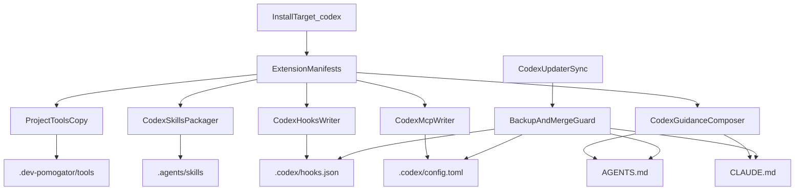

# Design

## Реализуемые требования

- [FR-1: First-Class Codex Platform](FR.md#fr-1-first-class-codex-platform-feature1)
- [FR-2: Project-Level Codex Artifact Layout](FR.md#fr-2-project-level-codex-artifact-layout-feature2)
- [FR-3: Existing User Artifact Protection](FR.md#fr-3-existing-user-artifact-protection-feature3)
- [FR-4: Codex Hooks Installation](FR.md#fr-4-codex-hooks-installation-feature4)
- [FR-5: AGENTS.md and CLAUDE.md Coexistence](FR.md#fr-5-agentsmd-and-claudemd-coexistence-feature5)
- [FR-6: Codex Skills Packaging](FR.md#fr-6-codex-skills-packaging-feature6)
- [FR-7: Project-Level Codex MCP Configuration](FR.md#fr-7-project-level-codex-mcp-configuration-feature7)
- [FR-8: Extension Parity Support Matrix](FR.md#fr-8-extension-parity-support-matrix-feature8)
- [FR-9: Windows Bash/SH Bootstrap for Codex](FR.md#fr-9-windows-bashsh-bootstrap-for-codex-feature9)
- [FR-10: Managed Update and Reinstall Path](FR.md#fr-10-managed-update-and-reinstall-path-feature10)
- [FR-11: Explicit Codex Parity Routing](FR.md#fr-11-explicit-codex-parity-routing-feature11)

## Компоненты

- `CodexPlatformSchema` — расширяет типы `Platform`, installer selection и manifest typing до `codex`.
- `CodexInstaller` — новый installer path, который materialize project-level Codex артефакты.
- `CodexArtifactMerger` — merge-safe writer для `AGENTS.md`, `CLAUDE.md`, `.codex/config.toml`, `.codex/hooks.json`, `.agents/skills/*`.
- `CodexHooksFeatureGate` — включает project-level `features.codex_hooks=true` и проверяет hooks-capable baseline `Codex >= 0.114.0`.
- `CodexHooksWriter` — генерация и smart merge `SessionStart`/`Stop` hook entries.
- `CodexGuidanceComposer` — собирает `AGENTS.md` и update blocks для `CLAUDE.md` без потери glossary semantics.
- `CodexSkillsPackager` — копирует и/или адаптирует extension skills в `.agents/skills/`.
- `CodexMcpWriter` — записывает project-level `[mcp_servers]` в `.codex/config.toml`.
- `CodexParityRouter` — для каждого extension фиксирует, через какую Codex-native поверхность достигается parity.
- `CodexUpdaterSync` — распространяет существующую managed discipline на новую платформу.
- `CodexManifestNormalizer` — убирает допущения `cursor | claude` из manifest typing и translation layer для `.agents/skills` / `.codex/*`.
- `CodexMcpSetupAdapter` — отделяет Codex MCP flow от существующих Cursor/Claude JSON writers и `setup-mcp.py`.
- `CodexMemoryParityDecision` — явно решает, как `requiresClaudeMem`-зависимые расширения ведут себя на `codex`.
- `CodexTestHarness` — расширяет Docker/CLI/helpers под split Codex feature suite.

## Где лежит реализация

- App-код: `src/config/schema.ts`, `src/index.ts`, `src/installer/index.ts`, `src/installer/extensions.ts`, `src/installer/shared.ts`, `src/installer/memory.ts`, `src/updater/index.ts`, `src/updater/github.ts`
- Wiring: `extensions/*/extension.json`, `extensions/specs-workflow/tools/mcp-setup/setup-mcp.py`, `install`, `install.ps1`, `install.sh`, `README.md`
- Tests: `tests/e2e/`, `tests/features/`, `tests/fixtures/`

## Директории и файлы

- `src/installer/codex.ts`
- `src/config/schema.ts`
- `src/index.ts`
- `src/installer/index.ts`
- `src/installer/extensions.ts`
- `src/installer/shared.ts`
- `src/installer/memory.ts`
- `src/updater/index.ts`
- `src/updater/github.ts`
- `src/constants.ts`
- `install`
- `install.ps1`
- `install.sh`
- `README.md`
- `extensions/*/extension.json`
- `extensions/specs-workflow/tools/mcp-setup/setup-mcp.py`
- `tests/e2e/helpers.ts`
- `tests/e2e/codex-installer.test.ts`
- `tests/e2e/codex-update.test.ts`
- `tests/e2e/cli-integration.test.ts`
- `tests/e2e/mcp-setup.test.ts`
- `Dockerfile.test`
- `tests/fixtures/configs/installed-codex.json`

## Алгоритм

1. CLI/bootstrap route распознаёт таргет `codex` и передаёт его в installer pipeline.
2. Installer сначала нормализует manifest model для `codex`: platform union, hooks/skills/tool sections и translation между legacy `.claude/skills` targets и `.agents/skills/`.
3. Installer собирает support matrix расширений для `codex` и вычисляет набор project-level артефактов.
4. Tools копируются в `.dev-pomogator/tools/` по существующей managed модели.
5. Skills materialize в `.agents/skills/`, при необходимости используя Codex-specific wrappers вокруг существующих extension workflows.
6. `AGENTS.md` и `CLAUDE.md` обновляются через merge-safe composer:
   - existing user file читается
   - before-overwrite создаётся backup
   - managed blocks вставляются/обновляются
   - выдаётся warning/report если потребовалось слияние
7. `.codex/config.toml` создаётся или обновляется на project level:
   - feature flags
   - `[mcp_servers]`
   - project-specific Codex settings
   - `features.codex_hooks=true` для hooks-capable installs
8. `.codex/hooks.json` создаётся или обновляется на project level:
   - `SessionStart`
   - `Stop`
   - schema fields `type`, `command`, `statusMessage`, `timeout`
   - только для тех extensions, чьё parity поведение реально привязано к этим lifecycle points
9. Для extension behavior, которое не покрывается только `SessionStart` и `Stop`, `CodexParityRouter` назначает другой surface: skill, `AGENTS.md`, `codex exec`, app automation или GitHub Action.
10. Для `requiresClaudeMem`-зависимых flows parity route обязан явно задокументировать memory strategy, а не опираться на implicit Claude-only install behavior.
11. `specs-workflow` MCP parity использует TOML writer для `.codex/config.toml`; existing JSON `setup-mcp.py` path либо адаптируется, либо явно bypassed.
12. Reinstall/update path применяет те же managed hash, backup и cleanup правила, что уже действуют для `Cursor`/`Claude`.

## Contracts

### `.codex/config.toml`

- Owner: `dev-pomogator` managed blocks + user project settings
- Scope: только текущий репозиторий
- Contents:
  - Codex project config
  - `[features]`
  - `[mcp_servers]`
  - feature flags, включая `codex_hooks = true` для hook-driven parity
- Constraints:
  - не хранит auth tokens
  - не пишет в `~/.codex/config.toml`
  - обновляется atomically

### `.codex/hooks.json`

- Owner: managed hook entries `dev-pomogator` + user-owned hook entries
- Supported events in MVP:
  - `SessionStart`
  - `Stop`
- Expected hook payload shape per entry:
  - `type`
  - `command`
  - `statusMessage`
  - `timeout`
- Merge model:
  - только managed entries обновляются/удаляются автоматически
  - user entries сохраняются
  - конфликтные правки требуют backup + warning
- Version contract:
  - hook-driven parity требует `Codex >= 0.114.0`
  - hooks feature должен быть включён через project-level config или эквивалентный runtime override

### `AGENTS.md`

- Owner: project-level Codex guidance
- Purpose:
  - persistent rules для Codex
  - routing to repo skills
  - build/test/install expectations
- Merge model:
  - если файл уже существует, новые managed blocks вставляются без потери существующих user sections

### `CLAUDE.md`

- Owner: существующий проектный glossary/index
- Purpose:
  - не заменяется `AGENTS.md`
  - остаётся source of truth для Claude-specific project glossary
- Merge model:
  - только минимальные, явно обозначенные managed changes
  - запрещено превращать файл в дубликат `AGENTS.md`

### `.agents/skills/<skill-name>/`

- Owner: managed repo-local Codex skills
- Required file: `SKILL.md`
- Optional files: `scripts/*`, `references/*`, `assets/*`
- Constraints:
  - каждый skill traceable к extension manifest
  - при update obsolete managed skill files удаляются без затрагивания user-owned skills

## Support Matrix Strategy

### Direct hooks parity

Расширения, которые могут быть спроектированы напрямую через подтверждённые `Codex hooks`:

- `auto-commit` → `Stop`
- `auto-simplify` → `Stop`
- `claude-mem-health` → `SessionStart`
- `bun-oom-guard` → `SessionStart`

### Hooks + additional parity surface

Расширения, которым кроме hooks требуется ещё один Codex-native механизм:

- `prompt-suggest` → `Stop` + explicit skill/manual activation path
- `suggest-rules` → `Stop`/skills/MCP + explicit memory parity decision
- `specs-workflow` → skills + `AGENTS.md` + TOML MCP writer + optional hooks
- `tui-test-runner` → skill + optional `SessionStart` hook after manifest normalization
- `devcontainer` → skill/post-install style workflow
- `forbid-root-artifacts` → tools + guidance + pre-commit workflow
- `plan-pomogator` → `AGENTS.md` + skill

### Explicitly excluded

- `test-statusline` — excluded from Codex support matrix по решению пользователя

## BDD Feature Suite

### Core features

- `features/core/codex-platform.feature`
- `features/core/codex-protection.feature`
- `features/core/codex-update.feature`
- `features/core/codex-hooks-schema.feature`

### Plugin features

- `features/plugins/auto-commit.feature`
- `features/plugins/auto-simplify.feature`
- `features/plugins/claude-mem-health.feature`
- `features/plugins/bun-oom-guard.feature`
- `features/plugins/suggest-rules.feature`
- `features/plugins/specs-workflow.feature`
- `features/plugins/prompt-suggest.feature`
- `features/plugins/tui-test-runner.feature`
- `features/plugins/devcontainer.feature`
- `features/plugins/forbid-root-artifacts.feature`
- `features/plugins/plan-pomogator.feature`
- `features/plugins/test-statusline.feature`

> Принцип: один plugin parity path — один отдельный `.feature`, а cross-cutting contract scenarios вроде hook schema живут в core suite, чтобы implementation и BDD coverage не были завязаны на общий Codex mega-scenario файл и не теряли общий контракт.

## API / Data Flow

## BDD Test Infrastructure (ОБЯЗАТЕЛЬНО)

> Секция НЕ может быть удалена. Агент обязан классифицировать фичу по Test Data Impact.
>
> **4 вопроса классификации** (ДА/НЕТ):
> 1. Фича создаёт, изменяет или удаляет данные через API/БД/файлы?
> 2. Фича изменяет состояние системы, которое нужно откатить после теста?
> 3. BDD сценарии из .feature требуют предустановленных данных (Given-шаги с данными)?
> 4. Фича взаимодействует с внешними сервисами, требующими mock/stub на уровне теста?
>
> Хотя бы 1 ДА → `TEST_DATA_ACTIVE` (заполнить все подсекции ниже).
> Все НЕТ → `TEST_DATA_NONE` (указать Evidence и Verdict, подсекции не нужны).

**Classification:** TEST_DATA_ACTIVE
**Evidence:** Фича создаёт и изменяет project-level файлы (`.codex/*`, `AGENTS.md`, `.agents/skills/*`, backup artifacts), требует rollback/cleanup между сценариями и нуждается в предустановленных fixtures существующих пользовательских файлов.
**Verdict:** Нужны test hooks уровня `beforeEach/afterEach` для создания изолированного git-проекта, seed existing Codex artifacts и cleanup backup/managed state.

<!-- Подсекции ниже заполнять ТОЛЬКО при TEST_DATA_ACTIVE. При TEST_DATA_NONE — удалить подсекции. -->

### Существующие hooks

| Hook файл | Тип | Тег/Scope | Что делает | Можно переиспользовать? |
|-----------|-----|-----------|------------|------------------------|
| `tests/e2e/helpers.ts` | helper fixture | suite | `setupCleanState()`, `setupInstalledState()`, path helpers для installer сценариев | Да — база для изоляции Codex installer/update tests |
| `tests/e2e/cursor-installer.test.ts` | beforeAll / scenario setup | per-suite | Паттерн чистой установки project/global артефактов | Да — как reference для Codex installer |
| `tests/e2e/claude-installer.test.ts` | beforeAll / scenario setup | per-suite | Паттерн project settings + hooks verification | Да — как reference для Codex hooks/config verification |
| `tests/e2e/mcp-setup.test.ts` | tool integration suite | per-suite | Покрывает существующий MCP setup flow и покажет, где нужен Codex-specific TOML path | Да — reference для Codex MCP adaptation |
| `tests/e2e/cli-integration.test.ts` | real CLI integration | per-suite | Проверяет реальные IDE/CLI binaries и config visibility | Да — база для Codex CLI integration |
| `Dockerfile.test` | Docker harness | suite | Устанавливает CLI binaries и запускает `npm test` | Да — нужен для Codex CLI availability в e2e |

### Новые hooks

| Hook файл | Тип | Тег/Scope | Что делает | По аналогии с |
|-----------|-----|-----------|------------|---------------|
| `tests/e2e/codex-installer.test.ts` | beforeEach / afterEach | per-scenario | Создаёт временные project-level `Codex` артефакты и очищает их после сценария | `tests/e2e/cursor-installer.test.ts`, `tests/e2e/claude-installer.test.ts` |
| `tests/e2e/codex-update.test.ts` | beforeEach / afterEach | per-scenario | Seed managed state, симулирует user modifications и проверяет backup/cleanup | `tests/e2e/helpers.ts` |

> Каждый новый hook ОБЯЗАН быть указан в FILE_CHANGES.md (action=create) и в TASKS.md Phase 0.

### Cleanup Strategy

Порядок cleanup:

1. Удалить созданные `.codex/` project fixtures.
2. Удалить generated `.agents/skills/` managed directories, не затрагивая user fixture copies.
3. Удалить backup artifacts в `.dev-pomogator/.user-overrides/`.
4. Сбросить `~/.dev-pomogator/config.json` test snapshot для сценария.
5. Сохранить install/update logs как debugging artifacts только при failing scenarios.

### Test Data & Fixtures

| Fixture/Data | Путь | Назначение | Lifecycle |
|-------------|------|------------|-----------|
| Existing AGENTS | `tests/fixtures/codex/existing/AGENTS.md` | Симуляция пользовательского `AGENTS.md` для backup/merge сценариев | per-scenario |
| Existing CLAUDE | `tests/fixtures/codex/existing/CLAUDE.md` | Симуляция пользовательского `CLAUDE.md` | per-scenario |
| Existing codex config | `tests/fixtures/codex/existing/.codex/config.toml` | Симуляция пользовательского project config | per-scenario |
| Existing codex hooks | `tests/fixtures/codex/existing/.codex/hooks.json` | Симуляция пользовательских hooks | per-scenario |
| Existing custom skill | `tests/fixtures/codex/existing/.agents/skills/custom-skill/SKILL.md` | Проверка сохранения user-owned skills | per-scenario |
| Installed codex config snapshot | `tests/fixtures/configs/installed-codex.json` | Snapshot managed state для update/reinstall tests | shared |

### Shared Context / State Management

| Ключ | Тип | Записывается в | Читается в | Назначение |
|------|-----|----------------|------------|------------|
| `projectDir` | `string` | `beforeEach` test hook | installer/update assertions | Путь к временному git-проекту |
| `existingArtifacts` | `record` | fixture setup | merge assertions | Набор user-owned project files до установки |
| `backupPaths` | `string[]` | installer/update run | verification steps | Пути созданных backup files |
| `installLogs` | `string` | installer run | diagnostics assertions | Текст warning/report для merge scenarios |
