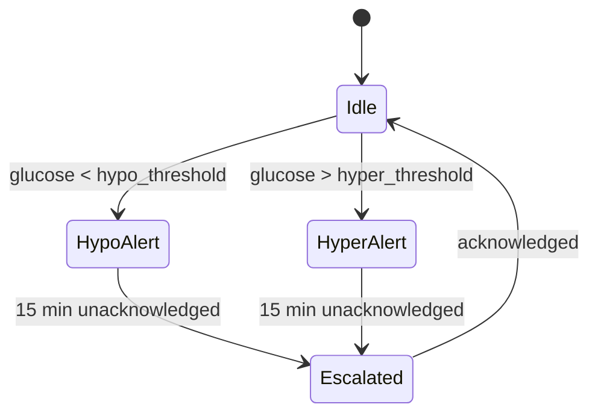

# RESEARCH: V-Model Integration into specs-workflow

## Источник исследования

**Репозиторий**: [leocamello/spec-kit-v-model](https://github.com/leocamello/spec-kit-v-model) v0.4.0
**Тип**: Community extension для [github/spec-kit](https://github.com/github/spec-kit)
**Каталог**: `extensions/catalog.community.json` (official `catalog.json` пустой)
**Статус**: `downloads: 0`, `verified: false`, автор: leocamello

### Структура репозитория

```
spec-kit-v-model/
├── commands/                  ← 8 AI промптов (markdown для Copilot/Claude)
│   ├── requirements.md        — генерация REQ-NNN из spec.md
│   ├── acceptance.md          — генерация ATP/SCN из requirements.md
│   ├── system-design.md       — IEEE 1016 decomposition (SYS-NNN)
│   ├── system-test.md         — ISO 29119-4 system tests (STP/STS)
│   ├── architecture-design.md — IEEE 42010/Kruchten 4+1 (ARCH-NNN)
│   ├── integration-test.md    — ISO 29119-4 integration tests (ITP/ITS)
│   ├── module-design.md       — pseudocode, state machines (MOD-NNN)
│   └── trace.md               — traceability matrix builder
├── templates/                 ← 9 шаблонов для генерируемых файлов
│   ├── requirements-template.md
│   ├── acceptance-plan-template.md
│   ├── system-design-template.md
│   ├── system-test-template.md
│   ├── architecture-design-template.md
│   ├── integration-test-template.md
│   ├── module-design-template.md
│   ├── unit-test-template.md
│   └── traceability-matrix-template.md
├── scripts/
│   ├── bash/                  ← 7 детерминированных скриптов
│   │   ├── validate-requirement-coverage.sh
│   │   ├── validate-system-coverage.sh
│   │   ├── validate-architecture-coverage.sh
│   │   ├── validate-module-coverage.sh
│   │   ├── build-matrix.sh
│   │   ├── diff-requirements.sh
│   │   └── setup-v-model.sh
│   └── powershell/            ← те же 7 на PowerShell (полная паритетность)
├── tests/
│   ├── validators/            ← Python: id_validator.py + уровневые валидаторы
│   ├── bats/                  ← 91 bash тест
│   ├── pester/                ← 91 PowerShell тест
│   ├── evals/                 ← 51 structural + 36 LLM-as-judge
│   └── fixtures/
├── specs/                     ← 4 dogfooding спеки
│   ├── 001-v-model-mvp/
│   ├── 002-system-design-testing/  (v-model: requirements, acceptance, matrix)
│   ├── 003-architecture-integration/ (v-model: +system-design, system-test, arch, integration)
│   └── 004-module-unit/            (v-model: 7 файлов, НЕТ module-design.md и unit-test.md)
├── docs/                      ← 6 документов
│   ├── id-schema-guide.md     — полная документация ID системы
│   ├── compliance-guide.md    — regulatory references
│   ├── v-model-overview.md
│   ├── v-model-config.md
│   ├── product-vision.md
│   └── usage-examples.md
├── extension.yml              ← манифест: 9 commands, 1 hook (after_tasks → trace)
└── config-template.yml        ← конфигурация (output_dir, id_prefixes, coverage_threshold)
```

### Что работает / что нет

| Компонент | Статус | Комментарий |
|-----------|--------|-------------|
| AI промпты (commands/) | Работает | IEEE 29148 quality criteria, strict translator constraint, banned words list |
| Bash скрипты | Работает | 7 скриптов, regex coverage, exit 0/1 |
| PowerShell скрипты | Работает | Полная паритетность с bash |
| Python валидаторы | Работает | ID format regex, hierarchy validation, orphan detection |
| Тесты | 269 штук | 91 bats + 91 pester + 51 structural + 36 LLM-judge |
| Шаблоны | 9 штук | Все уровни V-Model |
| Dogfooding Level 1-3 | Работает | specs 001-003 |
| Dogfooding Level 4 | НЕ обкатано | spec 004: нет module-design.md, unit-test.md |
| CLI install | Не работает | `specify extension search` не видит community catalog |

---

## Принципы V-Model Extension Pack

### "Scripts Verify, AI Generates"

AI (Copilot/Claude) генерирует контент файлов. Детерминированные скрипты (regex) валидируют:
- Покрытие (каждый REQ имеет ATP, каждый SYS имеет STP, и т.д.)
- Формат ID (regex validation)
- Orphans (тесты без requirements)
- Gaps (requirements без тестов)

AI **не** оценивает собственное покрытие. Только скрипт может сказать "100% coverage".

### Paired Generation

Каждый design-документ **парен** с test-документом:
- requirements.md ↔ acceptance-plan.md
- system-design.md ↔ system-test.md
- architecture-design.md ↔ integration-test.md
- module-design.md ↔ unit-test.md

### Progressive Traceability

`trace` команда запускается 4 раза — после каждой пары:
1. После acceptance → Matrix A
2. После system-test → Matrix A+B
3. После integration-test → Matrix A+B+C
4. После unit-test → Matrix A+B+C+D

Gaps ловятся на каждом уровне, а не в конце.

---

## ID Schema

### 12 типов ID, 4 уровня

| Уровень | Design ID | Test Case ID | Test Step ID | Matrix |
|---------|-----------|-------------|-------------|--------|
| Requirements ↔ Acceptance | `REQ-NNN` | `ATP-NNN-X` | `SCN-NNN-X#` | A |
| System ↔ System Test | `SYS-NNN` | `STP-NNN-X` | `STS-NNN-X#` | B |
| Architecture ↔ Integration | `ARCH-NNN` | `ITP-NNN-X` | `ITS-NNN-X#` | C |
| Module ↔ Unit Test | `MOD-NNN` | `UTP-NNN-X` | `UTS-NNN-X#` | D |

### Regex паттерны (из `tests/validators/id_validator.py`)

```python
ID_PATTERNS = {
    "REQ":  re.compile(r"REQ-(?:[A-Z]+-)?[0-9]{3}"),       # REQ-001, REQ-NF-001
    "ATP":  re.compile(r"ATP-(?:[A-Z]+-)?[0-9]{3}-[A-Z]"),  # ATP-001-A
    "SCN":  re.compile(r"SCN-(?:[A-Z]+-)?[0-9]{3}-[A-Z][0-9]+"),  # SCN-001-A1
    "SYS":  re.compile(r"SYS-[0-9]{3}"),                    # SYS-001
    "STP":  re.compile(r"STP-[0-9]{3}-[A-Z]"),              # STP-001-A
    "STS":  re.compile(r"STS-[0-9]{3}-[A-Z][0-9]+"),        # STS-001-A1
    "ARCH": re.compile(r"ARCH-[0-9]{3}"),                    # ARCH-001
    "ITP":  re.compile(r"ITP-[0-9]{3}-[A-Z]"),              # ITP-001-A
    "ITS":  re.compile(r"ITS-[0-9]{3}-[A-Z][0-9]+"),        # ITS-001-A1
    "MOD":  re.compile(r"MOD-[0-9]{3}"),                     # MOD-001
    "UTP":  re.compile(r"UTP-[0-9]{3}-[A-Z]"),              # UTP-001-A
    "UTS":  re.compile(r"UTS-[0-9]{3}-[A-Z][0-9]+"),        # UTS-001-A1
}
```

### Category prefixes (только для REQ/ATP/SCN)

| Prefix | Category | Пример |
|--------|----------|--------|
| *(none)* | Functional | `REQ-001` |
| `NF` | Non-Functional | `REQ-NF-001` |
| `IF` | Interface | `REQ-IF-001` |
| `CN` | Constraint | `REQ-CN-001` |

### Два типа трассируемости

**Intra-level (внутри уровня)** — закодировано в ID:
```
REQ-003  →  ATP-003-A  →  SCN-003-A1
     ^^^        ^^^
     "003" IS the link
```

**Inter-level (между уровнями)** — explicit field в файле:
```markdown
### Decomposition View
| SYS ID | Component | Parent Requirements |
| SYS-001 | SensorService | REQ-001, REQ-NF-002 |
```

Скрипт `build-matrix.sh` парсит `Parent Requirements` / `Parent System Components` / `Parent Architecture Modules` из конкретных секций (section-scoped regex).

---

## Сравнение: наш specs-workflow vs spec-kit-v-model

### Что есть у нас, чего нет у них

| Фича | Наша реализация | Аналог в spec-kit-v-model |
|------|-----------------|---------------------------|
| 13-файловая структура спеки | USER_STORIES, USE_CASES, RESEARCH, FR, NFR, AC, REQUIREMENTS, DESIGN, TASKS, FILE_CHANGES, CHANGELOG, README, .feature | spec.md (один файл) + checklists/ |
| 4-фазный workflow с STOP-точками | Phase 1 → 1.5 → 2 → 3 → 3+ | Нет фаз, линейная цепочка команд |
| @featureN cross-ref теги | FR.md ↔ .feature ↔ tests ↔ TASKS.md | Нет |
| EARS формат AC | WHEN...THEN...SHALL | SCN в BDD Given/When/Then (другой формат) |
| Phase 1.5 context analysis | Сканирование .claude/rules/, extensions/ | Нет |
| analyze-features.ps1 step mining | Извлечение паттернов из существующих .feature | Нет |
| Audit 5 категорий | ERRORS, LOGIC_GAPS, INCONSISTENCY, RUDIMENTS, FANTASIES | Нет (только coverage check) |
| TDD task ordering | Phase 0 Red → Phase N Green → Refactor | Нет |
| Smart merge hooks | .claude/settings.json hooks management | Нет |

### Что есть у них, чего нет у нас

| Фича | Их реализация | Аналог у нас |
|------|---------------|--------------|
| 4-уровневая V-Model трассируемость | REQ→ATP→SCN, SYS→STP→STS, ARCH→ITP→ITS, MOD→UTP→UTS | Только FR→AC→@featureN (1 уровень) |
| Self-documenting ID schema | ATP-003-A кодирует parent REQ-003 | Нет (FR-1 ↔ AC-1 — конвенция, не encoding) |
| Детерминированная coverage validation | 4 скрипта × 2 (bash+ps) с exit code 0/1 | validate-spec.ps1 проверяет формат, не coverage |
| Quadruple traceability matrix | Matrix A+B+C+D auto-generated | Ручная таблица в REQUIREMENTS.md |
| IEEE 29148 requirements quality | 8 criteria, banned words, strict translator | Нет формализованных критериев качества |
| Verification Method per requirement | Test/Inspection/Analysis/Demonstration | Нет |
| Inter-level explicit links | Parent Requirements field в файле | Нет (всё через @featureN) |
| Progressive matrix building | trace 4 раза, gaps на каждом уровне | Нет |

---

## Что переиспользуем / адаптируем / не берём

### Прямое переиспользование (адаптация формата)

| Что | Откуда | Что меняем |
|-----|--------|------------|
| ID regex паттерны (12 типов) | `tests/validators/id_validator.py` | Python → PowerShell (синтаксис regex одинаковый) |
| Hierarchy validation logic | `id_validator.py`: `validate_hierarchy()`, `validate_arch_hierarchy()`, `validate_mod_hierarchy()` | Портирование 3 функций |
| 9 шаблонов v-model/ | `templates/*.md.template` | Добавить наши плейсхолдеры `{FEATURE_NAME}`, `{FEATURE_SLUG}` |
| 4 coverage скрипта | `scripts/powershell/validate-*-coverage.ps1` | Объединить в 1 скрипт с `-Level` параметром |
| Matrix builder | `scripts/powershell/build-matrix.ps1` | Адаптировать output формат |

### Как reference (не копируем код, берём идеи)

| Что | Зачем |
|-----|-------|
| `commands/requirements.md` — AI промпт | IEEE 29148 criteria, banned words → для specs-management.md Phase 2A |
| `commands/trace.md` — matrix presentation format | Для spec-status.ps1 V-Model секции |
| `docs/id-schema-guide.md` — полная документация | Для нашей документации |

### Не берём

| Что | Почему |
|-----|--------|
| `commands/acceptance.md` — отдельный ATP генератор | У нас AC уже есть + EARS формат |
| `scripts/bash/setup-v-model.sh` | У нас scaffold-spec.ps1 |
| `.specify/` infrastructure | Spec-kit specific |
| `tests/evals/` — LLM-as-judge | Не в scope |
| Bottom 2 levels (module + unit) | Не обкатаны даже автором |

---

## Решение по подходу интеграции

### Подход A: Наш specs-workflow = база, V-Model = опциональный слой

**Почему выбран**:
- Backward compatible на 100%
- Наши уникальные фичи (EARS, @featureN, Phase 1.5, audit 5 категорий, TDD ordering) сохраняются
- V-Model как WARNING, не ERROR — мягкий onboarding
- Spec-kit-v-model тоже спроектирован как add-on layer

**Что это значит**:
- 13 файлов остаются обязательными
- v-model/ подпапка — опциональная, создаётся scaffold-spec.ps1
- Существующие спеки не ломаются
- Новые V-Model правила в validate-spec.ps1 — severity: WARNING

---

## Project Context & Constraints

### Relevant Rules

| Rule | Path | Summary | Impacts |
|------|------|---------|---------|
| specs-management | `.claude/rules/specs-management.md` | 4-фазный workflow с STOP-точками, Phase 1.5 context analysis | Phase 2 расширяется sub-phases 2A-2E |
| specs-validation | `.claude/rules/specs-validation.md` | @featureN cross-ref, 13 файлов = полная фича | Добавляется "with V-Model" definition |
| extension-manifest-integrity | `.claude/rules/extension-manifest-integrity.md` | toolFiles must cover all files | Новые шаблоны/скрипты → в extension.json |
| updater-sync-tools-hooks | `.claude/rules/updater-sync-tools-hooks.md` | tools обновляются вместе с commands | Новые скрипты → в toolFiles |

### Existing Patterns & Extensions

| Source | Path | What It Provides | Relevance |
|--------|------|------------------|-----------|
| specs-workflow extension | `extensions/specs-workflow/` | 4 фазы, scaffold/validate/audit/analyze скрипты | База для расширения |
| validate-spec.ps1 | `extensions/.../validate-spec.ps1` (501 строк) | 10 правил валидации | Добавляем 3 WARNING правила |
| audit-spec.ps1 | `extensions/.../audit-spec.ps1` (641 строка) | 7 checks + AI pending | Добавляем 3 checks + 4 AI |
| scaffold-spec.ps1 | `extensions/.../scaffold-spec.ps1` | Создаёт 14 файлов из templates/ | Добавляем создание v-model/ |
| id_validator.py | `leocamello/spec-kit-v-model/tests/validators/` | 12 ID regex, hierarchy validation | Портируем в PowerShell |

### Architectural Constraints Summary

- V-Model правила — ТОЛЬКО WARNING, не ERROR (backward compat)
- Все V-Model проверки обёрнуты в `if (Test-Path v-model/)` — пропускаются для старых спеков
- `$requiredFiles` в validate-spec.ps1 НЕ меняется
- specs-validator TypeScript `REQUIRED_MD_FILES` НЕ меняется
- Мост FR-N ↔ REQ-NNN через explicit field в файлах, не через ID encoding

---

## Глубокий анализ: промпты, валидация, шаблоны

### 1. Промпты: specs-management.md vs V-Model commands

#### Масштаб и структура

| Метрика | Наш specs-management.md | V-Model commands/ (8 файлов) |
|---------|------------------------|------------------------------|
| Объём | ~400 строк (1 файл, весь workflow) | ~2,400 строк суммарно (8 файлов, по 1 на артефакт) |
| Scope | Все 4 фазы + 13 файлов в одном промпте | Каждый артефакт — отдельный prompt с isolation |
| Setup | Нет (работает с существующей папкой) | JSON-выводящий скрипт (`setup-v-model.sh -Json`) → агент парсит paths |
| Handoffs | Нет (линейный workflow с STOP-точками) | Explicit handoffs между командами (`label: Generate System Tests`) |
| Templates | Ссылается на templates/ в scaffold-spec.ps1 | Каждый prompt загружает свой template explicit (`Load the template: Read templates/X-template.md`) |

#### Детализация инструкций (конкретный пример: генерация требований)

**Наш specs-management.md Phase 2:**
```
2. Заполнить FR.md (формат: ## FR-N: {Название})
3. Заполнить NFR.md (секции: Performance, Security, Reliability, Usability)
4. Заполнить ACCEPTANCE_CRITERIA.md (EARS формат)
```
3 строки. Формат задан, но НЕТ: критериев качества, banned words, verification method, rationale, категоризации REQ.

**V-Model commands/requirements.md:**
- 8 quality criteria с примерами fail→fix (§4.1-§4.8, ~200 строк)
- 15 banned words с заменами (таблица, ~30 строк)
- 4 категории REQ с prefix encoding (functional/NF/interface/constraint)
- Verification Method per REQ (Test/Inspection/Analysis/Demonstration)
- Rationale per REQ (backward trace к бизнес-потребности)
- Strict translator constraint с конкретными DO/DO NOT правилами
- Conflict detection: `[CONFLICT: REQ-N vs REQ-M]`
- Feasibility flagging: `[FEASIBILITY CONCERN: reason]`
- Derived requirement detection: `[DERIVED REQUIREMENT: description]`
- Выходной формат (header, overview, 4 tables, assumptions, dependencies, glossary, summary metrics)

**Вывод:** V-Model prompt на порядок детальнее. Наш промпт задаёт формат, но не контролирует семантическое качество. AI может написать "система должна быть быстрой" и пройти нашу валидацию.

#### Что V-Model prompt делает, а наш нет

| Аспект | V-Model | Наш |
|--------|---------|-----|
| **Quality gate per requirement** | 8 criteria check, banned words → rewrite loop | Нет — формат-валидация post-hoc |
| **Anti-gold-plating** | Strict translator: "DO NOT invent features not in source" | Нет — AI может додумать |
| **Category routing** | REQ-NF-001, REQ-IF-001, REQ-CN-001 → разный подход к каждому | Нет — все FR одинаковые |
| **Atomicity enforcement** | "Split compound AND/OR into separate REQ" с примером | Нет |
| **Consistency check** | "Cross-reference for conflicts → [CONFLICT]" | Нет |
| **Scale handling** | "Handle 50+ REQ inputs without truncation" | Нет |

#### Что наш prompt делает, а V-Model нет

| Аспект | Наш | V-Model |
|--------|-----|---------|
| **EARS формат AC** | WHEN...THEN...SHALL (structured) | Given/When/Then (BDD — менее формальный) |
| **@featureN cross-ref** | FR↔AC↔BDD↔Tests↔TASKS | Нет (связь только через ID) |
| **Phase 1.5 context analysis** | Сканирование .claude/rules/ и extensions/ | Нет (нет awareness of project rules) |
| **analyze-features.ps1** | Step mining из существующих .feature | Нет (каждый feature с нуля) |
| **Audit 5 категорий** | ERRORS, LOGIC_GAPS, INCONSISTENCY, RUDIMENTS, FANTASIES | Нет (только coverage check) |
| **TDD task ordering** | Phase 0 Red → Phase N Green → Refactor | Нет (линейные команды) |
| **BDD Test Infrastructure** | Hooks, cleanup strategy, shared context | Нет |
| **Full lifecycle** | USER_STORIES → USE_CASES → FR → ... → TASKS → FILE_CHANGES | Только requirements → tests |

---

### 2. Валидация: validate-spec.ps1 vs V-Model coverage scripts

#### Наш validate-spec.ps1 (501 строк, 11 правил)

| Правило | Severity | Что проверяет | Тип проверки |
|---------|----------|--------------|-------------|
| STRUCTURE | ERROR | 12 обязательных MD файлов + .feature | Exists check |
| PLACEHOLDER | WARNING | Незаполненные `{placeholder}` | Regex |
| FR_FORMAT | ERROR | `## FR-N:` headers в FR.md | Regex |
| UC_FORMAT | ERROR | `## UC-N:` headers в USE_CASES.md | Regex |
| EARS_FORMAT | WARNING | `WHEN/IF...THEN...SHALL` в AC.md | Regex |
| NFR_SECTIONS | WARNING | Performance/Security/Reliability/Usability | Header check |
| FEATURE_NAMING | WARNING | `{DOMAIN}{NNN}_{Название}` | Regex |
| CONTEXT_SECTION | WARNING | `## Project Context & Constraints` в RESEARCH.md | Header check |
| TDD_TASK_ORDER | WARNING | Phase 0 BDD Foundation в TASKS.md | Regex |
| CROSS_REF_LINKS | WARNING | Markdown `[text](file.md#anchor)` — файл и якорь существуют | Link resolution |
| LINK_VALIDITY | WARNING | FR/AC/NFR — кликабельные ссылки, не plain text | Regex |

**Что НЕ проверяет:**
- ❌ Coverage (FR→AC, AC→BDD, requirement→test case)
- ❌ Качество требований (banned words, ambiguity)
- ❌ ID format (regex validation для REQ-NNN, SYS-NNN)
- ❌ Hierarchy validation (ATP-003-A → REQ-003 exists)
- ❌ Orphan detection (test without requirement)
- ❌ Inter-level traceability (SYS→REQ explicit field)

#### V-Model coverage scripts (4 × bash + 4 × PowerShell)

| Скрипт | Что проверяет | Алгоритм |
|--------|--------------|----------|
| validate-requirement-coverage | REQ↔ATP pairs | Parse REQ IDs from requirements.md, ATP IDs from acceptance-plan.md. Forward: each REQ→at least 1 ATP. Backward: each ATP→valid REQ. |
| validate-system-coverage | SYS↔STP pairs | Parse SYS from Decomposition View, STP from system-test.md. Same forward/backward + orphan check. |
| validate-architecture-coverage | ARCH↔ITP pairs | Parse ARCH from Logical View, ITP from integration-test.md. + `[CROSS-CUTTING]` handling. |
| validate-module-coverage | MOD↔UTP pairs | Parse MOD from module-design.md, UTP from unit-test.md. + `[EXTERNAL]` handling. |
| build-matrix | Quadruple matrix | Section-scoped regex парсит Parent Requirements/Components/Modules из конкретных view-таблиц. |
| diff-requirements | Requirement changes | Diff between old and new requirements.md — added/removed/modified REQs. |
| setup-v-model | Environment | Creates v-model/ dir, outputs JSON с paths для AI agent. |

**Что V-Model НЕ проверяет (а мы проверяем):**
- ❌ Структуру 13 файлов (у них нет этой концепции)
- ❌ @featureN cross-ref (у них нет тегов)
- ❌ EARS формат AC
- ❌ TDD task ordering
- ❌ Markdown link validity (broken anchors)
- ❌ Terminology consistency (PascalCase/camelCase variants)

#### Ключевое различие

**Мы:** format-first валидация (файлы есть? формат верный? ссылки работают?)

**V-Model:** coverage-first валидация (каждый requirement имеет тест? каждый тест имеет requirement? нет orphans?)

Это комплементарные подходы — format без coverage не гарантирует покрытия, coverage без format не гарантирует навигацию.

---

### 3. Audit: audit-spec.ps1 vs trace.md + build-matrix

#### Наш audit-spec.ps1 (641 строк, 7 checks + 9 AI pending)

**Автоматические проверки (deterministic):**

| Check | Категория | Что ловит |
|-------|----------|----------|
| FR_AC_COVERAGE | LOGIC_GAPS | FR-N без AC-N(FR-N) в AC.md |
| FR_BDD_COVERAGE | LOGIC_GAPS | @featureN в FR/AC без BDD scenario + orphan @featureN в .feature |
| REQUIREMENTS_TRACEABILITY | LOGIC_GAPS | FR-N не referenced в REQUIREMENTS.md |
| TASKS_FR_REFS | LOGIC_GAPS | FR-N не referenced в TASKS.md |
| OPEN_QUESTIONS | RUDIMENTS | Unclosed `- [ ]` в RESEARCH.md |
| TERM_CONSISTENCY | INCONSISTENCY | PascalCase/camelCase варианты одного термина |
| LINK_VALIDITY | INCONSISTENCY | Plain text FR/AC refs вместо clickable links |

**AI pending checks (не автоматизированы):**
- DESIGN.md → code existence check
- FILE_CHANGES.md → edit targets exist, create targets don't
- "Need to add" / "TODO" → may already exist
- Domain naming consistency
- RESEARCH.md API assumptions without proof
- Untested claims as facts
- Scope creep (client in server spec)
- Open questions answered elsewhere

#### V-Model trace.md + build-matrix

**trace.md (AI prompt):**
- Строит полную traceability matrix из всех существующих V-Model файлов
- Forward coverage: requirement → test chain
- Backward coverage: test → requirement chain
- Gap identification: items without test, tests without item
- Matrix A+B+C+D incremental building

**build-matrix.sh/ps1 (deterministic script):**
- Section-scoped regex парсит `Parent Requirements` / `Parent System Components` / `Parent Architecture Modules`
- Строит inter-level links автоматически
- Выявляет orphans на каждом уровне

#### Overlap и gaps

| Функция | Наш audit | V-Model trace |
|---------|-----------|---------------|
| FR→AC coverage | ✅ FR_AC_COVERAGE | ✅ REQ→ATP (но через ID, не header matching) |
| FR→BDD coverage | ✅ FR_BDD_COVERAGE via @featureN | ❌ Нет (нет @featureN) |
| Multi-level coverage | ❌ Только FR→AC (1 уровень) | ✅ REQ→ATP→SYS→STP→ARCH→ITP→MOD→UTP (4 уровня) |
| Requirement→TASKS tracing | ✅ TASKS_FR_REFS | ❌ Нет |
| Terminology check | ✅ TERM_CONSISTENCY | ❌ Нет |
| Open questions | ✅ OPEN_QUESTIONS | ❌ Нет |
| Code existence | 🔄 AI pending | ❌ Нет (не работает с кодом) |
| API assumptions | 🔄 AI pending | ❌ Нет |
| Orphan tests | ❌ (partial via @featureN) | ✅ Backward coverage на каждом уровне |
| Inter-level matrix | ❌ | ✅ build-matrix auto-generation |
| Progressive gaps | ❌ (one-shot) | ✅ Matrix A → A+B → A+B+C → A+B+C+D |

---

### 4. Шаблоны: DESIGN.md.template vs system-design-template.md

#### Наш DESIGN.md.template (70 строк)

Секции:
1. Реализуемые требования (список ссылок FR-N)
2. Компоненты (bullet list)
3. Где лежит реализация (paths)
4. Директории и файлы (paths)
5. Алгоритм (пронумерованные шаги)
6. API (endpoint description)
7. BDD Test Infrastructure (hooks, cleanup, fixtures, shared context)

**Характеристика:** Свободная форма, нет mandatory views, нет traceability encoding, нет coverage gate. Секции — guidelines, а не constraints. AI заполняет как считает нужным.

#### V-Model system-design-template.md (~50 строк)

Секции:
1. Header (Feature Name, Branch, Date, Source reference)
2. Overview
3. ID Schema (SYS-NNN → REQ-NNN relationship documentation)
4. **Decomposition View (IEEE 1016 §5.1)** — SYS ID | Name | Description | Parent Requirements | Type
5. **Dependency View (IEEE 1016 §5.2)** — Source | Target | Relationship | Failure Impact + Diagram
6. **Interface View (IEEE 1016 §5.3)** — External + Internal interfaces (раздельные таблицы)
7. **Data Design View (IEEE 1016 §5.4)** — Entity | Component | Storage | Protection at Rest/Transit | Retention
8. Coverage Summary — Total SYS, Coverage %, Components per Type
9. Derived Requirements
10. Glossary

**Характеристика:** Жёсткая структура. 4 mandatory views с конкретными колонками таблиц. Coverage Summary с метриками. Derived Requirements section для HALT-worthy items.

#### Ключевое различие

| Аспект | Наш DESIGN.md | V-Model system-design |
|--------|--------------|----------------------|
| **Views** | 0 mandatory views | 4 mandatory IEEE 1016 views |
| **Tables** | Свободная форма | Конкретные колонки для каждого view |
| **Traceability** | Ссылки FR-N (reference) | Parent Requirements field (encoded traceability) |
| **Coverage** | Нет метрик | Coverage Summary: N/M REQs covered (%) |
| **Dependencies** | Bullet list | Dependency View: Source→Target→Failure Impact |
| **Interfaces** | API endpoint описание | External + Internal раздельно, с Error Handling |
| **Data** | Нет | Data Design: Storage, Protection, Retention |
| **Derived items** | Нет | `[DERIVED REQUIREMENT]` section с HALT |
| **BDD Infrastructure** | ✅ (hooks, cleanup, shared context) | ❌ (нет awareness of test infrastructure) |

**Аналогичная разница** для architecture-design-template.md (4 Kruchten views, Mermaid diagrams, CROSS-CUTTING tags) и module-design-template.md (pseudocode, state machines, data structures, error handling).

---

### 5. Конкретные примеры из dogfooding спек

#### Пример: specs/002-system-design-testing

Реальный generated requirements.md содержит:
- 16 REQ items (REQ-001..REQ-016)
- Каждый с: Description, Priority (P1/P2/P3), Rationale, Verification Method
- Banned words отсутствуют (проверено: ни одного "fast", "robust", "seamless")
- Category prefixes: REQ-001 (functional), REQ-NF-001 (non-functional)

Реальный generated acceptance-plan.md содержит:
- 16 ATP items (ATP-001-A..ATP-016-A), ровно 1:1 с REQ
- 35 SCN scenarios (SCN-001-A1..SCN-016-A3)
- Каждый ATP: Technique (Requirements-Based Testing), Test Type (Positive/Negative/Boundary)
- Coverage Summary: "16/16 REQs covered (100%)"

#### Пример: specs/003-architecture-integration

Реальный generated architecture-design.md содержит:
- 14 ARCH items (ARCH-001..ARCH-014)
- 2 `[CROSS-CUTTING]` modules: ARCH-010 (Logger), ARCH-014 (Config Manager)
- Logical View: 14 rows с Parent System Components
- Process View: 3 Mermaid sequenceDiagram
- Interface View: Input/Output/Exception для КАЖДОГО ARCH (ни одного "black box")
- Data Flow View: 5 data transformation chains
- Coverage: "11/11 SYS covered (100%)"

#### Пример: specs/004-module-unit (НЕ обкатано)

7 v-model файлов существуют (requirements, acceptance, system-design, system-test, architecture-design, integration-test, traceability-matrix). **НО:** module-design.md и unit-test.md **отсутствуют** — level 4 не обкатан даже автором.

Traceability matrix содержит 160KB данных — 3 уровня полностью заполнены, 4-й пустой.

---

### 6. Сводная таблица: что берём из V-Model для каждого FR

| FR | Что берём из V-Model | Что адаптируем/сохраняем от нас |
|----|---------------------|-------------------------------|
| FR-1 (IEEE 29148) | 8 criteria, 15 banned words, strict translator, verification method, 4 categories | EARS формат AC (вместо их BDD-only), @featureN cross-ref |
| FR-2 (Coverage) | 4 coverage scripts logic, exit 0/1, forward/backward/orphan/gap, build-matrix | Наши audit 5 категорий + AI semantic checks |
| FR-3 (ID schema) | 12 ID types, regex patterns, intra-level encoding, inter-level explicit fields | Мост FR-N ↔ REQ-NNN (не замена, а дополнение) |
| FR-4 (Design levels) | 3 IEEE standards, 12 mandatory views, derived detection, anti-pattern guards | Наш DESIGN.md (BDD Test Infrastructure) → сохраняется для нашего уровня |
| FR-5 (Paired gen) | 4 design↔test pairs, named techniques, language mandates, progressive matrix | TDD task ordering (Phase 0 Red), Phase 1.5 context analysis |

---

## Дополнительные паттерны для заимствования

### 7. Acceptance Test Quality Criteria (из acceptance.md)

У нас AC пишется в EARS формате (WHEN...THEN...SHALL) без формализованных критериев качества. У них — **два набора quality criteria** на разных уровнях:

#### 4 Test Case Quality Criteria (уровень ATP)

| # | Критерий | Что значит | Наш аналог |
|---|----------|-----------|------------|
| 1 | **Traceable** | Каждый ATP → ровно 1 REQ. ID-encoding: ATP-003-A → REQ-003 | У нас AC-N(FR-N) — формат есть, но не enforcement |
| 2 | **Independent** | ATP работает в любом порядке, не зависит от state предыдущего | Нет. BDD сценарии могут быть зависимы |
| 3 | **Repeatable** | 100 запусков = 100 одинаковых результатов. Нет live data, random, time-dependent | Нет enforcement. Сценарии могут быть non-deterministic |
| 4 | **Clear Expected Result** | "It works" — НЕ expected result. Конкретный HTTP 200, JSON body, DB state | Нет. EARS формат задаёт SHALL, но не конкретность |

**Пример fail → fix:**
- ❌ "Verify the user can log out" → зависит от login в предыдущем тесте
- ✅ "Verify a logged-in user can successfully log out and invalidate their session token" → owns preconditions

#### 4 Scenario Quality Criteria (уровень SCN/BDD)

| # | Критерий | Что значит | Наш аналог |
|---|----------|-----------|------------|
| 1 | **Declarative** | Поведение, не UI mechanics. "user authenticates" ≠ "types into #username-input" | Нет. analyze-features.ps1 не проверяет imperative |
| 2 | **Single Action** | "One When Rule" — один When per scenario. Два действия → split | Нет |
| 3 | **Strict Preconditions** | Given полностью описывает state. "user wants to buy" ❌ → "cart contains 1 item SKU-001 $29.99" ✅ | Нет enforcement |
| 4 | **Observable Outcomes** | Then = assert-able: HTTP code, DB state, specific text. "processes quickly" ❌ | Нет |

**Ценность:** Можно добавить как checklist в specs-management.md Phase 2 при генерации AC и .feature файлов.

---

### 8. Incremental Updates + Diff (из acceptance.md)

**Паттерн:** При обновлении существующих спек не регенерировать всё — diff и обновить только изменённое.

**Как работает:**
1. `diff-requirements.sh` сравнивает old vs new requirements.md
2. Выдаёт JSON: `{ added: [...], modified: [...], removed: [...] }`
3. **Added REQs** → генерация новых ATP/SCN, append
4. **Modified REQs** → регенерация только их ATP/SCN, replace in-place
5. **Removed REQs** → `[DEPRECATED]` tag (НЕ удалять — юзер подтверждает)
6. **Unchanged REQs** → НЕ трогать

**Наш аналог:** У нас нет diff. При "обнови спеки" AI перечитывает всё и может перезаписать / сломать. Это рискованно.

**Ценность:** `[DEPRECATED]` tag вместо удаления + diff-based incremental updates = безопаснее и быстрее.

---

### 9. Batch Processing (из acceptance.md + config)

**Паттерн:** Обработка требований батчами по 5 штук:
1. Process REQ-001..REQ-005 → write to file
2. Process REQ-006..REQ-010 → append
3. ...
4. After ALL batches → run coverage validation

**Зачем:** Предотвращает token bloat и quality degradation при большом количестве требований. AI не теряет контекст на 50-м требовании.

**Configurable:** `batch_size: 5` в config-template.yml.

**Наш аналог:** У нас нет batching. AI генерирует все FR/AC за один промпт. На больших спеках качество может деградировать.

---

### 10. Execution State в Traceability Matrix (из trace.md)

**Паттерн:** Каждый элемент матрицы имеет execution status:

| Статус | Значение |
|--------|---------|
| ⬜ Pending Execution | Тест существует, но не запускался |
| ✅ Passed | Запущен и прошёл |
| ❌ Failed | Запущен и упал |
| 🚫 Blocked | Не может быть запущен (зависимость) |
| ⏸️ Deferred | Сознательно отложен (с обоснованием) |

**MVP:** Все элементы = ⬜ Pending. Позже — pull из CI/CD.

**Наш аналог:** Нет. TASKS.md имеет `- [x]`/`- [ ]`, но это не per-test-case status.

**Ценность:** Аудитор видит не только "тест существует", а "тест запущен и прошёл". Это requirement для DO-178C, ISO 26262.

---

### 11. 4 Pillars of Regulatory Traceability (из trace.md)

**Pillar 1: Strict Bidirectionality**
- Forward: REQ → ATP → SCN (no gaps = no untested features)
- Backward: SCN → ATP → REQ (no orphans = no undocumented behavior)

**Pillar 2: Orphan & Gap Analysis**
- Gaps: REQ without ATP (incomplete)
- Orphans: ATP/SCN without REQ (compliance failure)
- Explicit section в report

**Pillar 3: Versioning and Baselines**
- File modification timestamps
- Git commit SHA
- Matrix reflects CURRENT state, not stale draft
- Baseline Information section в report

**Pillar 4: Granular Execution State**
- Per-element ⬜/✅/❌/🚫/⏸️
- Будущее: CI/CD integration

**Наш аналог:** audit-spec.ps1 делает partial Pillar 1 (FR→AC forward), partial Pillar 2 (orphan @featureN). Pillars 3 и 4 отсутствуют полностью.

---

### 12. 3-Section Report Format (из trace.md)

**Паттерн:** Trace output ВСЕГДА в 3 секциях:

1. **Coverage Audit (The Math)** — числа, проценты, PASS/FAIL per direction
2. **Exception Report** — конкретный список gaps и orphans (не проигнорируешь)
3. **Traceability Matrices** — полные таблицы (Matrix A, B, C, D)

+ **Baseline Information** — timestamps, paths, git SHA

**Наш аналог:** audit-spec.ps1 выдаёт findings list по категориям. Нет structured math section, нет baseline info.

**Ценность:** Аудитор в первую очередь смотрит на Coverage Audit. Один взгляд → COMPLIANT / NON-COMPLIANT.

---

### 13. Hook: after_tasks → trace (из extension.yml)

**Паттерн:** Автоматический trigger traceability matrix после генерации tasks:

```yaml
hooks:
  after_tasks:
    command: "speckit.v-model.trace"
    optional: true
    prompt: "Run traceability matrix to validate requirement coverage?"
```

**Зачем:** Забыть запустить trace невозможно — hook спрашивает автоматически.

**Наш аналог:** У нас Phase 3+ (Audit) запускается автоматически после СТОП #3. Похожий паттерн, но у нас audit, а не trace matrix.

**Ценность:** Можно добавить hook для автоматического запуска coverage check после Phase 2 (когда появляются FR + AC + .feature).

---

### 14. Handoffs между командами (из extension.yml + commands)

**Паттерн:** Каждая команда имеет explicit handoffs — куда идти дальше:

```yaml
handoffs:
  - label: "Generate System Tests"
    agent: speckit.v-model.system-test
    prompt: "Generate the system test plan for this system design"
    send: true
  - label: "Back to Requirements"
    agent: speckit.v-model.requirements
    prompt: "Review or update requirements"
```

**Зачем:** AI-агент знает следующий шаг. Не нужно читать документацию workflow. Prompt chains.

**Наш аналог:** specs-management.md описывает workflow текстом: "Phase 1 → Phase 1.5 → Phase 2 → Phase 3". Нет structured handoffs.

**Ценность:** Structured handoffs → AI может автоматически предложить "Next: generate system tests" вместо ожидания инструкции.

---

### 15. Compliance Artifact Mapping (из compliance-guide.md)

**Паттерн:** Таблица маппинга: "Standard Clause → V-Model Artifact":

| IEC 62304 Clause | Required Artifact | V-Model Artifact |
|-----------------|-------------------|-----------------|
| 5.2 Software Requirements Analysis | Software Requirements Specification | requirements.md |
| 5.7.1 Verification Strategy | Verification plan for each requirement | acceptance-plan.md |
| 5.7.4 Software Requirements Verification | Traceability of requirements to tests | traceability-matrix.md |

Аналогичные таблицы для ISO 26262, DO-178C, FDA 21 CFR Part 820, IEC 61508.

**Наш аналог:** Нет. Мы не маппим наши файлы к стандартам.

**Ценность:** Для regulated domains (медтех, автомобили, авиация) — критично. Можно добавить как опциональную секцию в REQUIREMENTS.md или отдельный compliance-map.md.

---

### 16. Pre-Audit Checklist (из compliance-guide.md)

**Паттерн:**
1. Run trace → generate current matrix
2. Verify "OVERALL STATUS: ✅ COMPLIANT"
3. Verify 0 items in Exception Report
4. Check Baseline Information for current timestamps
5. Ensure all source files committed to git
6. Archive traceability-matrix.md as audit artifact

**Наш аналог:** Нет. Нет DoD для "спека готова к ревью/аудиту".

---

### 17. Common Audit Findings Prevention (из compliance-guide.md)

| Finding | Prevention |
|---------|-----------|
| Requirement without test case | trace → gaps in Exception Report |
| Test case without requirement (orphan) | trace → orphans in Exception Report |
| Vague requirement ("shall be fast") | Criterion 1 (Unambiguous) + Banned Words |
| Compound requirement hiding untested behavior | Criterion 3 (Atomic) in requirements |
| Test case dependent on other test state | Criterion 2 (Independent) in acceptance |
| Non-repeatable test | Criterion 3 (Repeatable) in acceptance |

**Ценность:** Это готовый preventive checklist — можно добавить в audit-spec.ps1 как дополнительные проверки.

---

### 18. Config-Driven Customization (из config-template.yml)

```yaml
output_dir: "v-model"
id_prefixes:
  requirements: "REQ"
  test_cases: "ATP"
  scenarios: "SCN"
coverage_threshold: 100
batch_size: 5
categories:
  functional: true
  non_functional: true
  interface: true
  constraint: true
verification_methods:
  - "Test"
  - "Inspection"
  - "Analysis"
  - "Demonstration"
```

**Наш аналог:** Нет конфига. Всё hardcoded в промптах и скриптах.

**Ценность:** Configurable coverage_threshold (100% может быть overkill для MVP), configurable batch_size, toggleable categories.

---

### 19. Real Medical Device Example (из usage-examples.md)

Полный walkthrough IEC 62304 Class C vital signs monitor — 8 шагов от spec.md до quadruple matrix. Показывает:

1. Как "within 2.0 seconds" заменяет "quickly" (IEEE 29148 Criterion 1)
2. Как boundary conditions генерируются автоматически (ATP-003-B: exact threshold = no alarm)
3. Как safety-critical scenarios отделены (ATP-007-B: distinguish disconnect from flat-line)
4. Как Decomposition View фидит в Boundary Value Analysis tests
5. Как Interface View фидит в Interface Contract Tests
6. Как Fault Injection targets Dependency View specifically

**Ценность:** Готовый reference example для нашей документации. Показывает VALUE V-Model подхода на конкретном домене.

---

## Итого: что ещё брать (сверх FR-1..FR-5)

| # | Что брать | Откуда | Приоритет | Почему |
|---|-----------|--------|-----------|--------|
| 1 | 4+4 Quality Criteria для тестов | acceptance.md | HIGH | Наши AC/BDD без quality enforcement |
| 2 | Incremental diff + [DEPRECATED] tag | acceptance.md | MEDIUM | Безопасные обновления спек |
| 3 | Batch processing requirements | acceptance.md + config | MEDIUM | Quality degradation на больших спеках |
| 4 | Execution State per test (⬜/✅/❌/🚫/⏸️) | trace.md | LOW (MVP) | Для regulated domains |
| 5 | 3-Section report format (Math + Exceptions + Matrix) | trace.md | HIGH | Structured audit-friendly output |
| 6 | Baseline Information (timestamps, git SHA) | trace.md | MEDIUM | Audit trail |
| 7 | Hook: auto-trigger coverage after Phase 2 | extension.yml | HIGH | Нельзя забыть coverage check |
| 8 | Structured handoffs between phases | extension.yml | MEDIUM | AI знает next step |
| 9 | Compliance artifact mapping tables | compliance-guide.md | LOW | Только для regulated |
| 10 | Pre-Audit Checklist | compliance-guide.md | LOW | DoD для "спека готова" |
| 11 | Common Audit Findings Prevention table | compliance-guide.md | MEDIUM | Preventive checks |
| 12 | Config-driven customization | config-template.yml | MEDIUM | Flexibility без hardcode |
| 13 | Medical device reference example | usage-examples.md | LOW | Documentation value |

---

## Расширенный анализ: unit-тесты, evals, lifecycle, философия

### 20. White-Box Unit Test Techniques (из unit-test.md)

У нас unit-тесты не формализованы. У них — **5 обязательных + 2 safety-critical** техники, каждая привязана к конкретному module view:

#### Technique Selection Matrix (какой view → какая техника)

| Module View | Technique | Что тестирует | Когда применять |
|-------------|-----------|---------------|-----------------|
| Algorithmic/Logic View | **Statement & Branch Coverage** | Каждая строка кода и каждый True/False branch | ВСЕГДА (every non-EXTERNAL MOD) |
| Internal Data Structures | **Boundary Value Analysis** | min-1, min, mid, max, max+1 | Scalar ordered types (integers, floats, array lengths) |
| Internal Data Structures | **Equivalence Partitioning** | One representative per valid partition + invalid | Discrete non-scalar (Boolean, Enum) |
| Architecture Interface View | **Strict Isolation** | Dependency & Mock Registry table per UTP | Modules with external dependencies |
| State Machine View | **State Transition Testing** | Valid/invalid transitions, entry/exit actions | Stateful modules (Mermaid stateDiagram-v2) |
| *(safety-critical)* | **MC/DC Coverage** | Boolean truth table: каждое condition independently affects decision | Complex boolean decisions (domain ≠ "") |
| *(safety-critical)* | **Variable-Level Fault Injection** | Corrupt to NULL/zero/max/negative → verify detection | Safety-critical variables (domain ≠ "") |

#### Ключевые паттерны

**1. Arrange/Act/Assert (НЕ Given/When/Then):**
```
UTS-001-A1:
  Arrange: Set input_array = [1, 2, 3] and max_size = 3
  Act: Call validate_array(input_array, max_size)
  Assert: Returns true; internal counter equals 3
```
Unit тесты = white-box, implementation-oriented. BDD (Given/When/Then) = acceptance level.

**2. Dependency & Mock Registry (per UTP):**

| Dependency | Source | Mock/Stub Strategy | Rationale |
|------------|--------|-------------------|-----------|
| ThresholdConfigStore | ARCH Interface View | MockConfigStore | Returns fixed thresholds |
| EventBus | ARCH Interface View | StubEventBus | Records emitted events |

Modules без зависимостей: `"None — module is self-contained."`

**3. Statement & Branch Coverage детализация:**
- True path
- False path
- Loop zero iterations
- Loop one iteration
- Loop N iterations
- Error branches

**4. MC/DC Boolean truth table (safety-critical):**

| Test | A | B | C | Decision | Independence Proof |
|------|---|---|---|----------|-------------------|
| 1 | T | T | F | T | A flips: row 1 vs row 3 |
| 2 | T | F | F | F | B flips: row 1 vs row 2 |

Каждая строка = один UTS scenario.

**5. External Module Bypass:** `[EXTERNAL]` modules skipped entirely — "Module MOD-NNN is [EXTERNAL] — wrapper behavior tested at integration level."

**Наш аналог:** У нас unit тесты не формализованы. DESIGN.md не содержит pseudocode, нет mandatory views для модулей. Нет Dependency & Mock Registry.

**Ценность:**
- Technique Selection Matrix → можно добавить как checklist в specs-management.md Phase 2 при генерации unit-test specs
- Dependency & Mock Registry → решает проблему "какие зависимости мокать?"
- Arrange/Act/Assert формат → чёткое разделение от BDD стиля
- MC/DC для safety-critical → если проект regulated

---

### 21. Dual Eval System: Structural + LLM-as-Judge (из tests/evals/)

**Архитектура:** 31 файл, 2 типа метрик, 8 E2E тестов.

#### 2 типа метрик

| Тип | Количество | Что проверяет | LLM нужен? | Детерминизм |
|-----|-----------|--------------|------------|-------------|
| **Structural** | 8 классов | ID формат, views presence, parent refs, language mandate, template conformance | НЕТ | 100% |
| **LLM-as-judge** | 10 метрик | IEEE 29148 quality, BDD quality, design quality per level | ДА (Gemini) | ~70-90% |

#### 8 Structural Metric классов (deterministic)

| Класс | Что проверяет |
|-------|--------------|
| `StructuralIDMetric` | ID формат + hierarchy (orphans, gaps, duplicates) |
| `StructuralTemplateMetric` | Document template conformance (requirements, acceptance, traceability) |
| `StructuralBDDMetric` | Given/When/Then structure validity |
| `StructuralSystemDesignMetric` | SYS IDs + 4 IEEE 1016 views + Parent Requirements refs |
| `StructuralSystemTestMetric` | STP/STS IDs + ISO 29119 technique naming + NO user-journey phrases |
| `StructuralArchitectureDesignMetric` | ARCH IDs + 4 Kruchten views + Parent System Components refs |
| `StructuralIntegrationTestMetric` | ITP/ITS IDs + integration technique naming + NO user-journey phrases |
| `StructuralModuleDesignMetric` | MOD IDs + `\`\`\`pseudocode\`\`\`` blocks + 4 required views + Parent ARCH refs |
| `StructuralUnitTestMetric` | UTP/UTS IDs + unit technique naming + Mock Registry + Arrange/Act/Assert |

**Scoring formula:** `score = 1.0 - (issue_count / total_checks)`. Threshold: 0.95 (95%).

**Ключевое:** Каждый structural metric проверяет:
1. ID формат (regex)
2. Mandatory views/sections (string presence check)
3. Parent reference links (section-scoped search)
4. Language mandate violations (prohibited phrase detection)

#### LLM-as-Judge метрики (DeepEval + Google Gemini)

**Пример: `requirements_quality.py`:**
```python
REQUIREMENTS_QUALITY_CRITERIA = """
Score against 8 IEEE 29148 / INCOSE criteria (0.0-1.0 each):
1. Unambiguous: No vague terms without measurable thresholds
2. Testable/Verifiable: Measurable condition per requirement
3. Complete: No missing requirements implied by context
4. Consistent: No contradictions
5. Traceable: REQ-NNN or REQ-{CAT}-NNN format
6. Atomic: No compound "and" requirements
7. Necessary: No gold-plating
8. Feasible: Technically achievable
"""
# Threshold: 0.7 (typical first-draft scores 0.5-0.7)
```

Model: `gemini-2.5-flash` (configurable через env `DEEPEVAL_MODEL`).

**Аналогичные quality метрики:** `bdd_quality.py`, `system_design_quality.py`, `system_test_quality.py`, `architecture_design_quality.py`, `integration_test_quality.py`, `module_design_quality.py`, `unit_test_quality.py`, `traceability.py`.

**Наш аналог:** audit-spec.ps1 делает 7 deterministic checks + 9 "AI pending" checks, но:
- ❌ Нет scoring (0.0-1.0) — только findings list
- ❌ Нет structural checks per artifact type (только generic FR_FORMAT, UC_FORMAT)
- ❌ Нет LLM-as-judge metrics
- ❌ Нет E2E eval pipeline

**Ценность:**
- Structural metrics per artifact type → можно портировать как проверки в validate-spec.ps1
- Score formula → `1.0 - (issue_count / total_checks)` простая и прозрачная
- Language mandate checks (prohibited phrases) → низко-висящий фрукт для валидатора
- LLM-as-judge → можно оставить как reference для будущего

---

### 22. E2E Eval Harness: Simulated Runtime (из harness.py)

**Паттерн:** Полная симуляция spec-kit runtime для тестирования AI-генерации.

**Как работает:**
1. `parse_command(name)` → парсит YAML frontmatter + prompt body из `commands/{name}.md`
2. `_build_script_json()` → симулирует JSON output от `setup-v-model.sh` (пути к файлам)
3. `_build_file_contents()` → собирает все file-read results (как Copilot предоставил бы)
4. `render_prompt()` → собирает: pre-loaded context + command body + output instruction
5. `invoke()` → отправляет в Gemini через `google.genai`, получает сгенерированный документ

**System instruction:** `"You are a spec-kit extension agent executing a V-Model command. Follow the command's execution steps precisely."`

**Command → Template mapping:**
```python
COMMAND_TEMPLATES = {
    "requirements": "requirements-template.md",
    "acceptance": "acceptance-plan-template.md",
    "system-design": "system-design-template.md",
    # ... 9 commands → 9 templates
}
```

**Command → Available Docs dependencies:**
```python
"acceptance": ["requirements.md", "spec.md"],
"system-design": ["requirements.md", "spec.md"],
"system-test": ["requirements.md", "system-design.md", "spec.md"],
"unit-test": ["requirements.md", "architecture-design.md", "module-design.md", ...],
```

**Наш аналог:** У нас нет eval pipeline. Нет способа тестировать что AI-генерация specs-management.md даёт правильный output.

**Ценность:**
- **Eval architecture** → можно создать аналогичный harness для тестирования наших Phase 2 промптов
- **Deterministic → quality eval pipeline**: сначала structural (cheap), потом LLM-judge (expensive)
- **Pre-loaded context pattern** → AI получает файлы "как бы прочитанные", не делает реальные tool calls в тестах

---

### 23. ID Lifecycle Management (из id-schema-guide.md)

У нас FR-1, FR-2 → нет формализованных правил lifecycle. У них — 4 жёстких правила:

#### 4 правила ID lifecycle

| Правило | Поведение | Наш аналог |
|---------|----------|------------|
| **Immutability** | ID присвоен → НИКОГДА не перенумеровывается | Нет правила. FR-3 может стать FR-2 при удалении |
| **Gaps acceptable** | REQ-003 удалён → REQ-004 остаётся. Дыра в нумерации OK | Нет правила |
| **Deprecation > Deletion** | `### ~~REQ-003~~ [DEPRECATED]` + reason. Не удаляем из файла | У нас удаляем FR из файла |
| **IDs survive modification** | Описание REQ-003 изменилось → ID остаётся REQ-003 | У нас нет правила |

#### Deprecation format

```markdown
### ~~REQ-003~~ [DEPRECATED]
**Reason:** Replaced by REQ-012 after clinical risk reassessment.
```

Сохраняет ID в audit trail. Аудитор видит что REQ-003 существовал, был протестирован, и был явно retired.

#### Per-level independence

`REQ-001`, `SYS-001`, `ARCH-001`, `MOD-001` — **четыре разных объекта**. Нумерация per-level, связь через explicit fields (Parent Requirements), а НЕ через совпадение номеров.

**Ценность:**
- **Immutability rule** → можно добавить как правило в specs-management.md: "FR-N IDs permanent, gaps OK"
- **Deprecation format** → вместо удаления FR при обновлении спек, помечать `[DEPRECATED]`
- **Audit trail** → Git + [DEPRECATED] = полная история для code review

---

### 24. Separation of Concerns Philosophy (из product-vision.md)

**Ключевая формула:** _"The AI drafts. The human decides. The scripts verify. Git remembers."_

#### Таблица распределения ответственности

| Responsibility | Handler | Why |
|---------------|---------|-----|
| Creative translation (spec → structured requirements + test cases) | AI + **Human review** | Requires domain understanding. Human = critical review gate: hallucinated threshold (250ms vs 150ms) propagates as structurally perfect but functionally dangerous |
| Coverage calculation (every REQ has ATP?) | Deterministic scripts (regex) | Must be mathematically correct; AI hallucinations unacceptable for compliance metrics |
| Matrix generation (forward/backward links) | Deterministic scripts | Structural correctness verifiable by inspection |
| Gap detection (orphans, uncovered) | Deterministic scripts | Binary yes/no decisions, must be reproducible |
| Quality evaluation (well-written? comprehensive?) | LLM-as-judge (DeepEval + Gemini) | Qualitative assessment, clearly labeled as advisory |
| Audit trail (who changed what when) | Git (cryptographic commit hashes) | Immutable, mathematically verifiable history |

**Ключевой аргумент:** "An AI cannot grade its own homework. If the same model generates the test plan and evaluates its completeness, there is no independent verification."

**Наш аналог:** У нас audit-spec.ps1 делает deterministic checks + "AI pending" семантические проверки (тот же агент выполняет оба). Separation of concerns не формализован.

**Ценность:**
- Формализовать boundary: AI генерирует → scripts валидируют → человек ревьюит
- "AI pending" проверки в audit-spec.ps1 → перевести в separate LLM-judge step (не тот же агент)
- Git = audit trail → добавить baseline info (commit SHA, timestamps) в audit output

---

### 25. "Technical Debt of Intent" (из product-vision.md)

**Концепция:** Разрыв между intent и implementation растёт незаметно. Requirements живут в issue tracker, test cases в test files, никто не может доказать что они align.

Через 6 месяцев:
- Тест падает → никто не знает какой requirement он валидирует
- Feature убрана → orphaned тесты остаются в suite навсегда

**Solution:** specs/ directory = living proof: что было specified, что было tested, что было verified.

**Наш аналог:** У нас `.specs/` directory уже есть. Но нет формализованного "coverage proof" — audit-spec.ps1 проверяет cross-refs, но не генерирует compliance statement.

**Ценность:** Концепция "technical debt of intent" — хороший framing для объяснения ценности specs-workflow extension пользователям.

---

### 26. Git as QMS (Quality Management System) (из product-vision.md)

**Паттерн:** Git commit hashes = immutable, cryptographic audit trail. `git log` = QMS report.

- Каждое изменение requirement = versioned commit
- Каждое обновление test case = diffable
- Каждая регенерация traceability matrix = attributable

"No ALM database required for the audit trail."

**Наш аналог:** У нас Git используется стандартно, но:
- ❌ Нет baseline info в audit reports (commit SHA, timestamps)
- ❌ Нет discipline "commit after each V-Model level" (progressive baseline)
- ❌ Нет commit-message convention для spec changes

**Ценность:**
- Добавить Baseline Information секцию в audit-spec.ps1 output (Git SHA, file timestamps)
- Рекомендовать commit после каждой Phase (progressive baselines)

---

### 27. Domain-Driven Safety Config (из v-model-config.md)

**Паттерн:** Один YAML файл, одно поле `domain`, условно активирует safety-critical секции.

```yaml
# v-model-config.yml
domain: "iso_26262"  # or "do_178c" or "iec_62304" or "" (non-regulated)
```

**Эффект по уровням:**

| Level | Non-regulated (domain="") | iso_26262 | do_178c |
|-------|--------------------------|-----------|---------|
| System Design | 4 views | + FFI analysis, Restricted Complexity | + FFI, Restricted Complexity |
| System Test | 4 techniques | + MC/DC targets, WCET verification | + MC/DC, WCET |
| Architecture | 4 views | + ASIL Decomposition, Defensive Programming | + ASIL, Temporal Constraints |
| Integration Test | 4 techniques | + SIL/HIL Compatibility, Resource Contention | + SIL/HIL, Resource Contention |
| Module Design | 4 views | + Complexity Limits ≤10, Memory Management, MISRA | + Single Entry/Exit, Memory, Complexity |
| Unit Test | 5 techniques | + MC/DC Coverage, Variable-Level Fault Injection | + MC/DC, Variable-Level FI |

**Наш аналог:** У нас нет config файла для спек. Всё hardcoded в промптах.

**Ценность:**
- Паттерн conditional sections → можно добавить `specs-config.yml` для toggle V-Model level (basic vs full)
- Git-tracked config = auditable decision (recorded in repo, not in chat)

---

### 28. Python Validator Architecture (из id_validator.py)

**Паттерн:** 3 hierarchy validators, unified scoring, dual regex sets (loose + strict).

#### Два набора regex

| Набор | Назначение | Пример |
|-------|-----------|--------|
| `ID_PATTERNS` (loose) | Извлечение ID из текста (findall) | `re.compile(r"REQ-(?:[A-Z]+-)?[0-9]{3}")` |
| `ID_STRICT_PATTERNS` (strict) | Валидация формата (match) | `re.compile(r"^REQ-(?:[A-Z]+-)?[0-9]{3}$")` |

Loose = для парсинга (может быть частью строки). Strict = для валидации (exact match).

#### 3 hierarchy validators

| Validator | Level | Что проверяет |
|-----------|-------|--------------|
| `validate_hierarchy()` | REQ ↔ ATP ↔ SCN | orphaned_atps, orphaned_scns, uncovered_reqs, atps_without_scn |
| `validate_arch_hierarchy()` | ARCH ↔ ITP ↔ ITS | orphaned_itps, orphaned_its, uncovered_archs, itps_without_its |
| `validate_mod_hierarchy()` | MOD ↔ UTP ↔ UTS | orphaned_utps, orphaned_uts, uncovered_mods, utps_without_uts |

**Key pattern: base key extraction:**
```python
def _atp_base_key(atp_id: str) -> str:
    # "ATP-003-A" → "003"  (strips prefix + trailing letter)
    # "ATP-NF-001-B" → "NF-001"  (preserves category)
    without_prefix = atp_id[4:]
    return re.sub(r"-[A-Z]$", "", without_prefix)
```

Match ATP base key against REQ base key → intra-level link validation.

**Score:** `max(0.0, 1.0 - scored_issue_count / total_items)` — simple, transparent, 0-1 range.

**Наш аналог:** validate-spec.ps1 не имеет hierarchy validation. audit-spec.ps1 проверяет FR→AC coverage через header matching (не ID encoding).

**Ценность:**
- Dual regex (loose/strict) pattern → портируется в PowerShell напрямую
- Base key extraction → core algorithm для coverage скриптов
- Score formula → unified scoring для наших валидаторов
- 4 checks per level (orphans, gaps, uncovered, without-child) → полная bidirectional проверка

---

### 29. E2E Test Pattern: Input Specification as Fixture (из usage-examples.md)

**Паттерн:** Медицинское устройство (vital signs monitor) как полный walkthrough:

```
Step 1: /speckit.specify → spec.md (narrative)
Step 2: /speckit.v-model.requirements → requirements.md (11 REQ: 7 functional + 2 NF + 2 constraint)
Step 3: /speckit.v-model.acceptance → acceptance-plan.md (22 ATP, 34 SCN, 100% coverage)
Step 4: /speckit.v-model.system-design → system-design.md (SYS + views)
Step 5: /speckit.v-model.system-test → system-test.md (STP + STS)
Step 6: /speckit.v-model.architecture-design → architecture-design.md (ARCH + CROSS-CUTTING)
Step 7: /speckit.v-model.integration-test → integration-test.md (ITP + ITS)
Step 8: /speckit.v-model.trace → traceability-matrix.md (4 matrices, OVERALL: ✅ COMPLIANT)
```

**Quality in action:**
- "within 2.0 seconds" заменяет "quickly" (IEEE 29148 Criterion 1: Unambiguous)
- ATP-003-B: exact threshold = no alarm (Boundary Value Analysis)
- ATP-007-B: distinguish disconnect from flat-line (Safety-critical edge case)
- Independent test cases: each owns preconditions (Criterion 2: Independent)
- Repeatable: specific values (120 BPM, 121 BPM) ensure deterministic results

**Наш аналог:** У нас нет reference walkthrough. Каждый пользователь начинает с нуля.

**Ценность:** Готовый reference example → можно создать аналогичный walkthrough для specs-workflow (13-file structure, 4 phases, audit).

---

## Обновлённая сводка: полный список заимствований

### HIGH priority (берём в первую очередь)

| # | Что | Откуда | Effort | Impact |
|---|-----|--------|--------|--------|
| 1 | 4+4 Quality Criteria для тестов | acceptance.md | LOW | Добавить checklist в Phase 2 |
| 2 | 3-Section report format (Math + Exceptions + Matrix) | trace.md | MEDIUM | Structured audit output |
| 3 | Hook: auto-trigger coverage after Phase 2 | extension.yml | LOW | Нельзя забыть coverage |
| 4 | Language mandate checks (prohibited phrases per level) | structural.py | LOW | Добавить в validate-spec.ps1 |
| 5 | Structural metrics per artifact type | structural.py | MEDIUM | Per-level validation rules |
| 6 | Score formula: `1.0 - (issues / checks)` | id_validator.py | LOW | Unified scoring |
| 7 | ID immutability + [DEPRECATED] tag | id-schema-guide.md | LOW | Rule in specs-management.md |

### MEDIUM priority

| # | Что | Откуда | Effort | Impact |
|---|-----|--------|--------|--------|
| 8 | Incremental diff + [DEPRECATED] tag | acceptance.md | MEDIUM | Safe spec updates |
| 9 | Batch processing requirements | config-template.yml | MEDIUM | Quality at scale |
| 10 | Baseline Information (timestamps, git SHA) | trace.md | LOW | Audit trail |
| 11 | Structured handoffs between phases | extension.yml | MEDIUM | AI knows next step |
| 12 | Common Audit Findings Prevention table | compliance-guide.md | LOW | Preventive checks |
| 13 | Config-driven customization (specs-config.yml) | config-template.yml | MEDIUM | Flexibility |
| 14 | Dual regex (loose/strict) for validation | id_validator.py | LOW | Better parsing |
| 15 | Dependency & Mock Registry per unit test | unit-test.md | MEDIUM | Mock strategy clarity |
| 16 | Arrange/Act/Assert format for unit specs | unit-test.md | LOW | Clear unit test style |
| 17 | Technique Selection Matrix (view → technique) | unit-test.md | MEDIUM | Test technique guidance |
| 18 | Separation of concerns (AI drafts, scripts verify) | product-vision.md | LOW | Formalize boundary |

### LOW priority (nice-to-have / future)

| # | Что | Откуда | Effort | Impact |
|---|-----|--------|--------|--------|
| 19 | Execution State per test (⬜/✅/❌/🚫/⏸️) | trace.md | MEDIUM | Regulated domains |
| 20 | Compliance artifact mapping | compliance-guide.md | LOW | Regulated only |
| 21 | Pre-Audit Checklist | compliance-guide.md | LOW | DoD "спека готова" |
| 22 | E2E eval harness (simulated runtime) | harness.py | HIGH | AI generation testing |
| 23 | LLM-as-judge metrics (DeepEval + Gemini) | requirements_quality.py | HIGH | Quality scoring |
| 24 | Medical device reference example | usage-examples.md | LOW | Documentation |
| 25 | MC/DC truth tables (safety-critical) | unit-test.md | MEDIUM | Only for regulated |
| 26 | Variable-Level Fault Injection | unit-test.md | MEDIUM | Only for safety |
| 27 | Domain-driven safety config (v-model-config.yml) | v-model-config.md | MEDIUM | Only for regulated |
| 28 | Git as QMS (progressive baselines) | product-vision.md | LOW | Audit discipline |

---

## Глубокий анализ: валидаторы, шаблоны, скрипты, LLM-judge

### 30. Per-Artifact Structural Validators (5 Python файлов)

У нас validate-spec.ps1 проверяет **все файлы одинаково** (формат headers, placeholders, links). У них — **отдельный валидатор на каждый тип артефакта** с уникальными правилами.

#### template_validator.py — 9 document type validators

Каждый документ V-Model имеет свой набор required sections и ID patterns:

| Validator | Required Sections | Required IDs | Checks Count |
|-----------|-------------------|-------------|-------------|
| `validate_requirements` | Overview/Document Control, Requirements | `REQ-(?:[A-Z]+-)?[0-9]{3}` | 4 |
| `validate_acceptance_plan` | Overview/Test Strategy, Requirement Validation, Coverage Summary | ATP + SCN patterns | 5 |
| `validate_traceability_matrix` | Matrix, Coverage Metrics, Gap Analysis | — | 4 (+ table column check) |
| `validate_system_design` | Decomposition, Dependency, Interface | `SYS-[0-9]{3}` | 4 |
| `validate_system_test` | Coverage | STP + STS patterns | 3 |
| `validate_architecture_design` | Logical, Process, Interface, Data Flow, Coverage | `ARCH-[0-9]{3}` | 6 |
| `validate_integration_test` | Coverage | ITP + ITS patterns | 3 + technique presence |
| `validate_module_design` | Coverage | `MOD-[0-9]{3}` + Module headings | 4 + views + pseudocode |
| `validate_unit_test` | Coverage | UTP + UTS patterns | 5 + Mock Registry + techniques |

**Пруф — section existence через substring matching (гибче нашего exact match):**

```python
def _section_exists(sections: list[tuple[int, str]], name: str) -> bool:
    """Case-insensitive substring match."""
    name_lower = name.lower()
    return any(name_lower in title.lower() for _, title in sections)
```

`"Matrix"` matches `"Traceability Matrix"`, `"Coverage"` matches `"Coverage Summary"`. У нас — exact regex `##\s+$section`.

**Пруф — heading hierarchy validation (у нас нет):**

```python
def _check_heading_hierarchy(sections):
    issues = []
    prev_level = 0
    for level, title in sections:
        if prev_level > 0 and level > prev_level + 1:
            issues.append(f"Heading level skipped: '{title}' is h{level} after h{prev_level}")
        prev_level = level
    return issues
```

**Пруф — flexible format detection:**

```python
def _is_table_format_requirements(text: str) -> bool:
    return bool(re.search(r"^\|\s*ID\s*\|", text, re.MULTILINE))
```

Если requirements в табличном формате — пропускает check на section headers. У нас нет адаптивной валидации по формату.

**Score formula (uniform):**
```python
total_checks = N  # varies per validator (3-8)
failed = min(len(issues), total_checks)
score = max(0.0, 1.0 - failed / total_checks)
```

Линейная модель: каждый fail стоит 1/N очков. `min()` предотвращает score ниже 0.

#### bdd_validator.py — BDD из markdown (не из .feature)

**Ключевое отличие:** У них BDD сценарии EMBEDDED в markdown (acceptance-plan.md), а не в отдельных .feature файлах. Парсер:

```python
_SCN_HEADER = re.compile(
    r"\*\*(?:User\s+)?Scenario:\s*(SCN-(?:[A-Z]+-)?[0-9]{3}-[A-Z][0-9]+)\*\*"
)
_STEP_PATTERN = re.compile(
    r"^\s*\*\s*\*\*(Given|When|Then|And|But)\*\*\s+(.+)$", re.MULTILINE
)
```

Формат: `**Scenario: SCN-001-A1**` + `* **Given** some precondition`.

**And/But keyword inheritance (у нас нет):**

```python
if keyword in ("And", "But"):
    parent = last_type or "Unknown"
    if parent == "Given": givens.append(step_text)
    elif parent == "When": whens.append(step_text)
    elif parent == "Then": thens.append(step_text)
```

Score = `valid_count / total` (per-scenario ratio, не per-issue deduction).

#### system_validators.py — SYS/STP/STS hierarchy

**Пруф — динамический парсинг markdown table rows:**

```python
def extract_parent_requirements(text: str, sys_id: str) -> list[str]:
    sys_escaped = re.escape(sys_id)
    row_pattern = re.compile(
        rf"\|\s*{sys_escaped}\s*\|[^|]*\|[^|]*\|([^|]*)\|", re.MULTILINE
    )
    match = row_pattern.search(text)
    if not match: return []
    parent_cell = match.group(1)
    return _PARENT_REQ_PATTERN.findall(parent_cell)
```

Находит строку с SYS ID в таблице → извлекает Parent Requirements из 4-й колонки. У нас **нет** парсинга markdown таблиц.

**Score:** `max(0.0, 1.0 - scored_issue_count / total_items)` где `total_items = len(unique_sys) + len(unique_stp) + len(unique_sts)` — чем больше артефактов, тем меньше вес каждой ошибки.

#### architecture_validators.py — Mermaid linting + [CROSS-CUTTING]

**Пруф — Mermaid diagram syntax validation (у нас нет):**

```python
def validate_mermaid_syntax(text: str) -> list[str]:
    mermaid_blocks = re.findall(r"```mermaid\s*\n(.*?)```", text, re.DOTALL)
    if not mermaid_blocks:
        issues.append("No Mermaid diagrams found in Process View")
        return issues
    for i, block in enumerate(mermaid_blocks, 1):
        first_line = block.strip().split("\n")[0].strip()
        valid_types = ["sequenceDiagram", "graph", "flowchart", "classDiagram", "stateDiagram"]
        if not any(first_line.startswith(t) for t in valid_types):
            issues.append(f"Mermaid block {i}: missing or invalid diagram type '{first_line}'")
```

**[CROSS-CUTTING] handling:**

```python
def extract_parent_system_components(text, arch_id):
    if _CROSS_CUTTING_PATTERN.search(parent_cell):
        return ["CROSS-CUTTING"]
    return _PARENT_SYS_PATTERN.findall(parent_cell)
```

CROSS-CUTTING модули учитываются отдельно, не считаются orphans.

#### module_validators.py — самый сложный валидатор

**12 compiled regex patterns**, 4 required views, 7 allowed techniques.

**Пруф — [EXTERNAL] bypass (у нас нет):**

```python
is_external = bool(_EXTERNAL_TAG.search(block[:500]))  # первые 500 символов
```

External modules полностью пропускаются — нет pseudocode check, нет state machine check, нет unit test requirement.

**Пруф — Stateless bypass regex:**

```python
_STATELESS_BYPASS = re.compile(r"(?i)N/?A.*Stateless")
```

Matches `N/A - Stateless`, `N/A — Stateless`, `n/a Stateless`. Если модуль stateless — отсутствие `stateDiagram-v2` не является ошибкой.

**Пруф — Technique whitelist (strict enum):**

```python
VALID_TECHNIQUES = [
    "Statement & Branch Coverage",
    "Boundary Value Analysis",
    "Equivalence Partitioning",
    "Strict Isolation",
    "State Transition Testing",
    "MC/DC Coverage",
    "Variable-Level Fault Injection",
]
```

Каждый UTP должен указать technique из whitelist. Невалидные techniques — отдельный список `invalid_techniques`.

**Пруф — Bidirectional orphan detection:**

```python
for mod in modules:
    for parent in mod["parent_archs"]:
        if parent not in arch_set:
            issues.append(f"Orphaned MOD parent: {mod['id']} references {parent} "
                         "which is not in architecture-design.md")
```

Проверяет ОБОИХ: "ARCH без MOD" И "MOD ссылается на несуществующий ARCH". У нашего audit-spec.ps1 проверка только FR→AC (одно направление для большинства checks).

**Наш аналог:** validate-spec.ps1 имеет 10 generic правил. Нет per-artifact validation, нет heading hierarchy, нет markdown table parsing, нет Mermaid validation, нет bypass tags, нет technique whitelists.

**Ценность:**
- Per-artifact validators → портировать как отдельные функции в validate-spec.ps1 (или новый validate-vmodel.ps1)
- Heading hierarchy check → добавить как WARNING правило
- Markdown table column validation → проверять что FILE_CHANGES.md имеет Path|Action|Reason
- [EXTERNAL]/[CROSS-CUTTING] tags → добавить в specs-management.md vocabulary
- Technique whitelists → можно адаптировать для проверки NFR categories
- Score formula → унифицировать scoring для всех наших валидаторов

---

### 31. Template Architecture: Cross-Reference Chain

У них 9 templates образуют **замкнутую цепь трассируемости** через ID lineage. У нас 15 templates связаны через @featureN + markdown links, но без ID-embedded lineage.

#### Полная ID цепь (12 типов, 4 уровня)

```
REQ-NNN (requirements.md)
  ├── ATP-NNN-X / SCN-NNN-X# (acceptance-plan.md)     — Validation
  └── SYS-NNN (system-design.md)                       — System decomposition
        ├── STP-NNN-X / STS-NNN-X# (system-test.md)   — System verification
        └── ARCH-NNN (architecture-design.md)           — Architecture decomposition
              ├── ITP-NNN-X / ITS-NNN-X# (integration-test.md)  — Integration verification
              └── MOD-NNN (module-design.md)             — Module decomposition
                    └── UTP-NNN-X / UTS-NNN-X# (unit-test.md)  — Unit verification
```

Traceability-matrix.md собирает ВСЕ 4 матрицы в один документ.

#### Mandatory Template Sections (пруф)

| Template | Mandatory Views / Sections |
|----------|---------------------------|
| requirements | Overview, 4 category tables (Functional/NF/Interface/Constraint), Assumptions, Dependencies, Glossary, Footer metrics |
| acceptance-plan | Overview, ID Schema, per-REQ Requirement Validation groups, Coverage Summary (6 metrics), Uncovered Requirements |
| system-design | 4 IEEE 1016 views: Decomposition (§5.1), Dependency (§5.2), Interface (§5.3), Data Design (§5.4) + Coverage Summary + Derived Requirements |
| system-test | ISO 29119 Techniques, per-SYS Component Verification groups, Coverage Summary, Uncovered Components |
| architecture-design | 4 Kruchten views: Logical, Process (Mermaid), Interface (per-ARCH contracts), Data Flow + Coverage Summary + Derived Modules |
| integration-test | ISO 29119-4 Techniques table, per-ARCH Module Verification groups, Test Harness & Mocking Strategy, Technique Distribution, Uncovered Modules |
| module-design | per-MOD Module blocks с 4 views: Algorithmic/Logic (`pseudocode`), State Machine (Mermaid/N-A), Internal Data Structures, Error Handling + Coverage Summary |
| unit-test | ISO 29119-4 White-Box Techniques, per-MOD Module blocks, per-UTP: Technique + Dependency & Mock Registry + UTS Arrange/Act/Assert, Technique Distribution |
| traceability-matrix | 4 Matrices (A/B/C/D), per-matrix Coverage table, 10-category Gap Analysis, Audit Notes |

**Ключевое:** Coverage Summary в КАЖДОМ template — встроенная self-check. Если Total REQs covered ≠ Total REQs, разрыв виден сразу.

**Наш аналог:** У нас REQUIREMENTS.md имеет traceability matrix, но без self-check metrics. DESIGN.md — свободная форма без mandatory views.

**Ценность:**
- Coverage Summary self-check → добавить в наш REQUIREMENTS.md template
- Mandatory views → как WARNING checklist в DESIGN.md при V-Model mode
- Source header → стандартизировать в наших templates (какой файл является input)

---

### 32. Template-Level Distinction Rules

**Критически важное различие:** У них **язык сценариев зависит от уровня**. У нас все .feature используют одинаковый стиль.

#### 4 уровня → 4 стиля языка

| Уровень | Формат | Допустимый язык | Запрещённый язык |
|---------|--------|-----------------|------------------|
| Acceptance (ATP/SCN) | Given/When/Then | User-oriented: "user authenticates", "system displays" | — |
| System Test (STP/STS) | Given/When/Then | Technical, component-oriented: "SensorService processes data", "API returns 200" | User UI: clicks, sees, navigates |
| Integration Test (ITP/ITS) | Given/When/Then | Module-boundary: "ARCH-001 sends request to ARCH-005 interface" | User language, internal logic |
| Unit Test (UTP/UTS) | **Arrange/Act/Assert** | White-box, implementation: "Set input_array = [1,2,3]", "Call validate_array()" | Given/When/Then вообще |

**Пруф — запрещённые фразы (из structural.py):**

```python
_USER_JOURNEY_PATTERNS = [
    "the user clicks",
    "the user sees",
    "the user navigates",
    "the user selects",
    "the user enters",
    "the user logs in",
]
```

Structural metric проверяет: если system-test.md или integration-test.md содержит эти фразы → score penalty.

**Пруф — technique allowlists per level:**

```python
# System test
_ISO_29119_TECHNIQUES = {
    "Interface Contract Testing", "Boundary Value Analysis",
    "Fault Injection", "Equivalence Partitioning", "State Transition Testing",
}

# Integration test
_INTEGRATION_TECHNIQUES = {
    "Interface Contract Testing", "Data Flow Testing",
    "Interface Fault Injection", "Concurrency & Race Condition Testing",
}

# Unit test
_UNIT_TECHNIQUES = {
    "Statement & Branch Coverage", "Boundary Value Analysis",
    "Equivalence Partitioning", "Strict Isolation",
    "State Transition Testing", "MC/DC Coverage",
    "Variable-Level Fault Injection",
}
```

Каждый уровень имеет свой whitelist допустимых техник. Несоответствие → score penalty.

**Наш аналог:** У нас все .feature файлы пишутся в одном стиле (Given/When/Then). Нет language mandates, нет technique whitelists, нет level-dependent formatting.

**Ценность:**
- Language mandate checks → LOW effort добавить в validate-spec.ps1 (regex на prohibited phrases)
- Technique whitelists → полезно для DESIGN.md V-Model sections
- Arrange/Act/Assert distinction → важно для unit-test level specs

---

### 33. LLM-as-Judge Quality Prompts (8 metrics, полные criteria)

У нас "AI pending" checks в audit-spec.ps1 — текстовый checklist без scoring rubric. У них — **формализованные промпты** с dimensions, thresholds, scoring guidance.

#### requirements_quality.py — 8 IEEE 29148 criteria

```
Score against 8 IEEE 29148 / INCOSE criteria (0.0-1.0 each):
1. Unambiguous: No vague terms without measurable thresholds
2. Testable/Verifiable: Measurable condition per requirement
3. Complete: No missing requirements implied by context
4. Consistent: No contradictions
5. Traceable: REQ-NNN or REQ-{CAT}-NNN format
6. Atomic: No compound "and" requirements
7. Necessary: No gold-plating
8. Feasible: Technically achievable
Threshold: 0.7. Typical first-draft: 0.5-0.7.
```

#### bdd_quality.py — 5 criteria

```
1. Given/When/Then Clarity: concrete, specific, actionable steps
2. Edge Case Coverage: negative paths, boundary conditions, error scenarios
3. Independence: self-contained, no state coupling between scenarios
4. Determinism: no time/random/external state dependencies
5. Completeness: every ATP has ≥1 SCN
Threshold: 0.7.
```

#### traceability.py — 4 criteria (ВЫСШИЙ threshold 0.8)

```
1. Bidirectional Completeness: every REQ→ATP AND every ATP→REQ
2. Coverage Depth: unbroken REQ→ATP→SCN chain throughout
3. Granularity: each ATP targets specific requirement aspect
4. Auditability: ISO 26262/IEC 62304/DO-178C auditor can verify chain
Threshold: 0.8 (выше остальных — regulatory grade).
```

#### Остальные 5 quality metrics (3 dimensions × 3-4 criteria каждый)

| Metric | Dimensions | Key Criteria |
|--------|------------|-------------|
| system_design_quality | Completeness, View Quality, Derived Flagging | REQ→SYS decomposition, meaningful names (not boilerplate), derived requirement detection |
| architecture_design_quality | Completeness, View Quality, Interface Strictness | SYS→ARCH decomposition, Mermaid syntax, input/output types (not prose), error handling |
| system_test_quality | Coverage, Technique Appropriateness, Independence | SYS→STP coverage, correct technique-to-view mapping, no "user clicks" language |
| integration_test_quality | Coverage, Technique Appropriateness, Boundary Focus | ARCH→ITP coverage, 4 mandatory techniques, module-boundary language (not internal logic) |
| unit_test_quality | Coverage, Technique Appropriateness, Isolation Strictness | MOD→UTP coverage, whitelist techniques, mock registry per test case, AAA format |
| module_design_quality | Completeness, Logic Quality, Data Precision | ARCH→MOD coverage, typed pseudocode params, state machine precision, implementation readiness |

**Наш аналог:** audit-spec.ps1 имеет 9 "AI pending" checks:
- ERRORS: code existence, FILE_CHANGES targets, "Need to add" items
- INCONSISTENCY: domain naming
- FANTASIES: API assumptions, untested claims
- RUDIMENTS: scope creep, answered open questions
- LOGIC_GAPS: BDD test infrastructure

Но это **текстовый checklist для AI-агента**, не structured prompt с scoring. Нет dimensions, нет threshold, нет reproducibility.

**Ценность:**
- **requirements_quality criteria** → портировать 8 criteria как checklist в specs-management.md Phase 2
- **bdd_quality criteria** → добавить как quality gate для .feature generation
- **traceability threshold 0.8** → higher bar для regulatory specs
- **Structured prompt templates** → можно создать `templates/quality-prompts/` для structured AI audit

---

### 34. Three-Tier Test Strategy

У нас **нет тестов** для наших validation/audit скриптов. У них — 269 тестов в 3 тирах.

#### Архитектура тестирования

```
Tier 1: Script-level (182 tests)
├── tests/bats/  — 91 bash tests (BATS framework)
│   ├── build-matrix.bats
│   ├── diff-requirements.bats
│   ├── setup-v-model.bats
│   └── validate-{requirement,system,architecture,module}-coverage.bats
└── tests/pester/  — 91 PowerShell tests (Pester framework)
    ├── Build-Matrix.Tests.ps1
    ├── Diff-Requirements.Tests.ps1
    ├── Setup-VModel.Tests.ps1
    └── Validate-{Requirement,System,Architecture,Module}-Coverage.Tests.ps1

Tier 2: Structural metrics (51 tests, @pytest.mark.structural)
├── test_requirements_eval.py
├── test_acceptance_eval.py
├── test_system_design_eval.py
└── ...per artifact type

Tier 3: LLM-as-judge (36 tests, @pytest.mark.eval + @pytest.mark.e2e)
├── test_e2e_requirements.py  — generate + validate
├── test_e2e_acceptance.py
└── ...per artifact type
```

**Пруф — golden fixtures для 2 доменов:**

```python
# conftest.py
@pytest.fixture
def medical_device_input():
    return (FIXTURE_DIR / "golden" / "medical-device" / "input-spec.md").read_text()

@pytest.fixture
def automotive_adas_requirements():
    return (FIXTURE_DIR / "golden" / "automotive-adas" / "expected-requirements.md").read_text()
```

**Пруф — E2E test pattern:**

```python
def test_medical_device_structural(self, medical_device_input):
    output = invoke("requirements", context_files={"spec.md": medical_device_input},
                    arguments="Generate V-Model requirements from this medical device spec")
    tc = LLMTestCase(input=medical_device_input, actual_output=output)
    assert_test(tc, [StructuralTemplateMetric("requirements", threshold=0.90)])
```

E2E: генерация через Gemini → structural validation → score ≥ 0.90.

**Наш аналог:** validate-spec.ps1 (502 строки) — 0 тестов. audit-spec.ps1 (641 строка) — 0 тестов. analyze-features.ps1 (848 строк) — 0 тестов.

**Ценность:**
- Tier 1 (BATS/Pester для наших скриптов) → HIGH priority, предотвращает регрессии
- Tier 2 (structural метрики) → можно портировать как Pester tests для validate-spec.ps1
- Tier 3 (LLM-as-judge) → future, но architecture важна для планирования
- Golden fixtures → создать reference spec (как medical-device) для тестирования нашего workflow

---

### 35. Script Implementation Patterns

У нас 4 PS1 скрипта, все PowerShell-only. У них 7 × 2 скрипта (bash+ps1) с едиными паттернами.

#### Dual output mode (у нас нет)

Каждый V-Model скрипт поддерживает 2 режима:
- Human-readable (default): emoji + formatted text
- JSON (`--json` / `-Format json`): structured data для machine consumption

**Пруф — JSON output schema (validate-requirement-coverage):**

```json
{
  "total_reqs": 5,
  "total_atps": 10,
  "total_scns": 25,
  "reqs_covered": 5,
  "req_coverage_pct": 100,
  "has_gaps": false,
  "reqs_without_atp": [],
  "atps_without_scn": [],
  "orphaned_atps": []
}
```

Наш validate-spec.ps1 имеет `-Format json` (строка 468), но audit-spec.ps1, scaffold-spec.ps1 — нет JSON mode.

#### Section-scoped regex parsing (у нас нет)

**Пруф:** validate-architecture-coverage.sh извлекает ARCH IDs **только из Logical View секции**, не из всего файла:

```bash
# Parse ARCH IDs only from ## Logical section
in_logical=false
while IFS= read -r line; do
    if [[ "$line" =~ ^##[[:space:]]+Logical ]]; then in_logical=true; continue; fi
    if [[ "$line" =~ ^## ]] && $in_logical; then break; fi
    if $in_logical && [[ "$line" =~ ARCH-[0-9]{3} ]]; then
        # extract ARCH ID from this section only
    fi
done < "$arch_file"
```

Наш validate-spec.ps1 парсит весь файл одним regex. Section-scoped parsing предотвращает false positives (ID упомянутый в комментарии вне нужной секции не засчитывается).

#### Progressive partial mode (у нас нет)

**Пруф:** validate-system-coverage.sh:

```bash
if [ ! -f "$system_test_file" ]; then
    echo "⚠ system-test.md not found — validating forward coverage only (REQ→SYS)"
    # skip SYS→STP and STP→STS checks
fi
```

Скрипт **не падает** если downstream файл ещё не существует — проверяет только то что доступно. Наш validate-spec.ps1 report ERROR если файл отсутствует (не адаптируется к phase).

#### ID matching via base key extraction

**Пруф:**

```bash
# REQ-NF-001 → base key "NF-001"
# ATP-NF-001-B → base key "NF-001"
base_key() {
    local id="$1"
    local prefix="$2"  # "REQ-" or "ATP-"
    local without_prefix="${id#$prefix}"
    # Strip trailing -X letter for ATP/STP/ITP/UTP
    echo "${without_prefix%-[A-Z]}"
}
```

Match: `base_key("REQ-NF-001", "REQ-")` == `base_key("ATP-NF-001-B", "ATP-")` → "NF-001".

У нас audit-spec.ps1 matching через header text (`## AC-N (FR-N)` regex), не через ID base key.

**Наш аналог:** Наши скрипты — PowerShell only, no JSON для audit, no section-scoped parsing, no partial mode, no base key matching.

**Ценность:**
- Dual output mode → добавить `-Format json` в audit-spec.ps1
- Section-scoped parsing → для V-Model DESIGN.md sections
- Progressive partial mode → адаптировать validate-spec.ps1 для early phases
- Base key matching → core pattern для coverage validation скриптов

---

### 36. Dogfooding Maturity Analysis

Spec-kit-v-model обкатан на **собственных спеках** (dogfooding). Уровень зрелости неравномерный.

#### Реальные stats по спекам

| Spec | Level | Files | REQs | ATPs | SYS | ARCH | Traceability |
|------|-------|-------|------|------|-----|------|-------------|
| 002-system-design-testing | 1 | 3 | 16 | 16 | — | — | Matrix A only |
| 003-architecture-integration | 1-2 | 5 | ~20 | ~20 | 11 | 14 | Matrix A+B |
| 004-module-unit | 1-3 | 7 | 71 | 50+ | 12 | 17 | Matrix A+B+C (160KB) |

**Пруф — spec-004 качество:**
- 71 REQ с Rationale: `"US1, FR-021: Traceable identifiers..."` (backward trace)
- Categories: REQ-NNN (functional), REQ-NF-NNN (performance/regex), REQ-IF-NNN (CLI), REQ-CN-NNN (platform compat)
- Verification Method: predominantly "Test" с некоторыми "Inspection"
- 17 ARCH модулей, один `[CROSS-CUTTING]`: ARCH-017 (Tag Routing Logic)
- 3 Mermaid sequence diagrams в Process View
- ITP-009-A tests cross-platform parity between bash and PowerShell

**Пруф — level 4 НЕ обкатан:**
- spec-004 имеет 7 v-model файлов, но module-design.md и unit-test.md **ОТСУТСТВУЮТ**
- Traceability matrix: 3 уровня заполнены, 4-й пустой
- В unit-test.md template есть placeholder `[Module Name]` — шаблон не проверен на реальном примере

**Наш аналог:** У нас `.specs/hook-worklog-checker/` — etalon spec. Но мы не dogfood на собственных tools (validate-spec.ps1 не имеет своей спеки).

**Ценность:**
- Dogfooding pattern → создать `.specs/specs-workflow-tools/` spec для наших собственных скриптов
- Level 4 не обкатан → не портировать module/unit уровень как ready-to-use
- 71-REQ scale → доказывает что система работает на крупных спеках

---

### 37. Side-by-Side: validate-spec.ps1 vs V-Model validators

#### Масштаб

| Метрика | Наш validate-spec.ps1 | V-Model validators |
|---------|----------------------|-------------------|
| Строк кода | 502 | ~2,500 (6 файлов Python) |
| Правил | 10 | ~50 (per-artifact × per-check) |
| Output | Binary valid/invalid + counts | Score 0.0-1.0 per artifact |
| Тестов | 0 | 51 structural + fixtures |
| Типов артефактов | 1 (generic) | 9 (per document type) |

#### Gap Matrix: что наш НЕ проверяет

| # | V-Model Check | Наш аналог | Effort |
|---|--------------|------------|--------|
| 1 | Heading hierarchy (h1→h3 skip) | ❌ Нет | LOW |
| 2 | Per-artifact required sections | ❌ Generic только FR_FORMAT, UC_FORMAT | MEDIUM |
| 3 | Numeric score 0.0-1.0 | ❌ Binary only | LOW |
| 4 | Language mandate (prohibited phrases) | ❌ Нет | LOW |
| 5 | Technique whitelist per level | ❌ Нет | MEDIUM |
| 6 | Markdown table column validation | ❌ Нет | MEDIUM |
| 7 | Mermaid diagram syntax | ❌ Нет | MEDIUM |
| 8 | [EXTERNAL] bypass tags | ❌ Нет | LOW |
| 9 | [CROSS-CUTTING] accounting | ❌ Нет | LOW |
| 10 | Stateless bypass (N/A...Stateless) | ❌ Нет | LOW |
| 11 | Dual regex (loose/strict) | ❌ Нет | LOW |
| 12 | Section-scoped parsing | ❌ Нет | MEDIUM |
| 13 | BDD structure validation (G/W/T) | ❌ Нет | MEDIUM |
| 14 | Pseudocode block detection | ❌ Нет | LOW |
| 15 | Mock Registry per test case | ❌ Нет | LOW |

#### Наше преимущество: что V-Model НЕ проверяет

| # | Наш Check | V-Model аналог |
|---|-----------|---------------|
| 1 | EARS format (WHEN...THEN...SHALL) | ❌ Нет (только Given/When/Then) |
| 2 | @featureN cross-ref | ❌ Нет (связь только через ID) |
| 3 | CROSS_REF_LINKS (markdown link + anchor resolution) | ❌ Нет |
| 4 | TDD_TASK_ORDER (Phase 0 BDD Foundation) | ❌ Нет |
| 5 | CONTEXT_SECTION (Phase 1.5 analysis) | ❌ Нет |
| 6 | FEATURE_NAMING ({DOMAIN}{NNN}_{Name}) | ❌ Нет |
| 7 | PLACEHOLDER detection ({unfilled}) | ❌ Нет (только required sections) |

---

### 38. Side-by-Side: audit-spec.ps1 vs trace + coverage scripts

#### Масштаб

| Метрика | Наш audit-spec.ps1 | V-Model trace + scripts |
|---------|--------------------|-----------------------|
| Строк кода | 641 | ~3,000 (7 scripts × 2 platforms + trace.md) |
| Automated checks | 7 | 4 coverage + build-matrix + diff-req = 6 scripts |
| AI checks | 9 pending (text list) | 8 LLM-as-judge (structured prompts) |
| Coverage directions | 1 (FR→AC forward) | Bidirectional per level × 4 levels |
| Orphan detection | Partial (@featureN only) | Full per level (orphaned tests + gaps) |
| Output | Findings list by category | JSON + human, Coverage Math + Exceptions + Matrix |
| Тестов | 0 | 91 bats + 91 pester = 182 |

#### Gap: что audit НЕ делает

| # | V-Model Feature | Наш аналог | Impact |
|---|----------------|------------|--------|
| 1 | Bidirectional FR→AC AND AC→FR | ❌ Только FR→AC | HIGH |
| 2 | Multi-level coverage (4 levels) | ❌ Только FR→AC (1 level) | HIGH (V-Model mode) |
| 3 | Progressive gap detection (per level) | ❌ One-shot | MEDIUM |
| 4 | Build traceability matrix auto | ❌ Manual в REQUIREMENTS.md | HIGH |
| 5 | Diff-requirements (added/modified/removed) | ❌ Нет incremental | MEDIUM |
| 6 | Baseline info (Git SHA, timestamps) | ❌ Нет | MEDIUM |
| 7 | Coverage Summary math (%, counts) | ❌ Только findings list | HIGH |
| 8 | Structured JSON output | ❌ Text only | MEDIUM |

#### Наше преимущество

| # | Наш Check | V-Model аналог |
|---|-----------|---------------|
| 1 | 5 категорий (ERRORS/LOGIC_GAPS/INCONSISTENCY/RUDIMENTS/FANTASIES) | ❌ Flat severity |
| 2 | TERM_CONSISTENCY (PascalCase variants) | ❌ Нет |
| 3 | OPEN_QUESTIONS (unclosed checkboxes) | ❌ Нет |
| 4 | TASKS_FR_REFS (FR→TASKS tracing) | ❌ Нет |
| 5 | LINK_VALIDITY (clickable links vs plain text) | ❌ Нет |
| 6 | FR→BDD via @featureN (bidirectional) | ❌ Нет @featureN |

---

### 39. Side-by-Side: Templates

#### Подход к структурированию

| Аспект | Наши 15 templates | V-Model 9 templates |
|--------|-------------------|---------------------|
| Формат | Свободная форма с guidelines | Жёсткая структура с mandatory views |
| Views | 0 formal views | 4 IEEE 1016 + 4 Kruchten + 4 ISO 29119 per level |
| Self-check | Нет | Coverage Summary в каждом template |
| Cross-ref | @featureN + markdown links | ID lineage encoding (ATP-003-A → REQ-003) |
| Derived items | Нет | `[DERIVED REQUIREMENT]` section с HALT |
| Gap section | Нет | "Uncovered Requirements" / "Uncovered Components" |
| Glossary | Нет | Per-document glossary |
| Footer metrics | Нет | Total/By Priority/By Verification Method |

#### Конкретные gaps по templates

**DESIGN.md (наш) vs system-design-template.md (V-Model):**

| Секция | Наш | V-Model | Gap |
|--------|-----|---------|-----|
| Decomposition | Bullet list "Компоненты" | IEEE 1016 §5.1 table: SYS ID, Name, Description, Parent REQs, Type | Нет structured decomposition |
| Dependencies | Нет | IEEE 1016 §5.2: Source→Target→Relationship→Failure Impact + Mermaid | Нет dependency view |
| Interfaces | "API" — free form endpoint description | IEEE 1016 §5.3: External + Internal tables с Error Handling | Нет structured interface contracts |
| Data | Нет | IEEE 1016 §5.4: Entity, Storage, Protection Rest/Transit, Retention | Нет data design |
| Coverage | Нет | Coverage Summary: Total SYS, REQs covered % | Нет self-check |
| BDD Infra | ✅ Hooks, cleanup, fixtures, shared context, data lifecycle | ❌ Нет | Наше преимущество |

**ACCEPTANCE_CRITERIA.md (наш) vs acceptance-plan-template.md (V-Model):**

| Секция | Наш | V-Model | Gap |
|--------|-----|---------|-----|
| Format | EARS: WHEN...THEN...SHALL | BDD: Given/When/Then | Different approach, both valid |
| Grouping | По FR: "## AC-N (FR-N):" | По REQ: "### Requirement Validation: REQ-001" | Similar |
| Test types | Нет | Positive/Negative/Boundary per ATP | Нет test type classification |
| Coverage metric | Нет | Coverage Summary: 6 metrics (REQ/ATP/SCN counts + %) | Нет self-check |
| Uncovered | Нет | "Uncovered Requirements" section | Нет explicit gap list |
| Technique per test | Нет | ISO 29119 technique name per ATP | Нет technique assignment |

**Наше преимущество в templates:**

| Template | Уникальная фича |
|----------|-----------------|
| DESIGN.md | BDD Test Infrastructure (5 sub-tables: hooks, cleanup, fixtures, context, data) |
| TASKS.md | TDD ordering: Phase 0 Red → Phase N Green → Refactor |
| RESEARCH.md | Project Context & Constraints (3 tables: Rules, Patterns, Constraints) |
| REQUIREMENTS.md | Traceability Matrix с @featureN links |
| feature.template | Domain numbering convention ({DOMAIN}{NNN}_{Name}) |

---

### 40. What We Have That V-Model Cannot Match

#### 8 уникальных фич, отсутствующих в V-Model

| # | Фича | Что даёт | Почему V-Model не имеет |
|---|------|---------|------------------------|
| 1 | **analyze-features.ps1** (848 строк) | Step mining, pattern detection, candidate matching из existing .feature | V-Model не работает с existing BDD ecosystem |
| 2 | **@featureN unified tagging** | Один тег связывает FR↔AC↔BDD↔Tests↔TASKS через все 13 файлов | V-Model связывает через ID encoding (другой подход) |
| 3 | **5-category semantic audit** | ERRORS/LOGIC_GAPS/INCONSISTENCY/RUDIMENTS/FANTASIES — rich taxonomy | V-Model имеет flat severity (gap/orphan/issue) |
| 4 | **Phase 1.5 context analysis** | Сканирует .claude/rules/, extensions/ для constraints до Phase 2 | V-Model не awareness of project-level rules |
| 5 | **TDD task ordering** | Phase 0 (Red): .feature + steps first. Then Green. Then Refactor | V-Model — linear progression, no TDD ceremony |
| 6 | **BDD Test Infrastructure** | DESIGN.md: hooks/cleanup/fixtures/shared-context/data lifecycle | V-Model — pure spec, no test infrastructure design |
| 7 | **4 STOP-point workflow** | Enforced human review gates at Discovery/Context/Requirements/Finalization | V-Model — команды без STOP-точек |
| 8 | **Smart merge hooks updater** | Hash-based user modification protection, backup/overwrite strategy | V-Model — нет updater/installer |

#### Ключевой вывод

V-Model сильнее в **формализации** (IEEE/ISO views, mandatory sections, coverage math, score metrics, traceability encoding). Мы сильнее в **практичности** (existing BDD ecosystem integration, project context awareness, TDD ceremony, audit taxonomy, human review gates).

**Оптимальная стратегия:** взять формализацию V-Model (coverage scoring, mandatory views as WARNING, language mandates, per-artifact validation) и наложить на нашу практичную инфраструктуру (4 phases, @featureN, analyze-features, 5-category audit, TDD ordering).

---

## Финальная сводка: полный список заимствований (обновлённый)

### HIGH priority (берём в первую очередь)

| # | Что | Откуда | Effort | Impact |
|---|-----|--------|--------|--------|
| 1 | 4+4 Quality Criteria для тестов | acceptance.md | LOW | Добавить checklist в Phase 2 |
| 2 | 3-Section report format (Math + Exceptions + Matrix) | trace.md | MEDIUM | Structured audit output |
| 3 | Hook: auto-trigger coverage after Phase 2 | extension.yml | LOW | Нельзя забыть coverage |
| 4 | Language mandate checks (prohibited phrases per level) | structural.py | LOW | Добавить в validate-spec.ps1 |
| 5 | Structural metrics per artifact type | structural.py | MEDIUM | Per-level validation rules |
| 6 | Score formula: `1.0 - (issues / checks)` | id_validator.py | LOW | Unified scoring |
| 7 | ID immutability + [DEPRECATED] tag | id-schema-guide.md | LOW | Rule in specs-management.md |
| 8 | Per-artifact structural validators | template_validator.py + 4 others | HIGH | ~50 validation rules vs our 10 |
| 9 | Coverage Summary self-check in templates | all 9 templates | LOW | Built-in gap detection |
| 10 | Bidirectional coverage checks | coverage scripts | MEDIUM | FR→AC AND AC→FR |

### MEDIUM priority

| # | Что | Откуда | Effort | Impact |
|---|-----|--------|--------|--------|
| 11 | Incremental diff + [DEPRECATED] tag | acceptance.md + diff-requirements.sh | MEDIUM | Safe spec updates |
| 12 | Batch processing requirements | config-template.yml | MEDIUM | Quality at scale |
| 13 | Baseline Information (timestamps, git SHA) | trace.md | LOW | Audit trail |
| 14 | Structured handoffs between phases | extension.yml | MEDIUM | AI knows next step |
| 15 | Common Audit Findings Prevention table | compliance-guide.md | LOW | Preventive checks |
| 16 | Config-driven customization (specs-config.yml) | config-template.yml | MEDIUM | Flexibility |
| 17 | Dual regex (loose/strict) for validation | id_validator.py | LOW | Better parsing |
| 18 | Dependency & Mock Registry per unit test | unit-test.md | MEDIUM | Mock strategy clarity |
| 19 | Arrange/Act/Assert format for unit specs | unit-test.md | LOW | Clear unit test style |
| 20 | Technique Selection Matrix (view → technique) | unit-test.md | MEDIUM | Test technique guidance |
| 21 | Separation of concerns (AI drafts, scripts verify) | product-vision.md | LOW | Formalize boundary |
| 22 | Dual output mode (human + JSON) for all scripts | all scripts | MEDIUM | Machine-consumable output |
| 23 | Section-scoped regex parsing | coverage scripts | MEDIUM | Prevent false positives |
| 24 | Progressive partial validation | coverage scripts | MEDIUM | Phase-aware validation |
| 25 | Markdown table column schema validation | template_validator.py | MEDIUM | FILE_CHANGES.md columns |
| 26 | [EXTERNAL]/[CROSS-CUTTING] tag system | module_validators.py | MEDIUM | Special component handling |
| 27 | Technique whitelist validation | module_validators.py | MEDIUM | Enforce valid approaches |
| 28 | Heading hierarchy check | template_validator.py | LOW | Document structure quality |
| 29 | IEEE 29148 quality prompt template | requirements_quality.py | MEDIUM | Structured AI audit |

### LOW priority (nice-to-have / future)

| # | Что | Откуда | Effort | Impact |
|---|-----|--------|--------|--------|
| 30 | Execution State per test (⬜/✅/❌/🚫/⏸️) | trace.md | MEDIUM | Regulated domains |
| 31 | Compliance artifact mapping | compliance-guide.md | LOW | Regulated only |
| 32 | Pre-Audit Checklist | compliance-guide.md | LOW | DoD "спека готова" |
| 33 | E2E eval harness (simulated runtime) | harness.py | HIGH | AI generation testing |
| 34 | LLM-as-judge metrics (DeepEval + Gemini) | all quality metrics | HIGH | Quality scoring |
| 35 | Medical device reference example | usage-examples.md | LOW | Documentation |
| 36 | MC/DC truth tables (safety-critical) | unit-test.md | MEDIUM | Only for regulated |
| 37 | Variable-Level Fault Injection | unit-test.md | MEDIUM | Only for safety |
| 38 | Domain-driven safety config (v-model-config.yml) | v-model-config.md | MEDIUM | Only for regulated |
| 39 | Git as QMS (progressive baselines) | product-vision.md | LOW | Audit discipline |
| 40 | Mermaid diagram syntax validation | architecture_validators.py | MEDIUM | Diagram quality |
| 41 | Three-tier test strategy for our scripts | tests/ architecture | VERY HIGH | Regression prevention |
| 42 | Golden fixtures (medical-device, automotive) | tests/fixtures/golden/ | HIGH | Reference test data |

---

## Ещё глубже: command constraints, test fixtures, framework architecture

### 41. Derived Requirement / Derived Module HALT System

У нас нет формализованного механизма "AI обнаружил потребность, не описанную в требованиях". У них — **3-tier flagging system** с escalating strictness.

#### 3 уровня derived item handling

| Уровень | Tag | Поведение | Строгость |
|---------|-----|-----------|-----------|
| System Design | `[DERIVED REQUIREMENT]` | **HALT** — не продолжать до system test, пока человек не resolve | Жёсткий |
| Architecture Design | `[DERIVED MODULE]` | **HALT** — не присваивать ARCH ID, pipeline stops | Жёсткий |
| Module Design | `[DERIVED MODULE]` | Flag gaps, но **НЕ abort** generation | Мягкий |

**Пруф — system-design.md command (exact text):**

> Do NOT silently create a `SYS-NNN` component for an undocumented capability.
> Instead, flag it with: `[DERIVED REQUIREMENT: description of the needed capability and why it is architecturally necessary]`

Resolution options:
1. Add the capability to `requirements.md` (creating a new REQ-NNN)
2. Reject it as unnecessary
3. Merge it into an existing requirement

**Пруф — architecture-design.md command (harder HALT):**

> If a module is neither traceable to a `SYS-NNN` nor qualifies as `[CROSS-CUTTING]`, flag it as `[DERIVED MODULE: description]`.
> **Do NOT assign an `ARCH-NNN` to derived modules — halt and flag.**

**Пруф — module-design.md command (softer):**

> If any check fails, flag the specific gaps in the output but **do NOT abort generation**.

**Наш аналог:** У нас нет HALT conditions. AI может создать FR/AC/DESIGN без ограничений. Audit ловит проблемы post-factum (FANTASIES category), но не останавливает generation.

**Ценность:**
- HALT при derived items → предотвращает "gold-plating" (AI придумывает фичи)
- Мягкий HALT на module level → адаптируется к реальности (не блокирует progress)
- `[DERIVED REQUIREMENT]` tag → можно добавить в specs-management.md Phase 2

---

### 42. Escalating Language Mandates (Cascading Firewall)

У нас все .feature пишутся в одном стиле. У них — **каждый нижний уровень V-Model добавляет БОЛЬШЕ запрещённых фраз**.

#### Cascading language prohibition по уровням

| Уровень | Запрещённые фразы | Требуемый стиль |
|---------|-------------------|-----------------|
| **Acceptance** (ATP/SCN) | *(нет запретов)* | User-oriented: "user authenticates" |
| **System Test** (STP/STS) | 8 user-journey фраз | Component-centric: "SensorService returns 200" |
| **Integration Test** (ITP/ITS) | 8 user-journey + 4 internal-logic фраз = **12 banned** | Module-boundary: "ARCH-001 sends to ARCH-005" |
| **Unit Test** (UTP/UTS) | Given/When/Then **вообще** запрещён → Arrange/Act/Assert | Implementation: "Set array = [1,2,3]; Call validate()" |

**Пруф — system-test.md prohibited + required:**

Prohibited:
```
"the user clicks", "the user sees", "the user navigates",
"the user enters", "the user selects", "the user receives",
"the dashboard shows", "the form displays"
```

Required:
```
"the [component name] receives [input]"
"the [component name] returns [output]"
"the [component name] raises [error/exception]"
"the [service] processes [data] within [threshold]"
```

**Пруф — integration-test.md adds ADDITIONAL prohibitions (unique):**

Prohibited FROM unit tests:
```
"the function returns", "the method throws",
"the internal state changes"
```

Required integration language:
```
"ARCH-NNN sends [message] to ARCH-NNN"
"data flowing from ARCH-NNN to ARCH-NNN is transformed from [format A] to [format B]"
"when ARCH-NNN is unavailable, ARCH-NNN [handles gracefully]"
```

**Пруф — anti-pattern rewrite (integration level, three-level comparison):**

Bad (acceptance-level → prohibited):
```gherkin
Given a logged-in user on the dashboard
When the user clicks "Export Report"
Then the user sees a download dialog
```

Bad (unit-level → prohibited):
```gherkin
Given the parse function receives a JSON string
When the function processes the string
Then the internal parse tree is correctly formed
```

Good (integration-level → correct):
```gherkin
Given ARCH-001 (HTTP Router) has routed a valid POST request to ARCH-003 (Data Parser)
When ARCH-003 sends a parsed event payload to ARCH-005 (Event Emitter)
Then ARCH-005 publishes the event with the exact schema defined in the Interface View contract
```

**Наш аналог:** У нас нет language mandates. AI может написать "user clicks" в system-level test — и это пройдёт валидацию.

**Ценность:**
- Cascading firewall → предотвращает wrong abstraction level
- Anti-pattern examples → готовый training material для specs-management.md
- Validation: LOW effort — regex на prohibited phrases в validate-spec.ps1

---

### 43. Design View → Test Technique Feed-Forward Chain

У них каждый design view **явно именует** какую test technique он feedит downstream. У нас — нет маппинга design → test.

#### Полная цепь: что тестирует что

**System Design → System Test:**

| IEEE 1016 Design View | ISO 29119 Test Technique | Что тестирует |
|----------------------|-------------------------|---------------|
| Dependency View | **Fault Injection** | Что если Target fail? Cascade? Isolation? |
| Interface View | **Interface Contract Testing** | API contracts, protocol compliance, error responses |
| Data Design View | **Boundary Value Analysis** | Data limits, thresholds, ranges |
| Data Design View | **Equivalence Partitioning** | Representative data classes |

**Architecture Design → Integration Test:**

| Kruchten View | ISO 29119 Technique | Что тестирует |
|---------------|---------------------|---------------|
| Interface View | **Interface Contract Testing** | Consumer-provider contract compliance |
| Data Flow View | **Data Flow Testing** | Transformation chain correctness |
| Interface View + Process View | **Interface Fault Injection** | Malformed payloads, timeouts, partial responses |
| Process View | **Concurrency & Race Condition Testing** | Thread safety, deadlocks, resource starvation |

**Module Design → Unit Test:**

| Module View | White-Box Technique | Что тестирует |
|-------------|---------------------|---------------|
| Algorithmic/Logic View | **Statement & Branch Coverage** | Every line, every True/False branch |
| Internal Data Structures | **Boundary Value Analysis** | min-1, min, mid, max, max+1 |
| Internal Data Structures | **Equivalence Partitioning** | Boolean, Enum representatives |
| Architecture Interface View | **Strict Isolation** | Mock/stub all dependencies |
| State Machine View | **State Transition Testing** | Valid + invalid transitions |

**Наш аналог:** У нас DESIGN.md не содержит formal views. Нет маппинга design section → test technique.

**Ценность:**
- Feed-forward chain → если DESIGN.md имеет "Dependencies" → автоматически suggest Fault Injection test
- Если DESIGN.md имеет "API" → suggest Interface Contract Testing
- Добавить как reference table в specs-management.md Phase 2

---

### 44. Component Type Vocabulary (per V-Model level)

У них каждый уровень имеет **constrained vocabulary** для component types. У нас — free text.

| Уровень | Допустимые типы |
|---------|----------------|
| System Design (SYS) | `Subsystem`, `Module`, `Service`, `Library`, `Utility` |
| Architecture Design (ARCH) | `Component`, `Service`, `Library`, `Utility`, `Adapter` |
| Module Design (MOD) | Наследует от ARCH + `[EXTERNAL]`, `[CROSS-CUTTING]` tags |

**Пруф — Architecture adds `Adapter`, removes `Subsystem`:**

Architecture design command explicitly lists: `Component | Service | Library | Utility | Adapter`.

**Пруф — Module Design decomposition rules per ARCH type:**

| ARCH Type | Decomposition Rule | Пример |
|-----------|-------------------|--------|
| Component | One MOD per major function/class | Parser → MOD per parse/validate |
| Service | One MOD per endpoint/handler | API → MOD per handle_create/handle_delete |
| Library | One MOD per public API surface | Template Lib → MOD per load/render |
| Utility | Often 1:1 with ARCH | Config Loader → MOD load_config |

**Наш аналог:** DESIGN.md имеет свободное поле "Компоненты". Нет constrained vocabulary, нет decomposition rules.

**Ценность:**
- Constrained type vocabulary → помогает AI генерировать consistent компоненты
- Decomposition rules per type → guidelines для DESIGN.md population

---

### 45. Graduated Test Fixture Architecture (6 fixture sets)

У нас нет тестов для скриптов. У них — **6 levels of fixture complexity**, каждый для конкретного test scenario.

| Fixture Set | Purpose | Files | Key Pattern |
|------------|---------|-------|-------------|
| `minimal/` | Happy path (100% coverage) | 8 files | 3 REQs, 1:1 mapping, all views present |
| `complex/` | Edge cases | 8+ files | 10 REQs, 5 categories, many-to-many, orphans, [CROSS-CUTTING], [EXTERNAL], state machines |
| `gaps/` | Coverage failures | 8 files | Layered gaps: REQ→ATP, REQ→SYS, SYS→STP, STP orphan, ARCH orphan, MOD→UTP |
| `empty/` | Zero-element handling | 8 files | Table headers only, no data rows. Tests: total=0, gaps=false, exit 0 |
| `malformed/` | Invalid formats | 2 files | REQ001 (no dash), REQ-ABC (non-numeric), REQ-1 (too few digits), REQ-0001 (too many), duplicates |
| `golden/` | LLM reference output | 2×9=18 files | medical-device (IEC 62304 Class C) + automotive-adas (ISO 26262) |

**Пруф — complex fixture edge cases:**
- **Intentional orphan:** `ATP-999-A` references non-existent `REQ-999`
- **Many-to-many:** `SYS-004` maps to `REQ-004`, `REQ-NF-002`, AND `REQ-CN-001` (3 parents)
- **[CROSS-CUTTING]:** `ARCH-008` (Logger) — excluded from SYS→ARCH coverage
- **[EXTERNAL]:** `MOD-007` (AES-256 Wrapper) — excluded from unit test coverage
- **30 unit test scenarios** across 13 test cases using 5 different techniques

**Пруф — gaps fixture (layered gaps across V-Model):**

| Layer | Gap Type | Тестирует |
|-------|---------|-----------|
| REQ→ATP | REQ-003 и REQ-NF-001 без ATP | `reqs_without_atp` detection |
| REQ→SYS | REQ-003 без system component | Uncovered REQ at system level |
| SYS→STP | SYS-002 без test plan | SYS without STP |
| SYS→STP | STP-099-A references SYS-099 (не существует) | Orphaned test plan |
| ARCH→MOD | MOD-099 references ARCH-099 (не существует) | Orphaned module |
| MOD→UTP | MOD-002 без unit test | Uncovered module |

**Пруф — malformed fixture (ID validation edge cases):**

```markdown
| REQ001  | Missing dash                    | ...    (INVALID)
| REQ-ABC | Non-numeric ID                  | ...    (INVALID)
| REQ-1   | Too few digits (1 instead of 3) | ...    (INVALID)
| REQ-0001| Too many digits (4 instead of 3)| ...    (INVALID)
| REQ-001 | Duplicate (already exists above) | ...    (INVALID)
| REQ-002 | Valid format (contrast)          | ...    (VALID)
```

**Пруф — empty fixture exit code:**
Empty tables → exit 0. Validators НЕ считают пустой файл ошибкой.

**Наш аналог:** Нет тестов, нет fixtures. validate-spec.ps1 (502 строки) — 0 тестов.

**Ценность:**
- Graduated fixtures → blueprint для наших тестов
- Layered gaps → тестирование каждого уровня coverage отдельно
- Empty/malformed → edge cases которые мы должны обрабатывать
- Golden fixtures → reference outputs для regression testing

---

### 46. Constitution Document: 5 Core Governance Principles

У них есть **`.specify/memory/constitution.md`** — governance document для AI-агентов. У нас — правила в `.claude/rules/`, но нет единого принципиального документа.

#### 5 принципов (равноправных, все обязательны)

| # | Принцип | Суть | Наш аналог |
|---|---------|------|------------|
| 1 | **V-Model Discipline** | Каждый design spec MUST have paired test spec. 100% bidirectional coverage. | specs-validation.md (partial — только @featureN) |
| 2 | **Deterministic Verification** | Coverage calculations MUST be computed by scripts, NEVER by AI self-assessment | Нет (audit AI checks = тот же агент) |
| 3 | **Specification as Source of Truth** | Spec document authoritative для downstream. Change → re-validate all downstream | Нет формализовано |
| 4 | **Git as QMS** | All artifacts MUST be plaintext Markdown in Git. Commit hashes = audit trail | Мы используем Git, но нет формализации |
| 5 | **Human-in-the-Loop** | AI artifacts = drafts until human PR review. Ambiguity → `[NEEDS CLARIFICATION]` + STOP | 4 STOP-точки (аналог, но не формализован как принцип) |

**Пруф — Deterministic Verification principle:**

> "AI is used for creative translation but MUST NOT be trusted to verify its own output."

**Пруф — Human-in-the-Loop with NEEDS CLARIFICATION tag:**

> When requirements are ambiguous, AI MUST insert `[NEEDS CLARIFICATION: <reason>]` marker and STOP.

**Пруф — Governance mantra:**

> "The AI drafts. The human decides. The scripts verify. Git remembers."

**Пруф — 4 Quality Gates:**
1. Structural Validation (scripts — hard failure, never warning)
2. Traceability Matrix (build-matrix.sh — any missing cell fails pipeline)
3. LLM-as-Judge (DeepEval GEval against golden examples)
4. CI Enforcement (GitHub Actions: ci.yml + evals.yml)

**Наш аналог:** У нас `.claude/rules/no-mocks-fallbacks.md` и `specs-management.md` содержат правила, но нет единого governance document с принципами.

**Ценность:**
- `[NEEDS CLARIFICATION]` tag → добавить в specs-management.md Phase 2 (AI stops on ambiguity)
- "Scripts verify, not AI" → формализовать boundary между audit-spec.ps1 deterministic checks и AI checks
- Constitution document → можно создать аналогичный для нашего specs-workflow

---

### 47. build-matrix.sh: 870-строчный State Machine

Самый сложный скрипт в V-Model. У нас нет аналога.

#### Section-scoped state machine parsing

**Пруф — парсинг ТОЛЬКО из Decomposition View:**

```bash
in_decomposition=false
while IFS= read -r line; do
    if [[ "$line" =~ ^##[[:space:]]+Decomposition ]]; then
        in_decomposition=true; continue
    fi
    if $in_decomposition && [[ "$line" =~ ^##[[:space:]] ]]; then
        break  # exit when hitting next ## section
    fi
    if $in_decomposition && [[ "$line" =~ \|[[:space:]]*(SYS-[0-9]{3}) ]]; then
        # parse SYS table row ONLY from this section
    fi
done < "$SYSTEM_DESIGN"
```

Аналогичный pattern для `## Logical` view в architecture-design.md.

#### 6 типов gap detection

| # | Gap Type | Направление | Что ловит |
|---|---------|-------------|-----------|
| 1 | Uncovered Requirements | REQ → ATP | REQ без acceptance test |
| 2 | Orphaned Test Cases | ATP → REQ | Test без requirement |
| 3 | Uncovered REQs — System | REQ → SYS | REQ без system component |
| 4 | Orphaned System Tests | STP → SYS | System test без component |
| 5 | Uncovered SYS — Architecture | SYS → ARCH | SYS без architecture module |
| 6 | Orphaned Integration Tests | ITP → ARCH | Integration test без module |

**Пруф — [EXTERNAL] handling в Matrix D:**

```bash
# External modules: show [EXTERNAL] tag, "-- (integration level)" for test columns, status "Bypassed"
if [[ "${mod_external_flag[$mod_id]}" == "true" ]]; then
    echo "| $arch_id | $parent_sys | $mod_id [EXTERNAL] | $mod_name | -- (integration level) | -- | -- | Bypassed |"
fi
```

**Пруф — coverage calculation с exclusion:**

```bash
testable_mod=$((total_mod_count - external_count))
mod_utp_pct=$((mod_with_utp * 100 / testable_mod))  # external excluded
```

**Наш аналог:** audit-spec.ps1 делает FR→AC coverage (1 direction, 1 level). Нет section-scoped parsing, нет multi-level gaps, нет [EXTERNAL] exclusion.

**Ценность:**
- Section-scoped parsing pattern → портировать для V-Model DESIGN.md validation
- 6 gap types → расширить audit coverage checks
- [EXTERNAL] exclusion → honest coverage calculation

---

### 48. diff-requirements.sh: Git-Based Incremental Updates

У нас нет incremental spec updates. Каждое "обнови спеки" = полная перегенерация.

**Пруф — three-category classification:**

```bash
# Get committed version from git
git show "HEAD:$rel_path" > "$committed_version"

# Extract IDs from both versions
current_ids=$(extract_req_ids "$REQUIREMENTS")
committed_ids=$(extract_req_ids "$committed_version")

# Classification:
added=$(comm -23 <(echo "$current_ids") <(echo "$committed_ids"))    # in current, not in committed
removed=$(comm -13 <(echo "$current_ids") <(echo "$committed_ids"))  # in committed, not in current
# Modified: same ID, different table row content
for id in $(comm -12 ...); do
    current_row=$(grep "$id" "$REQUIREMENTS")
    committed_row=$(grep "$id" "$committed_version")
    if [[ "$current_row" != "$committed_row" ]]; then modified+="$id"; fi
done
```

**Пруф — JSON output:**

```json
{
  "changed": ["REQ-001", "REQ-NF-002"],
  "added": ["REQ-NF-002"],
  "modified": ["REQ-001"],
  "removed": ["REQ-003"],
  "total_changed": 2
}
```

**Пруф — edge cases:**
- No git repo → treat all as "added"
- File not yet committed → same
- Category prefixes → regex `REQ-([A-Z]+-)?[0-9]{3}` handles both

**Наш аналог:** При "обнови спеки" AI перечитывает ВСЕ файлы. Нет diff, нет incremental, нет protection от перезаписи unchanged items.

**Ценность:**
- diff-based updates → безопаснее (не трогаем unchanged REQs)
- `[DEPRECATED]` tag вместо удаления → audit trail
- `changed` list → downstream updates только для изменённых items

---

### 49. Multi-Agent Context Updater (18+ AI agents)

В `.specify/scripts/bash/update-agent-context.sh` — поддержка **18 AI coding agents**. У нас — только Claude Code + Cursor.

**Пруф — supported agents:**
Claude, Gemini, Copilot, Cursor, Qwen, Codex, Windsurf, Kilocode, Auggie, Roo, CodeBuddy, Qoder, Amp, SHAI, Amazon Q, Antigravity, IBM Bob

**Пруф — per-agent context files:**
- Claude: `CLAUDE.md`
- Gemini: `GEMINI.md`
- Copilot: `.github/agents/copilot-instructions.md`
- Cursor: `.cursor/rules/specify-rules.mdc`

**Пруф — section-aware update (не перезаписывает, а обновляет):**
- Для новых файлов: template substitution (`[PROJECT NAME]`, `[DATE]`)
- Для существующих: вставляет в `## Active Technologies` и `## Recent Changes`
- Recent Changes: sliding window (последние 3 записи)

**Наш аналог:** dev-pomogator installer sync'ит `.claude/rules/` и `.cursor/commands/`. Но нет dynamic context updates, нет section-aware merging.

**Ценность:**
- Section-aware update → для updater при обновлении CLAUDE.md
- Multi-agent support → если решим поддерживать Copilot/Gemini

---

### 50. Feature-Branch-to-Spec Convention

У них **branch naming ↔ spec directory** convention. У нас — manual spec naming.

**Пруф — branch naming algorithm (create-new-feature.sh):**
1. Extract meaningful words from description (filter stop words, ≥3 chars)
2. Take 3-4 most meaningful words, join with hyphens
3. Prefix with `NNN-` (zero-padded 3-digit, auto-increment)
4. Truncate to 244 bytes (GitHub limit)

**Пруф — numbering auto-increment:**
```bash
# Scan all local+remote branches for NNN- prefix, find highest
# Scan specs/ directories for NNN- prefix, find highest
# Take max of both, add 1
```

**Пруф — branch→spec mapping:**
```
Branch: 003-user-auth → specs/003-user-auth/ → specs/003-user-auth/v-model/
```

**Наш аналог:** scaffold-spec.ps1 принимает `-Name "my-feature"` → `.specs/my-feature/`. Нет автоматической связи с git branch.

**Ценность:**
- Branch↔spec auto-mapping → можно добавить `-Branch` param в scaffold-spec.ps1
- Auto-increment numbering → предотвращает конфликты при parallel feature development

---

### 51. Interface View: Zero Exceptions Rule

У нас DESIGN.md имеет опциональную секцию "API". У них — **каждый** component MUST have interface contract.

**Пруф — architecture-design.md (exact text):**

> Every ARCH module MUST appear in the Interface View (no exceptions — no black boxes)

**Пруф — Interface contract table per module:**

| Direction | Name | Type | Format | Constraints |
|-----------|------|------|--------|-------------|
| Input | request_data | JSON | `{"id": int, "payload": object}` | id > 0, payload non-null |
| Output | response | JSON | `{"status": int, "body": object}` | status in [200,400,404,500] |
| Exception | timeout_error | Error | `TimeoutError(service, elapsed_ms)` | thrown after 30s |

**Пруф — anti-pattern guard:**

> Reject "black box" descriptions: every `ARCH-NNN` MUST have explicit interface contract (inputs, outputs, exceptions). If description too vague to derive contracts → warning and refine.

**Пруф — External vs Internal distinction (CRITICAL for auditors):**

> External and internal interface tests MUST be separate test cases. Auditors expect this distinction to be explicit.

**Наш аналог:** DESIGN.md template имеет секцию "API" — свободная форма, optional.

**Ценность:**
- No-black-box rule → каждый компонент в DESIGN.md MUST have defined interfaces
- 3-direction table (Input/Output/Exception) → конкретный формат вместо free text
- External vs Internal split → structured interface documentation

---

## 52. Framework-Level Templates (.specify/templates/) — Скрытый слой стандартизации

Помимо 9 шаблонов v-model extension, в `.specify/templates/` лежат **6 шаблонов самого spec-kit фреймворка**. Это глубокий слой — он определяет КАК структурированы ВСЕ спеки ДО того, как v-model extension начинает работать.

### agent-file-template.md — Контекст-агрегатор

Автоматически генерирует project guidelines из ВСЕХ feature plans:

```markdown
# [PROJECT NAME] Development Guidelines
Auto-generated from all feature plans. Last updated: [DATE]

## Active Technologies
[EXTRACTED FROM ALL PLAN.MD FILES]

## Project Structure
[ACTUAL STRUCTURE FROM PLANS]

## Commands
[ONLY COMMANDS FOR ACTIVE TECHNOLOGIES]

## Code Style
[LANGUAGE-SPECIFIC, ONLY FOR LANGUAGES IN USE]

## Recent Changes
[LAST 3 FEATURES AND WHAT THEY ADDED]
```

**Аналог у нас:** Нет. Наш CLAUDE.md — ручной. У них guidelines-файл ГЕНЕРИРУЕТСЯ из всех спек автоматически.

### spec-template.md — 3-Facet User Stories

Каждая user story ОБЯЗАНА иметь три компонента:

1. **Narrative** — описание пользовательского сценария
2. **"Why this priority"** — ОБЯЗАТЕЛЬНОЕ обоснование P1/P2/P3
3. **"Independent Test"** — КАК проверить story изолированно

**Пруф — exact template structure:**

```markdown
### User Story 1 - [Brief Title] (Priority: P1)
[Describe this user journey in plain language]

**Why this priority**: [Explain the value and why it has this priority level]
**Independent Test**: [Describe how this can be tested independently]

**Acceptance Scenarios**:
1. **Given** [initial state], **When** [action], **Then** [expected outcome]
```

**Наш USER_STORIES.md:** свободная форма. Нет mandatory "Why this priority" и "Independent Test".

**Также:** `[NEEDS CLARIFICATION]` маркеры прямо в spec-template.md:

```markdown
- **FR-006**: System MUST authenticate users via [NEEDS CLARIFICATION: auth method not specified]
- **FR-007**: System MUST retain user data for [NEEDS CLARIFICATION: retention period not specified]
```

### plan-template.md — Constitution Check как GATE

Plan template содержит **обязательный gate** перед исследованием:

```markdown
## Constitution Check
*GATE: Must pass before Phase 0 research. Re-check after Phase 1 design.*
[Gates determined based on constitution file]
```

**И три архетипа проекта:**

```markdown
# [REMOVE IF UNUSED] Option 1: Single project (DEFAULT)
# [REMOVE IF UNUSED] Option 2: Web application (when "frontend" + "backend" detected)
# [REMOVE IF UNUSED] Option 3: Mobile + API (when "iOS/Android" detected)
```

Шаблон включает ВСЕ три варианта с инструкцией "REMOVE IF UNUSED".

**Наш план:** свободная форма проектной структуры.

### checklist-template.md — Quality Gate для спеки

```markdown
# [CHECKLIST TYPE] Checklist: [FEATURE NAME]
**Purpose**: [Brief description]
**Note**: Generated by the `/speckit.checklist` command

## [Category 1]
- [ ] CHK001 First checklist item
- [ ] CHK002 Second checklist item
```

Это **НЕ** checklist реализации, а checklist КАЧЕСТВА СПЕКИ. Из dogfooding spec 001:

```markdown
## Content Quality
- [x] No implementation details (languages, frameworks, APIs)
- [x] Written for non-technical stakeholders

## Requirement Completeness
- [x] No [NEEDS CLARIFICATION] markers remain
- [x] Requirements are testable and unambiguous
- [x] Success criteria are measurable

## Feature Readiness
- [x] All functional requirements have clear acceptance criteria
- [x] No implementation details leak into specification
```

**Наш аналог:** validate-spec.ps1 проверяет формат, но не качество содержимого. У них — human-reviewed checklist по 3 категориям.

### tasks-template.md — Foundational Blocking + Parallelism Metrics

**Ключевой паттерн: Phase 2 (Foundational) BLOCKS ВСЕ user stories:**

```markdown
## Phase 2: Foundational (Blocking Prerequisites)
**WARNING CRITICAL**: No user story work can begin until this phase is complete
```

**Parallelism tracking:**

```markdown
- [P] marker for parallel tasks
- [US1] marker for story attribution
Total tasks: 49 (5 setup + 5 foundational + 4 US1 + ...)
Parallel opportunities: 31 of 49 tasks (63%) could run in parallel
```

**Implementation Strategy — три варианта:**

1. **MVP First** — только Story 1, затем validate + deploy
2. **Incremental Delivery** — story за story, каждая deployed
3. **Parallel Team** — после Foundational developer A/B/C работают параллельно

**Наш TASKS.md:** TDD-порядок (Phase 0 Red → Phase N Green → Refactor), но нет explicit blocking dependency, нет parallelism percentage, нет strategy options.

**Ценность:**
- `[P]` marker → наглядно видно что можно параллелить
- `[USN]` marker → traceability task→story
- Foundational BLOCKS → prevent starting work on shaky foundation
- Parallelism % → метрика эффективности плана
- 3 strategy options → адаптация под размер команды

---

## 53. Tiered Threshold Degradation Pattern (Eval Tests)

Каждый eval test использует **разный порог** в зависимости от источника данных:

| Контекст | Structural Threshold | Quality Threshold |
|----------|---------------------|-------------------|
| Golden examples (human-written reference) | `1.0` | `0.7` |
| Fixture examples (handcrafted test data) | `0.95` | `0.7` |
| LLM-generated output (E2E tests) | `0.90` | `0.7` |
| Negative/inspection tests | `0.0` (bypass, manual assert) | N/A |

**Пруф — golden example (threshold=1.0):**

```python
@pytest.mark.structural
def test_golden_medical_device_structural(self, medical_device_system_design):
    tc = LLMTestCase(input="Golden medical-device system design",
                     actual_output=medical_device_system_design)
    assert_test(tc, [StructuralSystemDesignMetric(threshold=1.0)])
```

**Пруф — fixture (threshold=0.95):**

```python
@pytest.mark.structural
def test_fixture_minimal_passes(self, fixture_dir):
    reqs = (fixture_dir / "minimal" / "requirements.md").read_text()
    tc = LLMTestCase(input="minimal fixture", actual_output=reqs)
    assert_test(tc, [StructuralTemplateMetric("requirements", threshold=0.95)])
```

**Пруф — E2E LLM-generated (threshold=0.90):**

```python
@pytest.mark.e2e
def test_medical_device_structural(self, medical_device_input):
    output = invoke("requirements", context_files={"spec.md": medical_device_input})
    tc = LLMTestCase(input=medical_device_input, actual_output=output)
    assert_test(tc, [StructuralTemplateMetric("requirements", threshold=0.90)])
```

**Логика:** чем дальше от human-written reference, тем ниже structural threshold. Quality threshold одинаков (0.7) потому что семантическое качество менее чувствительно к формату.

**Наш аналог:** validate-spec.ps1 имеет binary pass/fail (ERROR/WARNING). Нет score, нет tiered thresholds.

**Ценность:** позволяет тестировать И golden references (строго) И LLM output (с допуском на вариативность). Без этого либо golden тесты проходят при плохом формате, либо LLM тесты всегда падают.

---

## 54. Threshold=0.0 Inspection Pattern (Тестирование подпроверок)

Уникальный паттерн: установить threshold=0.0 чтобы `assert_test` всегда проходил, затем вручную проверить `metric.reason` на конкретные sub-checks.

**Пруф — тест проверяет КОНКРЕТНУЮ подпроверку:**

```python
@pytest.mark.structural
def test_minimal_parent_req_references(self, fixture_dir):
    design = (fixture_dir / "minimal" / "system-design.md").read_text()
    tc = LLMTestCase(input="...", actual_output=design)
    metric = StructuralSystemDesignMetric(threshold=0.0)
    metric.measure(tc)
    assert "has no parent REQ reference" not in (metric.reason or ""), (
        f"Missing parent REQ references: {metric.reason}"
    )
```

**Зачем:** Composite metric проверяет ~10 вещей и выдаёт один score. Этот паттерн позволяет тестировать ОДНУ конкретную подпроверку без влияния остальных.

**Наш аналог:** audit-spec.ps1 выводит все findings одним списком. Нет способа тестировать конкретную подпроверку изолированно.

---

## 55. Negative Test Assertion Pattern

Тесты, которые проверяют что метрика КОРРЕКТНО ОБНАРУЖИВАЕТ проблему:

**Пруф — единственный тест в сьюте что ассертит score < 1.0:**

```python
@pytest.mark.structural
def test_gaps_fixture_detects_missing_coverage(self, fixture_dir):
    """Gaps fixture correctly scores < 1.0 due to missing ATP for REQ-NF-001."""
    reqs = (fixture_dir / "gaps" / "requirements.md").read_text()
    acc = (fixture_dir / "gaps" / "acceptance-plan.md").read_text()
    tc = LLMTestCase(input="gaps fixture", actual_output=reqs + "\n" + acc)
    metric = StructuralIDMetric(threshold=0.0)
    metric.measure(tc)
    assert metric.score < 1.0, "Gaps fixture should have score < 1.0"
    assert any(
        "REQ-NF-001" in issue for issue in metric.reason.split("; ")
    ), "Should identify REQ-NF-001 as uncovered"
```

**Два уровня проверки:**
1. `assert metric.score < 1.0` — метрика ДОЛЖНА обнаружить проблему
2. `assert "REQ-NF-001" in ...` — метрика ДОЛЖНА указать КОНКРЕТНЫЙ непокрытый requirement

**Пруф — `metric.reason.split("; ")`:** парсинг semicolon-delimited reason string.

**Наш аналог:** у нас нет тестов на то что validate-spec/audit-spec ПРАВИЛЬНО находит ошибки. Тесты проверяют только что скрипты работают, но не что они корректно детектят конкретные проблемы.

**Ценность:** без negative tests невозможно знать, ловит ли валидатор реальные проблемы или пропускает их.

---

## 56. Malformed Fixture Boundary Testing

`tests/fixtures/malformed/` тестирует ТОЧНЫЕ границы regex-валидации. Только 2 файла (requirements.md, acceptance-plan.md), но каждый содержит множество edge cases.

**Пруф — malformed/requirements.md (5 malformations):**

| Malformation | Пример | Что тестирует |
|---|---|---|
| Missing dash | `REQ001` | Regex MUST require dash separator |
| Non-numeric ID | `REQ-ABC` | Regex MUST require digits after dash |
| Too few digits | `REQ-1` (1 digit) | Regex MUST enforce exactly 3 digits |
| Too many digits | `REQ-0001` (4 digits) | Regex MUST enforce exactly 3 digits |
| Duplicate IDs | Two `REQ-001` entries | Duplicate detection |

**Пруф — malformed/acceptance-plan.md (5 malformations):**

| Malformation | Пример | Что тестирует |
|---|---|---|
| ATP missing dashes | `ATP001A` | ATP IDs MUST have dashes |
| ATP missing letter | `ATP-001` (no trailing letter) | ATP MUST end with letter |
| SCN numeric-only suffix | `SCN-001-1` | SCN suffix MUST be letter+number |
| SCN missing number | `SCN-001-A` (no trailing digit) | SCN MUST have trailing digit |
| Valid control | `ATP-001-A` + `SCN-001-A1` | Positive control (must pass) |

**Наш аналог:** validate-spec.ps1 проверяет FR_FORMAT regex, но нет dedicated malformed fixtures для boundary testing. Наши тесты проверяют что валидный формат принимается, но НЕ проверяют что невалидный отклоняется.

**Ценность:** без boundary testing можно иметь regex `REQ-\d+` который принимает и `REQ-1` и `REQ-0001` — оба wrong.

---

## 57. Minimal Fixture — Threshold для "Acceptable"

`tests/fixtures/minimal/` определяет МИНИМАЛЬНО валидный вход. Это контракт: "если документ выглядит хотя бы так — он acceptable".

**Пруф — minimal/requirements.md:**
- Ровно 3 requirement-а: `REQ-001`, `REQ-002`, `REQ-003`
- Каждый: ID, Description (с SHALL), Priority (P1/P2), Rationale, Verification Method
- Формат: pipe-separated table

**Пруф — minimal/acceptance-plan.md:**
- 3 validations (1:1:1 mapping — один REQ : один ATP : один SCN)
- `ATP-001-A` / `SCN-001-A1`, `ATP-002-A` / `SCN-002-A1`, `ATP-003-A` / `SCN-003-A1`
- Each SCN has Given/When/Then
- Coverage Summary shows 100%

**Контракт "minimal":**
- 3 requirements minimum
- 1:1:1 mapping (REQ:ATP:SCN)
- Given/When/Then required в каждом scenario
- Coverage Summary section included

**Наш аналог:** scaffold-spec.ps1 создаёт templates с placeholders, но нет "minimal valid" примера. Нет контракта "вот минимум что должно быть заполнено чтобы валидация прошла".

---

## 58. E2E Command Dependency Chain

Eval тесты явно кодируют цепочку зависимостей между командами через `context_files`:

| Команда | context_files (input) | Produces |
|---------|-----------------------|----------|
| requirements | `spec.md` | requirements.md |
| acceptance | `requirements.md` | acceptance-plan.md |
| system-design | `requirements.md` | system-design.md |
| system-test | `requirements.md` + `system-design.md` | system-test.md |
| architecture-design | `system-design.md` | architecture-design.md |
| integration-test | `architecture-design.md` | integration-test.md |
| module-design | `architecture-design.md` | module-design.md |
| unit-test | `module-design.md` | unit-test.md |

**Пруф — E2E test body:**

```python
@pytest.mark.e2e
def test_medical_device_structural(self, medical_device_input):
    output = invoke(
        "requirements",
        context_files={"spec.md": medical_device_input},
        arguments="Generate V-Model requirements from this medical device spec",
    )
```

**Наш аналог:** наш workflow Phase 1→2→3 описан в specs-management.md текстом, но нет executable dependency chain. Нет тестов, что Phase 2 использует output Phase 1.

**Ценность:** эта таблица — executable contract. Если команда system-test вдруг потребует `architecture-design.md` — тест сломается.

---

## 59. Release Discipline: One V-Model Pair Per Version

CHANGELOG.md раскрывает release pattern — каждая версия добавляет ровно ОДИН design+test pair:

| Version | Date | Добавлено | Matrix |
|---------|------|-----------|--------|
| v0.1.0 | Feb 19 | requirements + acceptance + trace | A |
| v0.2.0 | Feb 20 | system-design + system-test | A + B |
| v0.3.0 | Feb 21 | architecture-design + integration-test | A + B + C |
| v0.4.0 | Feb 22 | module-design + unit-test | A + B + C + D |

**4 версии за 4 дня.** Каждая включает ПОЛНЫЙ комплект:
- 2 command files (design + test)
- 2 bash scripts + 2 powershell scripts
- Fixtures для всех 6 scenarios (minimal/complex/gaps/empty/golden×2)
- Validators (Python)
- Eval tests (structural + quality + E2E)
- Updated docs (README, CONTRIBUTING, compliance-guide)
- BATS + Pester test growth

**Пруф — growth per version:**

| Version | Commands | BATS | Pester | Structural | LLM-judge | E2E |
|---------|----------|------|--------|------------|-----------|-----|
| v0.1.0 | 3 | — | — | — | — | — |
| v0.2.0 | 5 | 48 | 48 | 21 | 16 | 16 |
| v0.3.0 | 7 | 67 | 67 | 37 | 26 | 24 |
| v0.4.0 | 9 | 91 | 91 | 51 | 36 | 32 |

**Наш аналог:** нет explicit release cadence для спеков. Спеки создаются целиком (13 файлов) за один Phase workflow.

**Ценность:** инкрементальная стратегия — каждый level ПОЛНОСТЬЮ доделывается (с тестами, fixtures, docs) прежде чем начинать следующий. Никаких "скелетов" с TODO.

---

## 60. Document Concatenation for Cross-Artifact Testing

Trace eval тесты объединяют НЕСКОЛЬКО документов в один `actual_output` для проверки cross-document traceability:

**Пруф:**

```python
@pytest.mark.structural
def test_golden_medical_device_structural(self, medical_device_requirements,
                                          medical_device_acceptance):
    combined = medical_device_requirements + "\n" + medical_device_acceptance
    tc = LLMTestCase(input="Golden medical-device", actual_output=combined)
    assert_test(tc, [StructuralIDMetric(threshold=1.0)])
```

**Зачем:** Traceability metrics ДОЛЖНЫ видеть оба документа одновременно — requirements И acceptance — чтобы проверить что каждый REQ-NNN имеет ATP-NNN-X.

**Наш аналог:** audit-spec.ps1 читает файлы по отдельности и строит кросс-ссылки. Но тесты audit-spec не проверяют что конкретный REQ покрыт конкретным AC.

---

## 61. Quality Metrics Factory Pattern

Каждый LLM-as-judge metric создаётся через factory function с threshold:

**Пруф:**

```python
@pytest.mark.eval
def test_medical_device_requirements_quality(self, medical_device_requirements,
                                              medical_device_input):
    tc = LLMTestCase(
        input=medical_device_input,
        actual_output=medical_device_requirements,
        expected_output=(
            "A requirements specification with 5 traceable REQ-NNN items "
            "covering blood glucose measurement, calibration, alerts, and safety..."
        ),
    )
    metric = create_requirements_quality_metric(threshold=0.7)
    assert_test(tc, [metric])
```

**Три ключевых элемента:**
1. `input` — что было дано команде (исходная spec)
2. `actual_output` — что команда произвела (requirements.md)
3. `expected_output` — **natural-language quality bar** (не exact match, а семантическое описание "что значит хорошо")

**Наш аналог:** audit-spec.ps1 AI checks планируются (9 pending), но нет:
- Factory pattern для создания metric с порогом
- Natural-language expected_output как quality bar
- 3-input model (source → output → expectation)

---

## 62. Two-Class Test Architecture Per Artifact

КАЖДЫЙ eval test файл имеет ровно 2 класса:

```python
class TestRequirementsStructural:     # @pytest.mark.structural — NO LLM
    def test_golden_medical_device_structural(self, ...): ...
    def test_golden_automotive_adas_structural(self, ...): ...
    def test_fixture_minimal_passes(self, ...): ...
    def test_fixture_complex_passes(self, ...): ...

class TestRequirementsQuality:        # @pytest.mark.eval — LLM REQUIRED
    def test_medical_device_requirements_quality(self, ...): ...
    def test_automotive_adas_requirements_quality(self, ...): ...
```

**Pytest markers для selective execution:**

```toml
[tool.pytest.ini_options]
markers = [
    "eval:marks tests as LLM evaluation tests (may require API key)",
    "structural:marks tests as structural validation tests (deterministic)",
    "e2e:marks tests as end-to-end command invocation tests (requires GOOGLE_API_KEY)",
]
```

**Run commands:**

```bash
pytest tests/evals/ -m structural -v     # Fast, no API key, CI-safe
pytest tests/evals/ -m eval -v           # Needs OPENAI_API_KEY
pytest tests/evals/ -m e2e -v            # Needs GOOGLE_API_KEY, slow
```

**Наш аналог:** наши тесты — только E2E через Docker. Нет structural/LLM/E2E разделения. Всё или ничего.

**Ценность:** позволяет запускать структурные тесты на каждый push (CI), а LLM тесты — по расписанию (weekly) или manual trigger. Экономия API calls + быстрый feedback loop.

---

## 63. github/spec-kit: Architecture Overview (Родительский фреймворк)

Spec-kit — это **Python CLI фреймворк** (Typer-based) для Spec-Driven Development. V-model extension — один из плагинов.

**Пруф — CLI entry point:**

```
specify_cli:main  (pyproject.toml entry point)
```

**8 core commands (встроенные, не extensions):**

| Команда | Назначение | Output |
|---------|------------|--------|
| `/speckit.constitution` | Установить immutable principles проекта | `.specify/memory/constitution.md` |
| `/speckit.specify` | Создать feature specification (stories, requirements) | `specs/{feature}/spec.md` |
| `/speckit.clarify` | Уточнить underspecified areas | Updated spec.md |
| `/speckit.plan` | Technical implementation plan | `specs/{feature}/plan.md` |
| `/speckit.analyze` | Cross-artifact consistency analysis (READ-ONLY) | Analysis report |
| `/speckit.tasks` | Generate atomic task list | `specs/{feature}/tasks.md` |
| `/speckit.checklist` | Generate quality checklist | `specs/{feature}/checklists/*.md` |
| `/speckit.implement` | Execute all tasks sequentially | Working implementation |

**`.specify/` directory contract:**

```
.specify/
├── memory/
│   └── constitution.md        # Architectural DNA (non-negotiable)
├── extensions/
│   ├── .registry              # JSON: installed extensions metadata
│   ├── .cache/                # Catalog cache (gitignored)
│   ├── .backup/               # Config backups on removal
│   ├── extensions.yml         # Project-level extension config
│   └── {ext-id}/              # Individual extension directory
├── scripts/                   # Core spec-kit scripts
└── templates/                 # Core templates
```

**Сравнение с dev-pomogator:**

| Aspect | spec-kit | dev-pomogator |
|--------|----------|---------------|
| Source of truth | `extension.yml` (YAML) | `extension.json` (JSON) |
| Registry | `.specify/extensions/.registry` (per-project) | `~/.dev-pomogator/config.json` (global) |
| CLI | Python (Typer) | TypeScript (Node.js) |
| Platforms | 18 AI agents | 2 (Claude + Cursor) |
| Core commands | 8 built-in | 0 (всё через extensions) |
| Constitution | `.specify/memory/constitution.md` | `.claude/rules/*.md` (аналог) |

---

## 64. spec-kit Extension API: 18-Agent Command Registration

Ключевое архитектурное решение: **universal Markdown command format** с автоматической конвертацией под каждый AI agent.

**Пруф — CommandRegistrar поддерживает 18+ AI agents:**

| Agent | Directory | Format | Variable |
|-------|-----------|--------|----------|
| Claude Code | `.claude/commands/` | Markdown (.md) | `$ARGUMENTS` |
| Gemini CLI | `.gemini/commands/` | TOML (.toml) | `{{args}}` |
| GitHub Copilot | `.github/agents/` | Markdown (.md) | `$ARGUMENTS` |
| Cursor | `.cursor/commands/` | Markdown (.md) | `$ARGUMENTS` |
| Qwen | `.qwen/commands/` | TOML (.toml) | `{{args}}` |
| Windsurf | `.windsurf/workflows/` | Markdown (.md) | `$ARGUMENTS` |
| Codex | `.codex/prompts/` | Markdown (.md) | `$ARGUMENTS` |
| Kilo Code | `.kilocode/rules/` | Markdown (.md) | `$ARGUMENTS` |
| Amazon Q | `.amazonq/prompts/` | Markdown (.md) | `$ARGUMENTS` |
| Roo Code | `.roo/commands/` | Markdown (.md) | `$ARGUMENTS` |
| + 8 more | ... | ... | ... |

**Пруф — Universal command file format:**

```markdown
---
description: "Command description"
tools:
  - 'mcp-server/tool_name'
scripts:
  sh: ../../scripts/bash/helper.sh
  ps: ../../scripts/powershell/helper.ps1
---

# Command Title
## User Input
$ARGUMENTS

## Steps
### Step 1: Description
...
```

**Наш аналог:** 2 платформы (Claude + Cursor) с **отдельными копиями** файлов в `extensions/*/claude/` и `extensions/*/cursor/`. Нет auto-conversion.

**Ценность:**
- Single source of truth → нет рассинхронизации между платформами
- Frontmatter с `scripts:` и `tools:` → формализованные зависимости
- `$ARGUMENTS` → стандартный placeholder для пользовательского ввода
- Масштабируется до 18+ platforms без ручного копирования

---

## 65. spec-kit Extension Manifest Schema v1.0

**Пруф — полная структура extension.yml:**

```yaml
schema_version: "1.0"

extension:
  id: "my-ext"                    # ^[a-z0-9-]+$
  name: "My Extension"
  version: "1.0.0"               # semver
  description: "..."             # <200 chars

requires:
  speckit_version: ">=0.1.0,<2.0.0"  # version RANGES (не точная версия!)
  tools:
    - name: "tool-name"
      required: true
      check_command: "..."        # CLI проверка наличия
  commands:
    - "speckit.tasks"             # зависимость от core commands

provides:
  commands:
    - name: "speckit.my-ext.hello"
      file: "commands/hello.md"
      aliases: ["speckit.hello"]  # short aliases
  config:
    - name: "config.yml"
      template: "config.template.yml"
      required: false
  scripts:
    - name: "helper.sh"
      executable: true

hooks:
  after_tasks:
    command: "speckit.my-ext.hello"
    optional: true
    prompt: "Run hello command?"

config_schema:                    # JSON Schema для валидации конфига!
  type: "object"
  required: ["key"]

tags: ["example", "utility"]      # discovery tags
```

**Config hierarchy (4 уровня):**
1. `defaults` из extension.yml
2. Project config: `.specify/extensions/{ext}/{ext}-config.yml` (committed)
3. Local overrides: `.specify/extensions/{ext}/{ext}-config.local.yml` (gitignored)
4. Environment: `SPECKIT_{EXT_ID}_*` (highest priority)

**ExtensionRegistry entry:**

```json
{
  "jira": {
    "version": "2.1.0",
    "source": "catalog",
    "manifest_hash": "sha256:...",
    "enabled": true,
    "registered_commands": {"claude": [...], "cursor": [...]},
    "installed_at": "2026-01-28T..."
  }
}
```

**Сравнение с нашим extension.json:**

| Feature | spec-kit extension.yml | наш extension.json |
|---------|----------------------|-------------------|
| Version ranges | `>=0.1.0,<2.0.0` | нет |
| Tool prerequisites | `check_command` | `envRequirements` (похоже) |
| Config schema | JSON Schema validation | нет |
| Tags | discovery tags | нет |
| Aliases | command aliases | нет |
| Config layers | 4 уровня | 1 (global config) |
| Manifest hash | SHA256 tracking | SHA256 на файлы (не на manifest) |

**Ценность:**
- Version ranges → backward compatibility guard
- config_schema → JSON Schema validation для конфигов расширений
- 4-layer config → flexible override strategy

---

## 66. spec-kit Lifecycle Hooks

**Пруф — Hook events:**

| Event | Когда | Пример использования |
|-------|-------|---------------------|
| `after_tasks` | После `/speckit.tasks` | V-model: auto-trigger trace matrix |
| `after_implement` | После `/speckit.implement` | Future: auto-run linters |
| `before_commit` | Перед git commit | Future: spec validation |
| `after_commit` | После git commit | Future: notifications |

**Пруф — optional vs mandatory hooks:**

```yaml
hooks:
  after_tasks:
    command: "speckit.v-model.trace"
    optional: true              # Пользователь решает
    prompt: "Build traceability matrix?"
  after_implement:
    command: "speckit.v-model.trace"
    optional: false             # Всегда выполняется
```

**Hook registration storage:** `.specify/extensions/extensions.yml`

```yaml
hooks:
  after_tasks:
    - extension: v-model
      command: speckit.v-model.trace
      enabled: true
      optional: true
```

**Наш аналог:**
- `.claude/settings.json` hooks: `UserPromptSubmit`, `PostToolUse`, `PreToolUse`
- Наши hooks — shell commands (не AI commands)
- Нет `after_tasks`/`after_implement` equivalents — наши hooks привязаны к TOOL events, не к WORKFLOW events

**Ценность:**
- Workflow-level hooks → действие привязано к завершению ФАЗЫ, не к вызову инструмента
- Optional с prompt → user decides, не silent execution
- Формализация: hook config в manifest → декларативно, не imperatively

---

## 67. spec-kit Catalog System

**Пруф — two-catalog architecture:**

1. **Official:** `extensions/catalog.json` — maintained by spec-kit team (currently empty)
2. **Community:** `extensions/catalog.community.json` — community-contributed

**Пруф — catalog entry format:**

```json
{
  "jira": {
    "name": "Jira Integration",
    "version": "2.1.0",
    "download_url": "https://github.com/.../v2.1.0.zip",
    "verified": true,
    "tags": ["jira", "issue-tracking"],
    "provides": { "commands": 3, "hooks": 1 }
  }
}
```

**CLI commands:**

```bash
specify extension search "jira" --tag issue-tracking --verified
specify extension add v-model --from https://github.com/.../v0.4.0.zip
specify extension info v-model
```

**Наш аналог:** нет каталога. `npm install -g dev-pomogator` устанавливает ВСЁ. Расширения выбираются в интерактивном режиме installer-а.

**Ценность:** LOW для нас — другая модель (monorepo с выборочной установкой, не marketplace). Но `--verified` flag и `download_url` со zip — интересные паттерны для будущего.

---

## 68. spec-kit /speckit.analyze — READ-ONLY Cross-Artifact Analysis

AI-driven команда для проверки consistency МЕЖДУ артефактами. Не меняет файлы.

**Пруф — что проверяет:**
- spec.md ↔ plan.md alignment (requirements → design)
- plan.md ↔ tasks.md alignment (design → tasks)
- spec.md ↔ tasks.md alignment (requirements → tasks)
- **Constitution compliance** (план и задачи соответствуют principles)
- Gap identification (requirements без tasks, tasks без requirements)
- Conflict detection (contradictions between spec, plan, tasks)

**Ключевое отличие от нашего audit-spec.ps1:**

| Feature | /speckit.analyze | audit-spec.ps1 |
|---------|-----------------|----------------|
| Engine | AI (LLM reads all files) | Regex + planned AI |
| Direction | spec↔plan↔tasks (tri-directional) | FR↔AC↔BDD (two-directional) |
| Constitution | Checks against constitution.md | Нет аналога |
| Modifies files | No (READ-ONLY) | No |
| Output | Findings report | JSON/text report |

**Наш аналог:** audit-spec.ps1 проверяет FR↔AC↔BDD, но не проверяет:
- Соответствие `.claude/rules/` (аналог constitution)
- DESIGN.md ↔ TASKS.md alignment
- USER_STORIES ↔ FR alignment

**Ценность:**
- Constitution/rules compliance check — audit-spec мог бы проверять что DESIGN.md соответствует правилам из `.claude/rules/`
- Tri-directional: spec↔plan↔tasks → полный alignment check
- READ-ONLY guarantee → безопасно запускать на любом этапе

---

## 69. IEEE/ISO Standards Verification

Верификация ВСЕХ стандартов, на которые ссылается spec-kit-v-model.

**Результат: ВСЕ 9 стандартов РЕАЛЬНЫ. Minor terminology variances.**

| Стандарт | Real? | Claims accurate? | Расхождения |
|----------|-------|-----------------|-------------|
| IEEE 29148:2018 | ✓ | ✓ | "Verifiable" не "Testable"; "Singular" не "Atomic" |
| IEEE 1016:2009 | ✓ | ✓ | "Information View" не "Data Design" |
| IEEE 42010:2022 | ✓ | ✓ | Kruchten 4+1 explicitly referenced в стандарте |
| ISO 29119-4:2021 | ✓ | ✓ | Все техники подтверждены (BVA, EP, ST, S&BC, MC/DC) |
| DO-178C | ✓ | ✓ | MC/DC required for DAL A — верно |
| ISO 26262 | ✓ | ✓ | ASIL A/B/C/D — верно |
| IEC 62304 | ✓ | ✓ | Class A/B/C — верно |
| IEC 61508 | ✓ | ✓ | SIL 1-4 — верно |
| FDA 21 CFR 820 | ✓ | ✓ | Harmonized с ISO 13485 (Feb 2026) |

**Пруф — terminology corrections:**
- IEEE 29148 quality criteria OFFICIALLY: Unambiguous, **Verifiable**, Complete, Consistent, Traceable, **Singular**, Necessary, Feasible
- Spec-kit uses: Unambiguous, **Testable**, Complete, Consistent, Traceable, **Atomic**, Necessary, Feasible
- Same concepts, different words. NOT misrepresentations.

**V-Model pairing — REAL SDLC methodology:**
- Requirements ↔ Acceptance Testing
- System Design ↔ System Testing
- Architecture Design ↔ Integration Testing
- Module Design ↔ Unit Testing

Это **стандартный V-Model pattern** из software engineering, не изобретение spec-kit-v-model.

**Ценность:** можно confidently использовать IEEE/ISO ссылки в наших шаблонах, но с CORRECT terminology (Verifiable вместо Testable, Singular вместо Atomic).

---

## 70. Golden Fixtures: Input Spec → Requirements Transformation

18 golden fixture файлов раскрывают **quality bar** — что считается reference-quality output.

**Пруф — input-spec.md (Medical Device):**
- ~300 слов prose, NO IDs, NO tables, NO formal language
- Секции: Product Overview, Key Capabilities, Connectivity, Accuracy, Intended Use
- Пример: "Sensor samples every 5 minutes via BLE 5.0"

**Пруф — expected-requirements.md:**
- 5 requirements в 4 категориях: `REQ-001`, `REQ-002` (functional), `REQ-NF-001` (non-functional), `REQ-IF-001` (interface), `REQ-CN-001` (constraint)
- Каждый requirement: Description (SHALL), Priority (P1), Rationale (cites IEC 62304), Verification Method (Test/Analysis/Inspection)
- Requirements decomposed by **TYPE**, не по input sections

**Пруф — specific requirement example:**

> **REQ-001**: The system SHALL sample glucose sensor readings every 5 minutes (+/- 30 seconds) and display the current glucose level within 2 seconds of each reading.
> Priority: P1 | Rationale: Per IEC 62304 Class C, continuous monitoring requires deterministic sampling | Verification: Test

**Наш FR.md:** свободная форма `## FR-N: {Название}`, нет колонок Priority/Rationale/Verification Method, нет category prefixes (NF/IF/CN).

**Ценность:**
- 4-category ID prefix (REQ-NNN/NF/IF/CN) → чёткая классификация
- Verification Method column → определяет КАК будет проверяться requirement
- Rationale cites standards → traceability к регуляторным требованиям

---

## 71. Golden Fixtures: Derived Requirements Pattern

**System Design СОЗДАЁТ новые requirements** (REQ-DR-NNN), которых НЕ БЫЛО в input spec.

**Пруф — из expected-system-design.md (Medical Device):**

```markdown
## Derived Requirements

| ID | Description | Rationale | Parent SYS |
|----|-------------|-----------|------------|
| REQ-DR-001 | The system SHALL implement AES-128-CTR encryption for all sensor data at rest | Discovered during dependency analysis: SYS-004 handles protected health information | SYS-004 |
| REQ-DR-002 | The system SHALL maintain a diagnostic log with timestamps for all component failures | Safety constraint: IEC 62304 requires traceable failure history | SYS-001..SYS-005 |
```

**Automotive: 3 derived requirements** (including REQ-DR-003: hydraulic backup braking).

**Механизм:**
1. Design phase обнаруживает architectural/safety constraints
2. Constraints формализуются как derived requirements с explicit rationale
3. Derived requirements получают ID с prefix `DR-` и ссылку на parent SYS

**Наш аналог:** DESIGN.md не имеет секции "Derived Requirements". Если при проектировании обнаруживаются новые требования — они теряются или informal добавляются в FR.md без traceability.

**Ценность:** HIGH — добавить секцию "Derived Requirements" в DESIGN.md template с обязательными полями: ID, Description, Rationale, Parent Component.

---

## 72. Golden Fixtures: Internal Interface Contracts

**Typed struct contracts** определяют ТОЧНЫЙ формат данных между компонентами.

**Пруф — из expected-system-design.md Interface View:**

```markdown
### Internal Interfaces

| Source | Target | Contract |
|--------|--------|----------|
| SYS-001 | SYS-002 | `RawReading { timestamp_ms: u64, nanoamps: f32, sensor_id: u8 }` Latency: <= 10 ms |
| SYS-002 | SYS-003 | `CalibratedReading { timestamp_ms: u64, mg_dl: f32, confidence: f32 }` Latency: <= 20 ms |
```

**Пруф — Interface table format (Architecture Design):**

| Direction | Name | Type | Format | Constraints | Latency Budget |
|-----------|------|------|--------|-------------|----------------|
| Input | request_data | JSON | `{"id": int, "payload": object}` | id > 0, non-null | <= 5 ms |
| Output | response | JSON | `{"status": int, "body": object}` | status in [200,400,500] | <= 10 ms |
| Exception | timeout_error | Error | `TimeoutError(service, elapsed_ms)` | thrown after 30s | N/A |

**Пруф — Failure Impact (Dependency View):**

| Source | Target | Relationship | Failure Impact |
|--------|--------|-------------|----------------|
| SYS-001 | SYS-002 | Data Provider | Stale readings → SYS-003 enters hypo-alert holdoff |
| SYS-003 | SYS-004 | Event Trigger | No alerts → escalation timer never starts |

**Наш DESIGN.md:** секция "API" — свободная форма, optional. Нет typed contracts, нет failure impact, нет latency budgets.

**Ценность:** HIGH — structured interface contracts делают DESIGN.md implementation-ready. Developer видит ТОЧНЫЙ формат данных, а не "передаёт данные".

---

## 73. Golden Fixtures: Test Format Progression

Golden fixtures подтверждают что **escalating language mandates** (§42) работают на практике.

**Пруф — Acceptance (user-level, Given/When/Then):**

> Given the user has configured a hypoglycemia threshold of 70 mg/dL
> When the glucose reading drops to 65 mg/dL
> Then the system SHALL display a visual and audible hypoglycemia alert within 5 seconds

**Пруф — System Test (component-level, Given/When/Then, precise metrics):**

> Given the Glucose Sensor Interface is initialized with a 5-minute sampling period
> When the sensor delivers a raw reading of 75 nanoamps
> Then the Signal Processing Engine SHALL output a calibrated reading within 300 +/- 1 seconds

**Пруф — Integration Test (boundary-level, latency budgets):**

> Given ARCH-002 (Signal Processor) outputs a CalibratedReading with mg_dl=65.0
> When ARCH-003 passes it through Calibration Curve Engine
> Then total pipeline latency (ARCH-002 output to ARCH-004 output) is <= 50 ms

**Пруф — Unit Test (white-box, Arrange/Act/Assert):**

> Arrange: Create SPI mock returning [0x00, 0x4B, 0x00] (75 nanoamps little-endian)
> Act: Call `spi_read_glucose()` with the mocked SPI handle
> Assert: Returned RawReading.nanoamps == 75.0 +/- 0.001

**Прогрессия:**

| Level | Format | Perspective | Precision |
|-------|--------|-------------|-----------|
| Acceptance | Given/When/Then | User behavior | High-level ("alert within 5 seconds") |
| System | Given/When/Then | Component behavior | Precise ("300 +/- 1 seconds") |
| Integration | Given/When/Then | Boundary behavior | Latency budgets ("<= 50 ms") |
| Unit | Arrange/Act/Assert | Code-level | Exact ("== 75.0 +/- 0.001") |

**Наш аналог:** .feature файлы — только G/W/T, нет level distinction, нет A/A/A для unit tests.

---

## 74. Golden Fixtures: Module Design Quality Bar

Golden fixtures показывают что значит **implementation-ready** module design.

**Пруф — Module Catalogue:**

| MOD ID | Name | Parent ARCH | Target Source File(s) | Statefulness |
|--------|------|-------------|----------------------|-------------|
| MOD-001 | SPI Driver | ARCH-001 | `src/hal/spi_driver.c`, `src/hal/spi_driver.h` | Stateless |
| MOD-006 | Alarm State Machine | ARCH-006 | `src/alert/alarm_fsm.c` | **Stateful** |

**Пруф — Pseudocode (Algorithmic / Logic View):**

```
FUNCTION spi_read_glucose(handle: SpiHandle) -> Result<RawReading, SpiError>:
    raw_bytes ← spi_exchange(handle, READ_GLUCOSE_CMD, 3)
    MATCH raw_bytes:
        Ok(bytes) →
            nanoamps ← (bytes[1] << 8 | bytes[2]) as f32
            RETURN Ok(RawReading { timestamp_ms: now_ms(), nanoamps, sensor_id: handle.id })
        Err(timeout) →
            log_diagnostic(SPI_TIMEOUT, handle.id)
            RETURN Err(SpiError::Timeout(handle.id))
```

**Пруф — C struct definitions:**

```c
typedef struct {
    uint64_t timestamp_ms;
    float    nanoamps;
    uint8_t  sensor_id;
} RawReading;
```

**Пруф — State Machine (Mermaid для stateful modules):**



**Пруф — Error Handling table:**

| Error Condition | Error Code | Architecture Contract | Recovery |
|----------------|------------|----------------------|----------|
| SPI timeout | `SPI_TIMEOUT` | Log + retry 3x | Return last-known-good |
| CRC failure | `CRC_FAIL` | Log + discard | Request re-read |

**Metrics:**
- Medical: 5 REQ → 5 SYS → 11 ARCH → 11 MOD → 92 test scenarios
- Automotive: 5 REQ → 5 SYS → 11 ARCH → 11 MOD → 89 test scenarios
- Expansion ratio: ~2:1 per V-model level

**Наш DESIGN.md:** свободная форма "Алгоритм" — нет pseudocode, нет state machines, нет error handling tables, нет target source files.

**Ценность:** golden fixtures — конкретный пример того КАК должен выглядеть implementation-ready design. Не абстрактные правила, а reference quality.

---

## 75. Golden Fixtures: Coverage Expansion Metrics

Количественный benchmark покрытия через все 4 уровня V-Model.

**Пруф — Medical Device (Blood Glucose Monitor):**

| Level | Design Items | Test Plans | Test Scenarios | Expansion |
|-------|-------------|------------|----------------|-----------|
| Requirements | 5 REQ | 14 ATP | 15 SCN | 3.0x |
| System | 5 SYS | 10 STP | 12 STS | 2.4x |
| Architecture | 11 ARCH | 10 ITP | 12 ITS | 1.1x |
| Module | 11 MOD | 22 UTP | 53 UTS | 4.8x |
| **Total** | **32 items** | **56 plans** | **92 scenarios** | — |

**Пруф — Automotive ADAS (Emergency Braking):**

| Level | Design Items | Test Plans | Test Scenarios | Expansion |
|-------|-------------|------------|----------------|-----------|
| Requirements | 5 REQ | 9 ATP | 9 SCN | 1.8x |
| System | 5 SYS | 14 STP | 16 STS | 3.2x |
| Architecture | 11 ARCH | 10 ITP | 12 ITS | 1.1x |
| Module | 11 MOD | 22 UTP | 52 UTS | 4.7x |
| **Total** | **32 items** | **55 plans** | **89 scenarios** | — |

**Key metric: 1 requirement generates ~18 test scenarios across all 4 levels.**

**Cross-cutting modules:**
- Medical: ARCH-011 (Diagnostic Logger) → Parent SYS = ALL 5 components
- Automotive: ARCH-011 (Watchdog Timer) → Parent SYS = ALL 5 components

**All coverage metrics: 100% at every level in both domains.**

**Derived requirements: Medical = 2, Automotive = 3** (discovered during design phase).

**Ценность:** quantitative benchmark. Если наш audit будет проверять coverage — вот эталон: 1 FR → ~18 test scenarios.

## 76. Competitor Landscape: Spec Management Tools Beyond spec-kit

Для полноты картины — обзор 21+ инструмента из смежных ниш: requirements management, BDD frameworks, spec-driven development, test reporting, architecture documentation.

**Карта инструментов по категориям:**

| Категория | Инструменты | Ключевая идея |
|-----------|-------------|---------------|
| Requirements Management | Doorstop, git-reqs, OpenFastTrace | YAML/code-linked requirements + traceability graphs |
| BDD Frameworks | Gauge, Concordion, SpecFlow/ReqnRoll | Markdown/HTML specs вместо Gherkin |
| Spec-Driven Dev | Kiro (AWS), Tessl | Specs как primary artifact, code generated |
| Test Reporting | Allure TestOps, Serenity BDD | Coverage visualization + living documentation |
| Architecture Docs | ADR (MADR/adr-tools) | Decision records с lifecycle tracking |
| Code-Linked Docs | Swimm, Pickles | Auto-sync docs↔code |

**Пруф — все инструменты реальные:**
- Doorstop: https://github.com/doorstop-dev/doorstop (720+ stars)
- git-reqs: https://github.com/niradynamics/git-reqs (NIRA Dynamics)
- Gauge: https://github.com/getgauge/gauge (ThoughtWorks, 3.2k+ stars)
- Kiro: https://kiro.dev/ (AWS-backed IDE)
- Tessl: https://tessl.io/ ($125M funding, closed beta)
- Allure: https://github.com/allure-framework (Qameta)
- MADR: https://github.com/adr/madr
- adr-tools: https://github.com/npryce/adr-tools
- OpenFastTrace: https://github.com/itsallcode/openfasttrace (133 stars)
- Pickles: https://github.com/picklesdoc/pickles
- Swimm: https://docs.swimm.io/

**Ценность:** каждый инструмент содержит минимум 1 adoptable паттерн, описанный в §77-§84.

---

## 77. Doorstop — YAML-per-Requirement + Content-Hash Fingerprints

Python-based requirements management. Каждый requirement — отдельный YAML файл в git.

**Пруф — формат файла требования** (из `reqs/REQ001.yml`):

```yaml
active: true
derived: false
header: |
  Assets
level: 2.3
links: []
normative: true
ref: ''
reviewed: avwblqPimDJ2OgTrRCXxRPN8FQhUBWqPIXm7kSR95C4=
text: |
  Doorstop **shall** support the storage of external requirements assets.
```

**Пруф — DAG traceability через конфиги:**

Корневой документ (`reqs/.doorstop.yml`):
```yaml
settings:
  digits: 3
  prefix: REQ
  sep: ''
```

Дочерний документ с parent (`reqs/ext/.doorstop.yml`):
```yaml
settings:
  digits: 3
  parent: REQ    # ← DAG edge
  prefix: EXT
  sep: ""
extensions:
  item_validator: .req_sha_item_validator.py
```

**Пруф — content-hash fingerprints на ссылках** (из `reqs/tutorial/TUT001.yml`):

```yaml
links:
- REQ003: 9TcFUzsQWUHhoh5wsqnhL7VRtSqMaIhrCXg7mfIkxKM=
- REQ004: T2tSkn27DO3GXvagwOgNNLvhW4FPNg9gyLfru-l9hWQ=
```

Hash после каждого link UID — это **fingerprint содержимого linked item**. Когда linked item меняется, fingerprint не совпадает → Doorstop помечает ссылку как "suspect" при валидации. Это `reviewed` stamp mechanism.

**Пруф — CLI команды** (из README + `doorstop/cli/main.py`):
```bash
doorstop create SRD ./reqs/srd              # Создать документ
doorstop create HLTC ./tests/hl --parent SRD # Дочерний документ
doorstop add SRD                             # Добавить requirement
doorstop link HLTC001 SRD002                 # Связать (DAG edge)
doorstop                                     # Integrity checks
doorstop publish all ./public                # Export HTML
```

**Пруф — экспорт:** `doorstop/core/publishers/` — `html.py`, `latex.py`, `markdown.py`, `text.py` + XLSX через `doorstop/core/exporter.py`.

**Tree class из `doorstop/core/tree.py`:**
> "A bidirectional tree structure to store a hierarchy of documents. Although requirements link 'upwards', bidirectionality simplifies document processing and validation."

**Сравнение с нами:**

| Аспект | Doorstop | Наш specs-workflow |
|--------|----------|--------------------|
| Формат | 1 YAML = 1 requirement | 1 MD = все FR (FR.md) |
| Traceability | DAG через parent↔child links + hash fingerprints | @featureN теги (text-match) |
| Staleness | Hash mismatch → "suspect" автоматически | Нет (только ручной audit) |
| Export | HTML/LaTeX/MD/XLSX | Нет |
| CLI | `doorstop add/link/publish` | `scaffold-spec.ps1` / `validate-spec.ps1` |

**Ценность для нас:**
1. **Content-hash fingerprints на кросс-ссылках** (HIGH) — когда FR-1 меняется а AC-1 нет, hash mismatch → автоматический "suspect" флаг. Мощнее нашего текстового audit.
2. **Шардинг по файлам** (LOW) — для ОЧЕНЬ больших спек: 1 FR = 1 файл. Для наших масштабов overkill.
3. **`.spec.yml` конфиг** (LOW) — формализовать parent→child между файлами спеки.

---

## 78. git-reqs — Source Code Comment Linking + NetworkX Graph

Python-based requirements tool от NIRA Dynamics. Ключевая идея: requirements трекаются через **комментарии в source code**.

**Пруф — source code comment linking** (из README https://github.com/niradynamics/git-reqs):

```scala
// git-reqs: KalmanFilter implements SRS_45fad
```

Создаёт directed graph edge: `KalmanFilter` (implementation) → `SRS_45fad` (requirement).

Для тестов с JUnit:
```scala
it should "calculate the time and measurement update" +
    "as required in git-reqs: TEST_f0ea7 verifies SRS_45fad"
```

Auto-creation items из кода:
```scala
it should "perform the time update" +
    "as required in git-reqs: ?TestSpecification:Testcase:KalmanTimeUpdateTest verifies SRS_a56fe"
```

`?` prefix = "создай этот item если не существует". Source file обновляется in-place с assigned ID.

**Пруф — NetworkX graph** (из README):
> "Traceability is handled by NetworkX, a graph-theory package for python. Hence, each requirement is a node in a graph and each relation between requirements is an edge in the graph."
> "NetworkX has many possibilities to analyze the graph for example check that the requirement graph really is tree, get subgraphs of ancestors and descendants or just get all leaves originating from one node."

**Пруф — partial coverage tracking:**

```
partly_verifies(1/2)
```

"The verification status will be calculated for each node and propagated upwards." — дробное покрытие, не только да/нет.

CLI: `git-reqs report --type test_coverage` и `git-reqs report --type relations`.

**Сравнение с нами:**

| Аспект | git-reqs | Наш specs-workflow |
|--------|----------|--------------------|
| Traceability direction | Code → Requirements (bottom-up) | Specs → Code (top-down via TASKS/FILE_CHANGES) |
| Linking mechanism | Source code comments | @featureN tags в MD + .feature |
| Graph | NetworkX DAG | Нет графа |
| Partial coverage | `partly_verifies(1/3)` | Нет (только covered/not) |
| Auto-creation | `?` prefix в коде | Нет |

**Ценность для нас:**
1. **Source code comment linking** (HIGH) — паттерн `// specs-ref: FR-1 implements feature-slug` в файлах реализации создаёт bidirectional traceability. Наш audit мог бы сканировать source files на эти маркеры.
2. **Partial coverage tracking** (MEDIUM) — `partly_verifies(1/3)` семантика для сценариев, покрывающих часть requirement.
3. **Auto-creation из кода** (LOW) — `?` prefix для создания test items прямо из тестов.

---

## 79. Gauge — Markdown BDD Specs (не Gherkin)

ThoughtWorks-built test automation framework (Go). Ключевая идея: **Markdown `.spec` файлы** вместо Gherkin `.feature`.

**Пруф — формат Markdown спецификации** (из `parser/testdata/sample.spec` + https://docs.gauge.org/writing-specifications):

```markdown
# Search specification
Tags: search, admin

The admin user must search products on the search page

* User is logged in as "mike"       ← Context steps (= Background)

## Successful search
Tags: successful

* Search for product "Cup Cakes"
* Verify results contain "Cup Cake"

## Failed search

* Search for product "unknown"
* Verify empty results

___                                   ← Tear down separator
* Logout user "mike"
```

**Ключевые отличия от Gherkin:**

| Gherkin | Gauge Markdown |
|---------|---------------|
| `Feature:` keyword | `# H1` (Markdown heading) |
| `Scenario:` keyword | `## H2` (subheading) |
| `Given/When/Then` keywords | `* step` (просто текст) |
| `Background:` | Steps before first ## |
| Нет tear down | `___` separator |
| `@tag` annotation | `Tags:` на строке |
| `"параметр"` | `"quoted"` или `<angle>` |

**Пруф — Concepts (reusable step groups)** из `parser/testdata/concept.cpt`:

```markdown
# Login as user <username> and create <project>

* Login as user <username> and "password"
* Navigate to project page
* Create project <project>
```

`.cpt` файлы = **макро-система для шагов**. В Gherkin аналога нет.

**Пруф — plugin architecture** из `plugin/descriptor.go`:
```go
type PluginDescriptor struct {
    ID, Version, Name, Description string
    Command struct { Windows, Linux, Darwin []string }
    Scope      []string
    Capabilities []string // включая "gRPCSupportCapability"
}
```

Plugins через gRPC. Language runners (JS, Python, Java, Ruby, C#, Go), report generators, IDE support — всё plugins.

**Ценность для нас:**
1. **Concept files (.cpt) как reusable step macros** (MEDIUM) — переиспользуемые step sequences для .feature файлов, уменьшение дупликации.
2. **`___` tear down separator** (LOW) — чище чем Gherkin's lack of official tear down.
3. **Markdown-native specs без Given/When/Then** (LOW) — для ACCEPTANCE_CRITERIA.md мог бы быть simpler format.

---

## 80. Kiro (AWS) — Spec-Driven IDE

AWS-backed IDE (форк VS Code/Code OSS). Spec-driven development как first-class workflow.

**Пруф** (из https://kiro.dev/docs/specs/ и https://martinfowler.com/articles/exploring-gen-ai/sdd-3-tools.html):

**Три файла на spec:**
1. `requirements.md` — User stories + GIVEN/WHEN/THEN acceptance criteria (EARS format)
2. `design.md` — Component architecture, data flow, error handling, testing strategy
3. `tasks.md` — Implementation tasks с real-time status tracking

**Два workflow варианта:**
- **Requirements-First:** requirements.md → design.md → tasks.md
- **Design-First:** design.md → requirements.md → tasks.md

**Пруф — Agent Hooks** (из https://kiro.dev/ и AWS re:Post):

Agent hooks = agentic actions triggered by file events (create, save, delete) или manually. Пример: auto-generating tests при save implementation files, security review при изменениях.

**Пруф — Task Execution:**
> "Kiro provides a task execution interface for tasks.md files that displays real-time status updates."

Задачи обновляются как in-progress/completed в реальном времени.

**Сравнение с нами:**

| Аспект | Kiro | Наш specs-workflow |
|--------|------|--------------------|
| Файлы | 3 (requirements + design + tasks) | 13 (12 MD + 1 .feature) |
| Format | EARS в requirements | EARS в ACCEPTANCE_CRITERIA.md |
| Workflow | 2 варианта (Req-First, Design-First) | 1 вариант (Discovery-first) |
| Status | Real-time task status в IDE | Ручные чеклисты в TASKS.md |
| Hooks | On-save/on-create agent hooks | UserPromptSubmit / PostToolUse |

**Ценность для нас:**
1. **Requirements-First vs Design-First workflow** (LOW) — добавить альтернативный порядок Phases для технических фич.
2. **Agent hooks on file events** (MEDIUM) — on-save hooks для spec validation.
3. **Real-time task status** (LOW) — structured status format в TASKS.md.

---

## 81. Tessl — Spec-as-Source (specs = primary artifact)

AI-native development platform ($125M funding, closed beta). Спецификации — primary maintained artifact, код генерируется и auto-synced из спеков.

**Пруф** (из https://tessl.io/blog/how-tessls-products-pioneer-spec-driven-development/, https://martinfowler.com/articles/exploring-gen-ai/sdd-3-tools.html, https://github.com/cameronsjo/spec-compare/blob/main/docs/tools/tessl.md):

**Spec формат — `.spec.md` с 3 частями:**
1. **Description** — natural language описание компонента
2. **Capabilities** — список capabilities с linked tests
3. **API** — interface exposed другим компонентам

**Ключевые технические решения:**
- **1:1 mapping** между spec files и generated code files
- Generated code помечен: `// GENERATED FROM SPEC - DO NOT EDIT`
- Теги `@generate` и `@test` контролируют что Tessl производит
- **Spec Registry** — 10,000+ specs для external libraries (предотвращает API hallucinations)
- **Task Evals** — measurement стерят ли specs agent behavior

**Пруф — property-based testing connection** (из https://tessl.io/registry/tessl/npm-fast-check):
Tessl registry включает `npm-fast-check` (v4.5.0) — property-based testing для JS/TS. Интеграция генерирует test cases из specs; arbitraries → random values → **shrink failing cases to minimal counterexamples**.

**Ценность для нас:**
1. **Spec Registry** (MEDIUM) — registry спек-шаблонов для external patterns. Наша extension system уже устанавливает tools; добавить "spec template registry" = reuse.
2. **1:1 spec-to-code mapping** (LOW) — FILE_CHANGES.md мог бы трекать какой spec file → какой implementation file, для bidirectional navigation.
3. **Task Evals** (LOW) — measurement улучшает ли спека качество agent output. Post-implementation verification.

---

## 82. Allure TestOps — Ghost Tests for Coverage Visualization

Test reporting framework. Ключевая идея: **"fake empty tests"** как placeholders для непокрытых requirements.

**Пруф** (из https://qameta.io/blog/automated-requirement-coverage/):

> "If a requirement is covered with an automated test, we show the actual test; if it isn't, we show the fake test."

Requirements как fake empty test entities linked к requirement sources (Jira, Confluence, file paths). "We wouldn't need to add any extra annotations to the tests for that to work - just a link to the requirement."

**Пруф — unlinked requirements visualization:**

> "Unlinked tests should be reviewed and display as a flat list outside the requirement hierarchy."

Для incomplete test runs: requirements с unrun тестами получают "skipped" status.

**Пруф — pytest plugin** (из https://github.com/arenadata/pytest_allure_spec_coverage):

```python
@pytest.mark.scenario("path/to/something")
def test_something():
    pass
```

Фичи:
- Показ uncovered specs рядом с test results
- **Linter mode:** `pytest --sc-only --sc-target 80` — fails CI если coverage < 80%
- Custom collectors для custom spec format

**Ценность для нас:**
1. **"Ghost tests" для непокрытых requirements** (HIGH) — наш audit мог бы генерировать coverage visualization: GREEN (есть passing BDD scenario), RED (нет scenario), YELLOW (scenario есть но fails). Сейчас `audit-spec.ps1` только текстовый отчёт.
2. **Linter mode с coverage target** (MEDIUM) — `validate-spec.ps1 --coverage-target 80` — fail если cross-reference coverage ниже threshold. Для CI.
3. **`@scenario` marker pattern** (LOW) — linking тестов к spec IDs через decorators. Наш `@featureN` похож но менее гранулярный. `@FR-1` или `@AC-1` markers = точнее.

---

## 83. ADR Pattern — Architecture Decision Records

Lightweight формат для фиксации архитектурных решений как numbered Markdown файлы.

**Пруф — MADR template** (из https://github.com/adr/madr/blob/develop/template/adr-template.md):

```markdown
---
status: "{proposed | rejected | accepted | deprecated | ... | superseded by ADR-0123}"
date: {YYYY-MM-DD when the decision was last updated}
decision-makers: {list everyone involved in the decision}
consulted: {list everyone whose opinions are sought}
informed: {list everyone who is kept up-to-date on progress}
---

# {short title, representative of solved problem and found solution}

## Context and Problem Statement
## Decision Drivers
## Considered Options
## Decision Outcome
### Consequences
### Confirmation
## Pros and Cons of the Options
## More Information
```

YAML frontmatter с `status` field для lifecycle tracking.

**Пруф — adr-tools CLI** (из https://github.com/npryce/adr-tools/blob/master/src/adr-new):

```bash
# Новый ADR что supersedes ADR 12:
adr new -s 12 Use PostgreSQL Database

# ADR что supersedes 3 и 4, и amends 5:
adr new -s 3 -s 4 -l "5:Amends:Amended by" Use Riak CRDTs

# Связать два существующих ADR:
adr link 12 Amends 10 "Amended by"
```

Status transitions **автоматические**: при `-s` (supersede) старый ADR's "Accepted" заменяется на "Superseded by [new ADR]".

**Пруф — graph generation** (из `src/_adr_generate_graph`):

```bash
adr generate graph | dot -Tsvg > graph.svg
```

Graphviz DOT output с dotted chronological edges + labeled semantic edges ("Supersedes", "Amends").

**Ценность для нас:**
1. **DECISIONS.md для спек** (MEDIUM) — фиксация архитектурных решений во время создания спеки. Сейчас решения buried в RESEARCH.md или теряются.
2. **Status lifecycle с YAML frontmatter** (MEDIUM) — spec files с frontmatter: `status: draft | review | approved | superseded`. Сейчас нет формального lifecycle.
3. **Graphviz DAG visualization** (LOW) — `audit-spec.ps1` генерирует DOT файл: FR → AC → BDD → TASK.

---

## 84. Other Notable Tools

### Concordion — Executable Specs в HTML

**Пруф** (из https://concordion.org/tutorial/java/html/):

```html
<html xmlns:concordion="http://www.concordion.org/2007/concordion">
  <p concordion:assert-equals="getGreeting()">Hello World!</p>
  <span concordion:set="#name">Jane Smith</span>
  <span concordion:execute="#result = split(#name)">broken</span>
  <span concordion:assert-equals="#result.firstName">Jane</span>
</html>
```

HTML-документ с assertions что запускаются через fixture code. **Executable documentation** — сам документ содержит assertions.

**Ценность:** концепция "executable documentation" — ACCEPTANCE_CRITERIA.md с embedded test assertions.

### SpecFlow / ReqnRoll — .NET BDD + Living Documentation

**Пруф:** SpecFlow discontinued Tricentis; ReqnRoll = community fork (https://reqnroll.net/).

**Ценность:** tight IDE integration — step definitions auto-generated, navigation .feature↔code seamless.

### Serenity BDD — Narrative Test Reports

**Пруф** (из https://serenity-bdd.github.io/docs/reporting/living_documentation):

> "Living Documentation should not be confused with conventional test reporting."

Reports включают:
- Requirements hierarchy (Capabilities > Features > Stories)
- Step-by-step execution detail со скриншотами
- Coverage statistics per requirement level

**Ценность:** **Requirements hierarchy в reports** — наш `spec-status.ps1` мог бы генерировать HTML report с requirements tree + coverage по уровням (US > UC > FR > AC > BDD Scenario).

### Pickles — Living Documentation из .feature

**Пруф:** https://github.com/picklesdoc/pickles и https://www.picklesdoc.com/

Output: Static HTML, Dynamic HTML (SPA с поиском), Word, Excel, JSON, Markdown. Читает plain Markdown рядом с .feature для контекста.

**Ценность:** `generate-docs.ps1` скрипт для конвертации `.specs/{feature}/` в browsable HTML mini-site. Сейчас только raw Markdown.

### Swimm — Code-Linked Documentation + Auto-Sync

**Пруф:** https://docs.swimm.io/ и https://github.com/marketplace/swimm-io

Patented auto-sync algorithm — updates code snippets в docs при изменении referenced code. CI интеграция: detects stale documentation.

**Ценность:** **Staleness detection** — наши FILE_CHANGES.md и DESIGN.md ссылаются на конкретные файлы/функции. "Staleness check" что referenced code files изменились since spec was last updated. Аналог Doorstop fingerprints но для code files.

### OpenFastTrace — Requirements Tracing Suite

**Пруф:** https://github.com/itsallcode/openfasttrace (133 stars, actively maintained 2026)

Java-based. Reads requirements из Markdown, traces через code, generates HTML tracing reports. Plugin architecture для custom importers.

**Ценность:** **Tracing report** — "every requirement traced through implementation to test" в одном visual report. HTML report format = gold standard traceability visualization.

---

## 85. Specs-Workflow Gap Analysis: Template Gaps

Детальный анализ пробелов в шаблонах нашего specs-workflow расширения. Все пути относительно `extensions/specs-workflow/tools/specs-generator/templates/`.

### GAP-TM-1: Missing @featureN в FR.md.template (HIGH, SMALL)

**Текущее состояние** (`FR.md.template:3`):
```markdown
## FR-1: {Название}
```

**Ожидаемое** (из `specs-validation.md` и reference spec `.specs/spec-workflow-feature-steps-validation/FR.md:4`):
```markdown
## FR-1: {Название} @feature1
```

Все 5 FR headers (строки 3, 10, 17, 21, 25) без `@featureN`.

### GAP-TM-2: Missing @featureN в ACCEPTANCE_CRITERIA.md.template (HIGH, SMALL)

**Текущее** (`ACCEPTANCE_CRITERIA.md.template:3`):
```markdown
## AC-1 (FR-1)
```

**Ожидаемое:**
```markdown
## AC-1 (FR-1) @feature1
```

Все AC headers (строки 3, 9, 15, 19, 24) без `@featureN`.

### GAP-TM-3: Missing @featureN в feature.template (HIGH, SMALL)

**Текущее** (`feature.template:7,12,17`): Scenario строки без `# @featureN` комментария.

**Ожидаемое** (из `specs-validation.md:8` и reference `.specs/spec-workflow-feature-steps-validation/*.feature:9`):
```gherkin
  # @feature1
  Scenario: {Сценарий 1}
```

### GAP-TM-4: Missing @featureN в USE_CASES.md.template (MEDIUM, SMALL)

UC headers без `@featureN`. По `specs-validation.md` — FR/AC/UC все должны иметь @featureN.

### GAP-TM-5: USER_STORIES.md.template без US-N identifier format (MEDIUM, SMALL)

**Текущее:** простой bullet list `- Как {роль}, я хочу...`

**Ожидаемое** (из reference spec `USER_STORIES.md:2`):
```markdown
## US-1: {Название}
```

Structured sub-sections для traceability.

### GAP-TM-6: FR.md.template FR-3..FR-5 без AC/UC back-links (LOW, SMALL)

FR-1 и FR-2 имеют `**Связанные AC:**` и `**Use Case:**`. FR-3, FR-4, FR-5 — только `{Описание}`.

### GAP-TM-7: TASKS.md.template без _Leverage_ и _files_ placeholders (MEDIUM, SMALL)

**Текущее:** Task items показывают только `@featureN` и `_Requirements:`.

**Ожидаемое** (из `plan-pomogator.md` Todos section): каждая задача должна иметь `files:` (paths + actions) и `_Leverage: path/to/file1_`.

### GAP-TM-8: RESEARCH.md.template без Open Questions section (MEDIUM, SMALL)

`audit-spec.ps1` (строки 327-360, CHECK 5: OPEN_QUESTIONS) ищет `- [ ]` checkboxes в RESEARCH.md. Но шаблон не содержит `## Open Questions` секцию — пользователи не знают что добавлять.

---

## 86. Specs-Workflow Gap Analysis: Validation & Traceability Gaps

### GAP-VA-1: spec-status.ps1 missing CHANGELOG.md (HIGH, SMALL)

**Текущее** (`spec-status.ps1:125-137`): `$allFiles` — 11 файлов, `CHANGELOG.md` отсутствует.

**Ожидаемое:** `validate-spec.ps1:121-134` и `completeness.ts:15-28` оба включают `CHANGELOG.md` (12 файлов). Progress percentage считается с denominator 11 вместо 12.

### GAP-VA-2: list-specs.ps1 missing CHANGELOG.md (HIGH, SMALL)

Аналогично GAP-VA-1. `$expectedFiles` — 11 файлов вместо 12.

### GAP-VA-3: spec-status.ps1 .feature не назначен фазе (MEDIUM, SMALL)

**Текущее** (`spec-status.ps1:118-121`): Phases: Discovery (3), Requirements (6), Finalization (2). Total = 11. `.feature` нигде.

**Ожидаемое** (из `specs-management.md` Phase 2, step 9): .feature создаётся в Requirements phase.

### GAP-VA-4: validate-spec.ps1 placeholder regex false positives на code blocks (MEDIUM, MEDIUM)

**Текущее** (`validate-spec.ps1:203-217`): `\{[^}]+\}` matches content внутри fenced code blocks.

**Ожидаемое:** skip fenced code block regions (triple backtick).

### GAP-VA-6: audit-spec.ps1 без FILE_CHANGES validation (MEDIUM, MEDIUM)

FILE_CHANGES.md проверка — только в `$aiChecksPending` (line 571). Нет автоматической проверки что FILE_CHANGES table non-empty и paths из TASKS.md `files:` в ней присутствуют.

### GAP-TR-1: No UC→FR cross-reference check (MEDIUM, MEDIUM)

`audit-spec.ps1:150-258` проверяет FR→AC и FR/AC→BDD. Нет UC→FR coverage проверки.

**Ожидаемое** (из `specs-management.md` Phase 3+, LOGIC GAPS): "Для каждого UC проверить: есть ли связанный FR."

### GAP-TR-2: No User Story→UC/FR traceability check (LOW, MEDIUM)

Нет автоматической проверки что US-N map к UC/FR.

### GAP-TR-3: REQUIREMENTS.md.template traceability matrix несовместим с reference (MEDIUM, SMALL)

**Шаблон:** `ID | Name | Linked AC | @featureN | Status`
**Reference spec:** `Требование | User Story | Use Case | Test`

### GAP-QG-1: No TDD task ordering check в audit (MEDIUM, MEDIUM)

`validate-spec.ps1` проверяет TDD_TASK_ORDER (есть Phase 0). Audit НЕ проверяет: @featureN на implementation tasks, verify steps per Phase.

### GAP-QG-2: Reference spec TASKS.md не следует TDD Phase structure (HIGH, LARGE)

`.specs/spec-workflow-feature-steps-validation/TASKS.md:64-268`: `### TASK-N` format, нет `## Phase 0/1/2/3`, нет `@featureN` на tasks, нет verify steps. Нарушает собственный шаблон.

### GAP-AU-2: audit-spec.ps1 TERM_CONSISTENCY пропускает .feature (MEDIUM, SMALL)

`$filesToCheck` (`audit-spec.ps1:366`): `@("FR.md", "DESIGN.md", "TASKS.md", "ACCEPTANCE_CRITERIA.md", "USE_CASES.md")`. Нет `.feature` и `*_SCHEMA.md`.

---

## 87. Specs-Workflow Gap Analysis: Quick Wins + Competitor Mapping

### Top 10 Quick Wins (отсортированы по impact/effort)

| # | Gap | Severity | Effort | Файл для исправления | Идея от |
|---|-----|----------|--------|---------------------|---------|
| 1 | GAP-VA-1+VA-2: CHANGELOG.md missing | HIGH | SMALL | `spec-status.ps1`, `list-specs.ps1` | Doorstop (все артефакты трекаются) |
| 2 | GAP-TM-1+TM-2+TM-3: @featureN missing | HIGH | SMALL | `FR.md.template`, `AC.md.template`, `feature.template` | git-reqs (traceability markers everywhere) |
| 3 | GAP-WF-1: Reference spec path broken | HIGH | SMALL | `specs-management.md` | — (bug fix) |
| 4 | GAP-TM-5: US-N format missing | MEDIUM | SMALL | `USER_STORIES.md.template` | Kiro (structured requirements format) |
| 5 | GAP-TM-7+TM-8: Missing template sections | MEDIUM | SMALL | `TASKS.md.template`, `RESEARCH.md.template` | spec-kit-v-model (comprehensive templates) |
| 6 | GAP-VA-3+WF-2+WF-3: Phase assignment gaps | MEDIUM | SMALL | `spec-status.ps1` | — (consistency fix) |
| 7 | GAP-TR-3: Traceability matrix mismatch | MEDIUM | SMALL | `REQUIREMENTS.md.template` | Doorstop/OpenFastTrace (structured traceability) |
| 8 | GAP-AU-2: .feature in term consistency | MEDIUM | SMALL | `audit-spec.ps1` | git-reqs (cross-artifact consistency) |
| 9 | GAP-VA-4: Code block false positives | MEDIUM | MEDIUM | `validate-spec.ps1` | — (quality improvement) |
| 10 | GAP-TR-1: UC→FR coverage check | MEDIUM | MEDIUM | `audit-spec.ps1` | Allure (full coverage tracking) |

### Новые паттерны от конкурентов (не GAPs, а additions)

| # | Паттерн | Источник | Priority | Effort |
|---|---------|----------|----------|--------|
| A | Content-hash fingerprints на кросс-ссылках | Doorstop §77 | HIGH | MEDIUM |
| B | Source code comment linking (`// specs-ref: FR-1`) | git-reqs §78 | HIGH | LOW |
| C | Ghost tests для coverage visualization | Allure §82 | HIGH | MEDIUM |
| D | DECISIONS.md для архитектурных решений | ADR §83 | MEDIUM | LOW |
| E | Status lifecycle frontmatter (draft→approved) | ADR §83 | MEDIUM | LOW |
| F | Concept files — reusable step macros | Gauge §79 | MEDIUM | MEDIUM |
| G | Coverage target linter mode | Allure §82 | MEDIUM | LOW |
| H | Staleness detection для referenced code | Swimm/Doorstop §84 | MEDIUM | MEDIUM |
| I | Partial coverage tracking (1/3) | git-reqs §78 | LOW | MEDIUM |
| J | Graphviz DAG visualization | ADR §83 | LOW | LOW |
| K | Living documentation HTML generation | Pickles/Serenity §84 | LOW | HIGH |

---

## 88. Specs-Workflow Integration Gaps

### GAP-WF-1: specs-management.md references non-existent reference spec (HIGH, SMALL)

**Текущее** (`specs-management.md`, последняя строка):
```
Референс: `.specs/hook-worklog-checker/`
```

Эта директория **не существует**. Реальные спеки: `spec-workflow-feature-steps-validation`, `spec-workflow-md-validation`, `spec-workflow-vmodel`, `suggest-rules-insights`.

### GAP-IN-1: extension.json hooks пустые — hardcoded в installer (HIGH, LARGE)

**Текущее** (`extension.json:87-89`):
```json
"hooks": { "cursor": {}, "claude": {} }
```

`_hooksNote` (line 114): "Hooks are installed by memory.ts (hardcoded)".

**Ожидаемое** (из `extension-manifest-integrity.md`): manifest = single source of truth. Hooks hardcoded в `src/installer/memory.ts` (line 168: `npx tsx` для specs-validator) вместо manifest.

### GAP-IN-3: specs-management.md validation rules table — no "checked by" column (LOW, SMALL)

11 validation rules перечислены в таблице, но не указано какой скрипт (`validate-spec` vs `audit-spec`) реализует какое правило.

### GAP-QG-3: Reference spec REQUIREMENTS.md — plain-text FR refs вместо clickable links (MEDIUM, SMALL)

`.specs/spec-workflow-feature-steps-validation/REQUIREMENTS.md:7-16`: `FR-1`, `FR-2` как plain text, не `[FR-1](FR.md#fr-1-...)` links. Нарушает `LINK_VALIDITY` check из `audit-spec.ps1`.

---

## Финальная сводка v5: полный список заимствований (88 секций)

### HIGH priority (берём в первую очередь)

| # | Что | Откуда (секция) | Effort | Impact |
|---|-----|-----------------|--------|--------|
| 1 | 4+4 Quality Criteria для тестов | §6 acceptance.md | LOW | Добавить checklist в Phase 2 |
| 2 | 3-Section report format (Math + Exceptions + Matrix) | §8 trace.md | MEDIUM | Structured audit output |
| 3 | Hook: auto-trigger coverage after Phase 2 | §10 extension.yml | LOW | Нельзя забыть coverage |
| 4 | Language mandate checks (prohibited phrases per level) | §42 commands | LOW | validate-spec.ps1 |
| 5 | Structural metrics per artifact type | §30 structural.py | MEDIUM | Per-level validation |
| 6 | Score formula: `1.0 - (issues / checks)` | §30 id_validator.py | LOW | Unified scoring |
| 7 | ID immutability + [DEPRECATED] tag | §18 id-schema-guide.md | LOW | specs-management.md rule |
| 8 | Per-artifact structural validators | §30 5 Python validators | HIGH | ~50 rules vs our 10 |
| 9 | Coverage Summary self-check in templates | §31 all 9 templates | LOW | Built-in gap detection |
| 10 | Bidirectional coverage checks | §38 coverage scripts | MEDIUM | FR→AC AND AC→FR |
| 11 | Derived Requirement HALT system | §41 commands | LOW | Anti gold-plating |
| 12 | Escalating language mandates (cascading firewall) | §42 5 commands | LOW | Wrong-level prevention |
| 13 | `[NEEDS CLARIFICATION]` tag + STOP | §46 constitution.md | LOW | AI stops on ambiguity |
| 14 | No-black-box interface rule | §51 architecture-design.md | LOW | DESIGN.md quality |
| 15 | 3-Facet User Stories (narrative + why priority + independent test) | §52 spec-template.md | LOW | USER_STORIES.md quality |
| 16 | Spec Quality Checklist (3 categories) | §52 checklist-template.md | LOW | Pre-Phase-2 gate |
| 17 | Negative test assertions (score < 1.0 + specific ID) | §55 test_trace_eval.py | MEDIUM | Validator correctness |
| 18 | Malformed fixture boundary testing | §56 fixtures/malformed | MEDIUM | Regex edge cases |
| 19 | Content-hash fingerprints на кросс-ссылках (suspect detection) | §77 Doorstop | MEDIUM | Автоматический staleness detection |
| 20 | Ghost tests для coverage visualization (GREEN/RED/YELLOW) | §82 Allure | MEDIUM | Visual coverage report |
| 21 | Source code comment linking (`// specs-ref: FR-1`) | §78 git-reqs | LOW | Bidirectional code↔spec traceability |
| 22 | @featureN missing в 3 templates (FR/AC/feature) | §85 GAP-TM-1,2,3 | SMALL | Шаблоны нарушают specs-validation.md |
| 23 | CHANGELOG.md missing в spec-status + list-specs | §86 GAP-VA-1,2 | SMALL | Progress % denominator wrong |

### MEDIUM priority

| # | Что | Откуда (секция) | Effort | Impact |
|---|-----|-----------------|--------|--------|
| 24 | Incremental diff + [DEPRECATED] tag | §48 diff-requirements.sh | MEDIUM | Safe spec updates |
| 25 | Batch processing requirements | §12 config-template.yml | MEDIUM | Quality at scale |
| 26 | Baseline Information (timestamps, git SHA) | §8 trace.md | LOW | Audit trail |
| 27 | Structured handoffs between phases | §10 extension.yml | MEDIUM | AI knows next step |
| 28 | Common Audit Findings Prevention | §16 compliance-guide.md | LOW | Preventive checks |
| 29 | Config-driven customization (specs-config.yml) | §12 config-template.yml | MEDIUM | Flexibility |
| 30 | Dual regex (loose/strict) | §30 id_validator.py | LOW | Better parsing |
| 31 | Dependency & Mock Registry per test | §22 unit-test.md | MEDIUM | Mock strategy |
| 32 | Arrange/Act/Assert format | §22 unit-test.md | LOW | Unit test style |
| 33 | Technique Selection Matrix | §22 unit-test.md | MEDIUM | Technique guidance |
| 34 | Dual output (human + JSON) all scripts | §35 scripts | MEDIUM | Machine-consumable |
| 35 | Section-scoped regex parsing | §47 build-matrix.sh | MEDIUM | Prevent false positives |
| 36 | Progressive partial validation | §35 coverage scripts | MEDIUM | Phase-aware |
| 37 | Markdown table column schema | §30 template_validator.py | MEDIUM | FILE_CHANGES columns |
| 38 | [EXTERNAL]/[CROSS-CUTTING] tags | §30 module_validators.py | MEDIUM | Special components |
| 39 | Technique whitelist validation | §30 module_validators.py | MEDIUM | Valid approaches |
| 40 | IEEE 29148 quality prompt template | §33 requirements_quality.py | MEDIUM | Structured AI audit |
| 41 | Design View → Test Technique chain | §43 5 commands | MEDIUM | Design→test mapping |
| 42 | Graduated test fixtures (6 levels) | §45 tests/fixtures | HIGH | Test infrastructure |
| 43 | 6 gap types in build-matrix | §47 build-matrix.sh | MEDIUM | Comprehensive gaps |
| 44 | Tiered threshold degradation (1.0→0.95→0.90) | §53 eval tests | MEDIUM | Flexible validation |
| 45 | Threshold=0.0 sub-check inspection | §54 eval tests | LOW | Granular metric testing |
| 46 | E2E command dependency chain (input→output) | §58 harness.py | MEDIUM | Executable contract |
| 47 | Quality metric factory with natural-language bar | §61 eval tests | MEDIUM | AI audit quality |
| 48 | Foundational phase BLOCKS all stories | §52 tasks-template.md | LOW | Dependency enforcement |
| 49 | [P] parallel + [USN] story markers in tasks | §52 tasks-template.md | LOW | Traceability + parallelism |
| 50 | Parallelism percentage metric | §52 tasks-template.md | LOW | Plan efficiency metric |
| 51 | Agent-file auto-aggregator from all plans | §52 agent-file-template.md | MEDIUM | Context compression |
| 52 | Minimal fixture = contract for "acceptable" | §57 fixtures/minimal | MEDIUM | Validation threshold |
| 53 | Document concatenation for cross-artifact testing | §60 test_trace_eval.py | LOW | Cross-file validation |
| 54 | Two-class test architecture (Structural + Quality) | §62 eval tests | MEDIUM | Selective CI execution |
| 55 | DECISIONS.md для архитектурных решений | §83 ADR/MADR | LOW | Decision tracking per spec |
| 56 | Status lifecycle frontmatter (draft→approved→superseded) | §83 ADR | LOW | Formal spec lifecycle |
| 57 | Coverage target linter mode для CI | §82 Allure | LOW | `--coverage-target 80` |
| 58 | Staleness detection для referenced code files | §84 Swimm/Doorstop | MEDIUM | Anti-stale specs |
| 59 | Concept files — reusable step macros (.cpt) | §79 Gauge | MEDIUM | BDD step reuse |
| 60 | Partial coverage tracking (partly_verifies 1/3) | §78 git-reqs | MEDIUM | Granular coverage |
| 61 | UC→FR cross-reference check в audit | §86 GAP-TR-1 | MEDIUM | Full traceability chain |
| 62 | .feature + SCHEMA в term consistency check | §86 GAP-AU-2 | SMALL | Complete consistency |
| 63 | TDD task ordering quality check в audit | §86 GAP-QG-1 | MEDIUM | Enforce TDD conventions |
| 64 | Phase assignments fix (.feature + CHANGELOG) | §86 GAP-VA-3,WF-2,WF-3 | SMALL | Accurate phase detection |

### LOW priority (nice-to-have / future)

| # | Что | Откуда (секция) | Effort | Impact |
|---|-----|-----------------|--------|--------|
| 65 | Execution State per test (⬜/✅/❌/🚫/⏸️) | §13 trace.md | MEDIUM | Regulated |
| 66 | Compliance artifact mapping | §16 compliance-guide.md | LOW | Regulated only |
| 67 | Pre-Audit Checklist | §16 compliance-guide.md | LOW | DoD "спека готова" |
| 68 | E2E eval harness (simulated runtime) | §27 harness.py | HIGH | AI gen testing |
| 69 | LLM-as-judge metrics | §33 quality metrics | HIGH | Quality scoring |
| 70 | Medical device reference | §16 usage-examples.md | LOW | Documentation |
| 71 | MC/DC truth tables | §22 unit-test.md | MEDIUM | Safety only |
| 72 | Variable-Level Fault Injection | §22 unit-test.md | MEDIUM | Safety only |
| 73 | Domain-driven safety config | §15 v-model-config.md | MEDIUM | Regulated only |
| 74 | Git as QMS (progressive baselines) | §19 product-vision.md | LOW | Audit discipline |
| 75 | Mermaid diagram validation | §30 architecture_validators.py | MEDIUM | Diagram quality |
| 76 | Three-tier test strategy for our scripts | §34 tests/ architecture | VERY HIGH | Regression |
| 77 | Golden fixtures (2 domains) | §45 tests/fixtures/golden | HIGH | Reference data |
| 78 | Multi-agent context updater | §49 update-agent-context.sh | MEDIUM | 18+ agents |
| 79 | Decomposition granularity rules per type | §44 module-design.md | LOW | MOD guidelines |
| 80 | Safety-critical conditional sections | §42 5 commands | MEDIUM | Regulated only |
| 81 | Release discipline: one pair per version | §59 CHANGELOG.md | LOW | Incremental delivery |
| 82 | Constitution Check as GATE before research | §52 plan-template.md | LOW | Quality gate |
| 83 | 3 project archetypes in plan (single/web/mobile) | §52 plan-template.md | LOW | Template flexibility |
| 84 | Heading hierarchy check | §30 template_validator.py | LOW | Structure quality |
| 85 | Component type vocabulary per level | §44 3 commands | LOW | Consistent types |
| 86 | Branch↔spec auto-mapping | §50 create-new-feature.sh | LOW | Branch convention |
| 87 | Constitution / governance document | §46 constitution.md | LOW | Principles codification |
| 88 | Separation of concerns | §19 product-vision.md | LOW | Formalize boundary |
| 89 | Universal command format + auto-conversion (18 agents) | §64 spec-kit CLI | HIGH | Single source of truth |
| 90 | Derived Requirements section in DESIGN.md | §71 golden fixtures | HIGH | Design→new requirements |
| 91 | Typed interface contracts (struct + latency + exceptions) | §72 golden fixtures | HIGH | Implementation-ready DESIGN |
| 92 | Workflow hooks (after_tasks, after_implement) | §66 extension.yml | MEDIUM | Post-phase automation |
| 93 | Constitution/rules compliance in audit | §68 /speckit.analyze | MEDIUM | Rules alignment check |
| 94 | IEEE/ISO correct terminology (Verifiable, Singular) | §69 standards | LOW | Accurate citations |
| 95 | Verification Method column in FR template | §70 golden fixtures | LOW | How-to-verify per FR |
| 96 | 4-category requirement prefixes (NF/IF/CN) | §70 golden fixtures | LOW | FR classification |
| 97 | Test format progression (G/W/T → A/A/A) | §73 golden fixtures | MEDIUM | Level-appropriate testing |
| 98 | Coverage expansion ratio benchmark (1 FR ≈ 18 scenarios) | §75 golden fixtures | LOW | Audit reference |
| 99 | Extension manifest config_schema (JSON Schema) | §65 extension.yml | LOW | Config validation |
| 100 | 4-layer config hierarchy (defaults→project→local→env) | §65 spec-kit | MEDIUM | Config flexibility |
| 101 | Graphviz DAG visualization (FR→AC→BDD→TASK) | §83 ADR-tools | LOW | Visual traceability |
| 102 | Living documentation HTML generation из specs | §84 Pickles/Serenity | HIGH | Browsable spec site |
| 103 | Spec Registry для reusable spec templates | §81 Tessl | HIGH | Template marketplace |
| 104 | Reference spec TASKS.md не следует TDD Phases | §86 GAP-QG-2 | LARGE | Reference quality |
| 105 | Hooks в manifest вместо hardcoded installer | §88 GAP-IN-1 | LARGE | Manifest integrity |

### Статистика v5

- **Всего items:** 105 (было 85 в v4)
- **Новых:** 20 items из конкурентов (§76-§84) и gap-анализа (§85-§88)
- **По приоритету:** 23 HIGH, 41 MEDIUM, 41 LOW
- **По источнику:** spec-kit-v-model (73), конкуренты (12), внутренние gaps (20)
- **Секций:** 88 (было 75)
